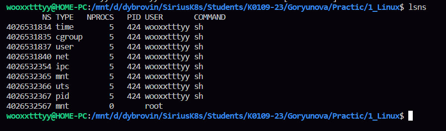
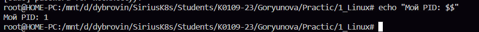
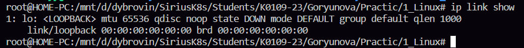
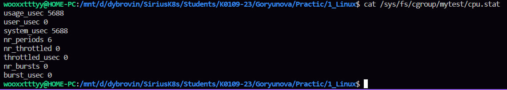
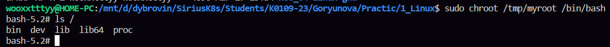

лаба очень прикольная интересная занимательная 

в первом блоке мы смотрим как линукс изолирует процессы с помощью неймспейсис, это такой механизм ядра, который изолирует процессы друг от друга 
сначала я смотрела в каких неймспейсах сидит текущий shell, а потом смотрела все активные неймспейсы в системе в целом

с помощью unshare запустила новый bash в изолированном pid неймспейс, внутри этого окружения процесс стал pid 1, а остальные процессы хоста стали не видны, потом сделала то же самое с сетевым неймспейс и внутри оказался только loopback-интерфейс, по этому можно убедиться, что все изолировано 

после exit процессы остались нетронутыми, потому что ushare создает неймспейсы для дочерних процессов, а родительские никто не трогает, вот все и остается нетронутым 

во втором блоке я смотрела как cgroups может ограничивать ресурсы, после выставления лимита в 20 процентов я запустила нагрузку стресс тестирование и тд и потом через топ смотрела, процесс и правда не превышал 20 процентов

если лимит памяти превысить, процсс просто будет убит как я поняла, но я не уверена

в третьем блоке я создала изолированное окружение через chroot и поместила туда баш и лс со всеми их библиотеками 
потом запустила внутри этой папки баш через chroot, для этого баша папка /tmp/myroot стала как настоящий корень /, он думает, что он в обычной линукс системе, но на самом деле видит только ту папку и то, что туда положили

ну короче можно сделать вывод что chroot ограничивает доступ  процессам к файлам и у них есть только то, что есть в новом корневом каталоге 

последний блок Что сдать преподователю 

1. lsns — список namespace-ов системы

2. echo $$ внутри нового PID namespace (должно быть 1 или маленькое число)

3. ip link в новом NET namespace (только lo)

4. cat /sys/fs/cgroup/mytest/cpu.max — ваш лимит

5. ls / внутри chroot

эту лабу из первых трех я сделала последней, сказали что она сложная, но вроде легкой оказалась, пока мне нравится ставлю лайк 