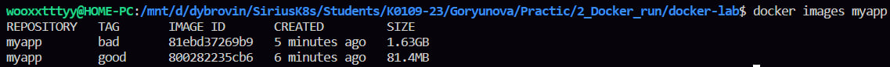
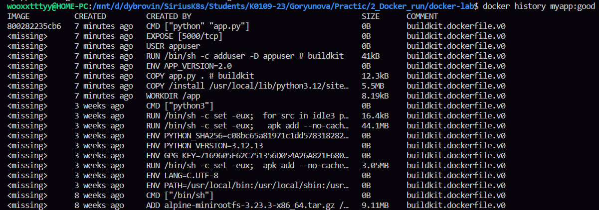
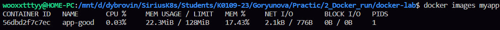

эту лабу я сделала первую, великий Роберт Андреевич меня запугал, и я думала что будет снова сложно, но по факту чет легко оказалось 

сначала скопировали готовый плохой докерфайлик без оптимизации, поэтому он и весил 1 с лишним гб, потому что отсутсвовал --no-cache-dir при установке pip, следовательно кэш сохранялся внутри образа, и все файлы копировались до установки зависимостей, что нарушает кэширование слоев 

ну и скопировала все остальные файлики плохого контейнера и запустила его, весил он 1.62 гб, что огого
через керл проверила, он мне отвечал хело фром контейнер 

потом я скопировала хороший докерфайлик, но у меня чет не работало, поэтому с помощью интернета я добавила --target /install, так как до этого в первом варианте пакеты не туда шли, куда надо, а когда я уже изменила докерфайлик, питон стал видеть эти пакеты (за корректность данных изменений в файле я не отвечаю, работает и слава богу, я сама не особо если честно поняла)

потом я скопировала все другие файлики, ну и собрала и запустила контейнер
после запуска проверила размер, и опа, он оказался 81.4 мб

значит дальше перешла к части три, вообще эти команды я даже не помню, чтобы когда-то использовала, как будто первый раз вижу
получается я посмотрела слои образа и их размер, для того чтобы видеть из чего он состоит и какие слои самые тяжелые, затем посмотрела детальную техническую информацию об образе, после посмотрела каждый слой и какие файлы в нем добавились или удалились
вообще не помню таких команд в своей жизни, но мне понравилось, что-то новое 

так ну в блоке четыре опубликовала все на докер ком, вроде как получилось, хоть что-то получилось у меня без проблем 

последний блок Что сдать преподавателю 

1. Вывод docker images myapp — две строки (bad vs good), видна разница в размере

2. Вывод docker history myapp:good — слои образа

3. docker stats app-good — работающие лимиты CPU/RAM

4. URL вашего образа на Docker Hub
https://hub.docker.com/repository/docker/daria755/flask-demo/general
