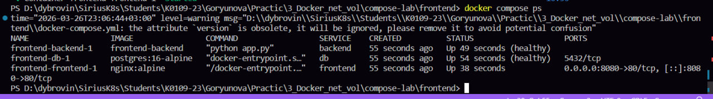
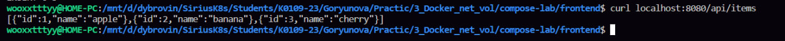
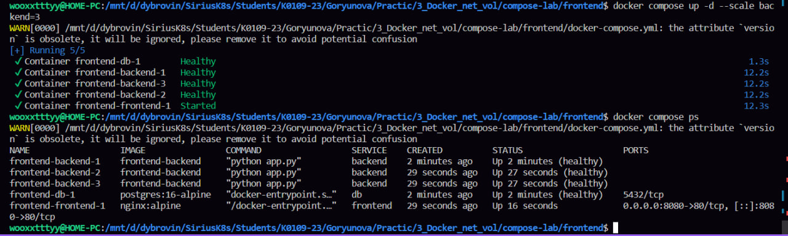

эта лаба для меня была посложнее, чем вторая, но в целом норм

сначала я смотрела какие сети уже есть в докер, я увидела бридж и хост, а потом создала свою изолированную сеть
запустила в этой сети два контейнера: один с постгрес, второй — простой alpine, потом внутри alpine я проверила, что можно обращаться к контейнеру с бдшкой по имени (ping db) — это работает из за встроенного dns в докере, а когда я запустила контейнер вне сети, он уже не смог найти бдшку

во втором блоке, как я поняла, надо было научиться сохранять данные даже после удаления контейнера 
я создала вольум, запустила постгрес и подключила вольум, и создала тестовые данные в таблице, потом я удалила контейнер, а вольум оставила, и при проверке тестовые данные сохранились супер класс

в следующем блоке я делала получается такой стек, ну как делала, копировала готовые файлы, но значит бдшка, фронтенд на нджинкс и бэкэнд фласк
при запуске у меня были ошибки, они решались просто тем, что я меняла пути в докерфайле и в докер компоусе на свои, он просто при сборке не мог найти некоторые файлики, вот а потом была ошибка, что все сервисы запускаются, но почему-то фронтенд стоит в статусе ап, но при этом у него не написано хелфи рядом, и что-то я не поняла в чем прикол, если все запустилось и все работает, оч странно вообщем, может потом умные одногруппники мне объяснят 

в конце короче посмотрела все созданные вольумы, что все существует, ну и почистила все 

последний блок Что сдать преподавателю

1. docker compose ps — все сервисы healthy

вот про что я писала, он вроде в статусе ап фронтенд этот, но при это хелфи не написано 
2. curl localhost:8080/api/items — данные из БД через nginx

3. docker compose ps после --scale backend=3 — 3 экземпляра backend

там вот видны три экземпляра бэкэнд

лаба прикольная мне понравилось, хотя ошибок было много, великий гпт и интернет, и капелька моих знаний почти решили все ошибки
