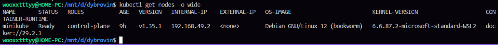
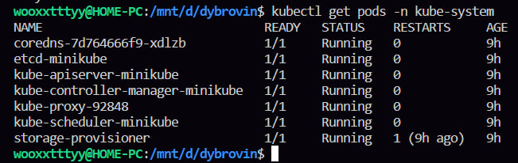
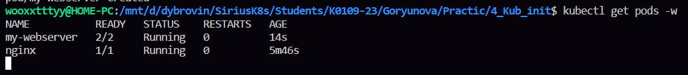
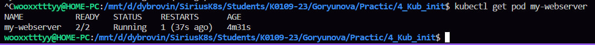

все что связано с кубернетисом для меня оч сложно, поэтому лабы с 4 по 7 хоть там просто копипаст и они легкие, для меня все равно были непростые, потому что я не понимаю что делаю 

так получается сначала был поднят кубернетис кластер с заданными параметрами типо память и цпу, делается одной готовой командой

в первом блоке как я поняла надо смотреть работает ли вообще кластер и из чего он состоит
сперва смотрела какие есть ноды, у меня получается только вот один запущенный миникуб, дальше сразу же смотрела подробную информацию о ноде миникуб, типо сколько там спу, запущен не запущен и т.д.
дальше я смотрела системные поды в неймспейс кубе-систем, они все у меня были в статусе ранинг
затем была проверка что сам кубернетис жив, там всё было в статусе хелфи
потом в какой то директории, которую я видела впервые, надо было посмотреть статические поды, как я поняла, из них запускаются главные компоненты кубернетиса, и вот тут у меня не работала команда, я почитала в инете, надо просто перед ls написать миникуб ssh и у меня все заработало, хз поч так, может конкретики требует какой-то
в следующей команде кат, где смотреть надо аргументы запуска api-сервера (не пон если честно что это), у меня была такая же ошибка как в предыдущей команде, решалась она точно так же
дальше я смотрела список просто того, чем может управлять кубернетис, тут вот я вроде поняла, ну и в конце просто версию кубернетиса чекнули, единственная команда, которую я поняла от и до 

Какие поды в kube-system должны быть Running?
kube-apiserver → без него ничего не работает
etcd → база данных
kube-scheduler → без него поды не запускаются
kube-controller-manager → следит за состоянием
я почитала, что это основные поды, вот они у меня тоже были ранинг 

во втором блоке сначала я запустила под с контейнером нжинкс, как я поняла, под это самая маленькая единица в кубернетис, потом я проверила этот под и нжинкс был в статусе ранинг, а еще я смотрела жизненный цикл этого пода, типо его стадии в реальном времени - прикольно
еще заходила внутрь контейнера и там смотрела обычные вещи, типо хостнейм, етс хостс, процессы, сеть 
потом посмотрела логи контейнера и в реальном времени тоже, ну там как и везде, типо время и че было 
в самом конце чекнули просто описание пода

в третьем блоке был успешно скопирован файл ямл, в котором для кубернетиса описывается какой должен быть под, ну и применили этот файл, потом проверила запустилось или нет, все было в статусе ранинг 
потом я смотрела логи контейнера, тут была ошибка что вывод был пустой, крч чекнула оказалось что эти логи записывались в какой-то конкретный файл и в команде надо в конце указать путь до этого файла, чтобы он вывел мне эти логи, короче прикольно все

блок четвертый какое то самовосстановление 
сначала мы убили главный процесс контейнера с пид 1 это сам нжинкс, потом была проверка и контейнер перезапустила и снова появился, вот в конце смотрели рестарты и там их было два, все норм контейнер перезапустился 

Почему Pod не удалился, а перезапустился?
потому что какой то кубелет агентик супер умный в кубернетисе и спасает контейнеры, если они умерли, то есть перезапускает их

последний блок Что сдать преподавателю

1. kubectl get nodes — все Ready

2. kubectl get pods -n kube-system — все системные поды Running

3. kubectl get pods — два пода (nginx и my-webserver) Running

4. kubectl get pod my-webserver — показать RESTARTS > 0 после kill

лаба легкая, я вроде как даже что то поняла, но кубернетис все равно сложный оч