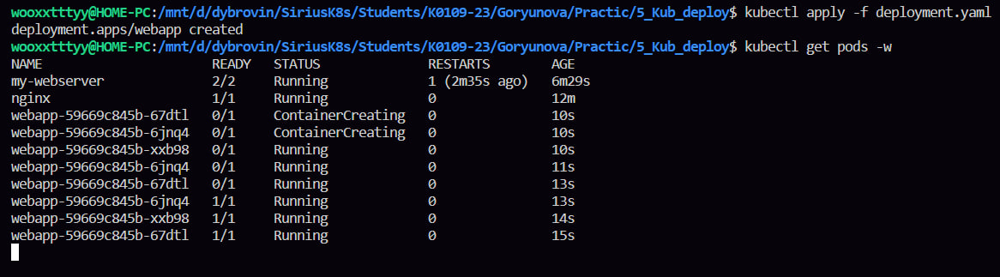
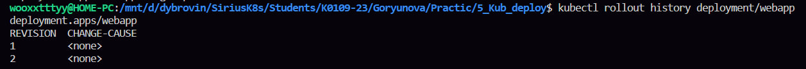
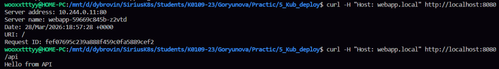

значит как мы поняли из прошлый лабы, поды не такие крутые и самостоятельные, поэтому нужен диплоймет, ну чтож 

в первом блоке сперва был успешно скопирован готовый файл ямл, где было уже описание нескольких подов, а не одного, некая система, ну и применен этот файлик
потом в реальном времени можно было посмотреть как создаются эти поды, вообще оч крутая штука, мне так нравится смотреть в реальном времени, прям забавно
также чекнули статус диплоймента, все супер
дальше мы смотрели репликасет, я искренне не поняла че это, помню роберт что то рассказывал, но я хзшка

во втором блоке был удачно скопирован готовый файлик, я так поняла даем доступ к приложению хз, и применили файлик
дальше получили айпи ноды, тот же айпи виртуалки
дальше проверяли балансировку и можно было увидеть что трафик распределяется между тремя подами
дальше мы обновили образ контейнера, создался новый репликасет, новые поды, а старые удалились, при этом трафик не прерывается, запущенный керл в другом терминале работает
потом чекнули статус обновления, историю и потом откатились назад, когда потом я посмотрела еще раз историю, версия уменьшилась прикол да

в третьем блоке делаем ингрес, для начала я его просто включила, просто ингрес это типо правила, а вот ингрес контролер который как раз я запустила, вот он чет делает
потом был создан простой сервис, который отвечает текстом, и какой то сервис апи, просто два сервиса сделала
далее удачно скопирован файлик ингрес, потом он был применен и выполнена проверочка, что все ок
дальше настроили етс хостс, чтобы вот эта вся штука работала как сайт типо и была выполнена проверка через керл, но, у меня вывод был пустой, поэтому с лучшим другом интернетом было принято сначала перебросить порт ингрес контролера на локальный 8080, и только потом проверять керл только еще и с явным указанием порта
потом я посмотрела поды этого ингреса, один был ранинг, два других комплитид, почему так я не поняла

в четвером блоке было сравнение типо сервис, как вообще открывается доступ к приложению 
значит создали сервис доступный только внутри кластера, и снаружи к нему подключиться нельзя, ну когда мы зашли внутри, то запрос идет
была выполнена проверка связи через порт, работает, и через внешний айпи, там не работает, кубернетис просит облако, а его нет, вот и некому выдать айпи

последний блок Что сдать преподавателю 
1. kubectl get pods — 3 пода webapp Running

2. kubectl rollout history deployment/webapp — минимум 2 ревизии

3. curl webapp.local и curl webapp.local/api — разные ответы

4. Объяснить: в чём разница ClusterIP и NodePort 
кластер айпи это виртуальный айпи адрес доступный только внутри кластера, нодпорт открывает порт на каждой ноде кластера и трафик с ноды перенаправляется на кластер айпи сервиса

я ничегооо не понимаюююю в этом кубернетисеееееееее...........