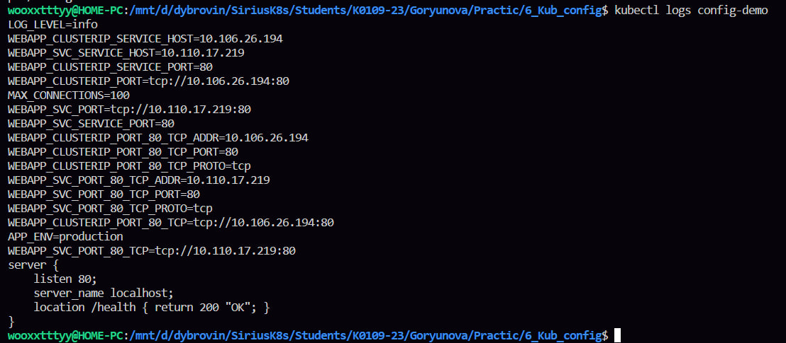
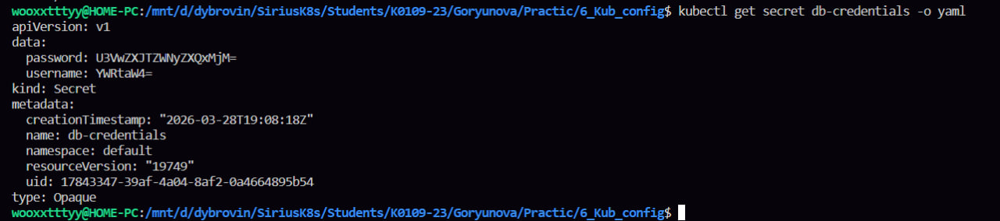
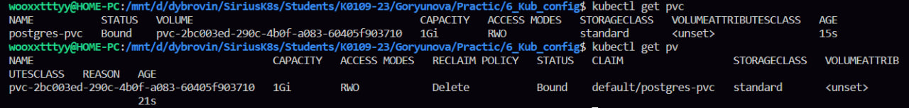
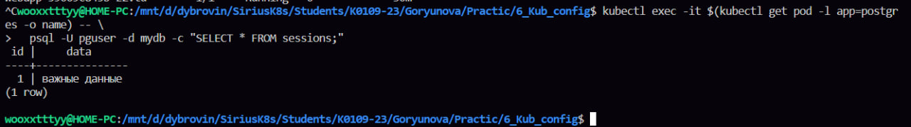

я все еще не понимаю что я делаю, понять кубернетис мне не дано 

так первый блок в этой лабе конфигмап, способ хранить конфигурацию отдельно от приложения
сперва создали конфигмап, это вообще делается для того, чтобы не хранить настройки в коде и менять конфигурацию без пересборки приложения, такверже была выполнена проверочка, все ок, все создалось 
дальше был скопирован готовый файлик, он нужен, чтобы показать как приложение получает конфигурацию
потом был создан конфигмап из файла, то есть файл превращается в конфигмап хз
ну и создали под, который будет использовать этот конфигмап, потом при просмотре логов можно будет увидеть переменные окружения и содержимое файла 

во втором блоке мы учимся хранить безопасно пароли 
был создан сикрет, типо объект с логином и паролем, проверили, что данные легко читаются, чтобы показать что сикретс в таком виде не польностью защищены
далее скопировали готовый файл, чтобы приложение могло получить самые секретные данные на всем белом свете, обязательно не забыли применить под
в логах спокойно видим и пароль

в третьем блоке у нас способ хранить данные отдельно от контейнера 
скопировали файлик, применили его, проверили что хранилище создано и подключено, в статусе я увидела bound
внути контейнера подключились к базе, чтоб таблицу создать, удалил под, диплоймент все перезапустил, при повторной проверке данные из таблицы сохранились, значит вот это pvc работает

последний блок Что сдать преподователю 
1. kubectl logs config-demo — все 3 способа передачи ConfigMap работают

2. kubectl get secret db-credentials -o yaml — данные в base64

3. kubectl get pvc postgres-pvc — статус Bound

4. Вывод SELECT после пересоздания пода — данные сохранились

кстати какие ошибки были, когда копировала файлы, он ругался что нет лимита на ресурсы, поэтому приходилось дописывать файлики все, а также была ошибка конектион ерор во втором блоке, когда смотрели в etcd без шифрования, по умному в интернете не нашла решение, поэтому по тупому узнала в гпт, он сказала что просто нет доступа в eпtcd и прописал мне команду с сертификатами для доступа 