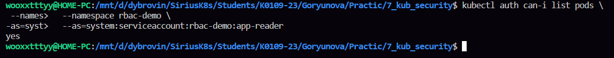
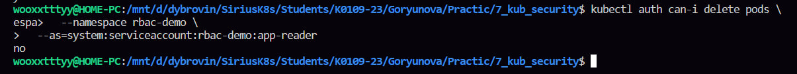
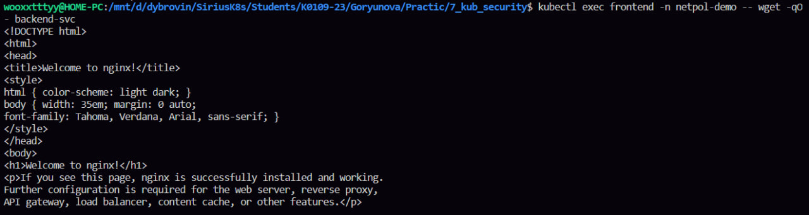
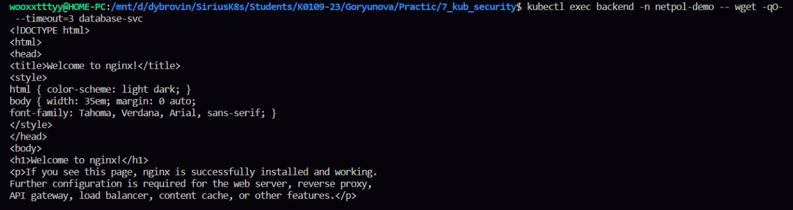
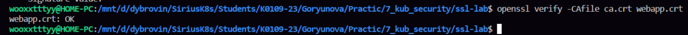
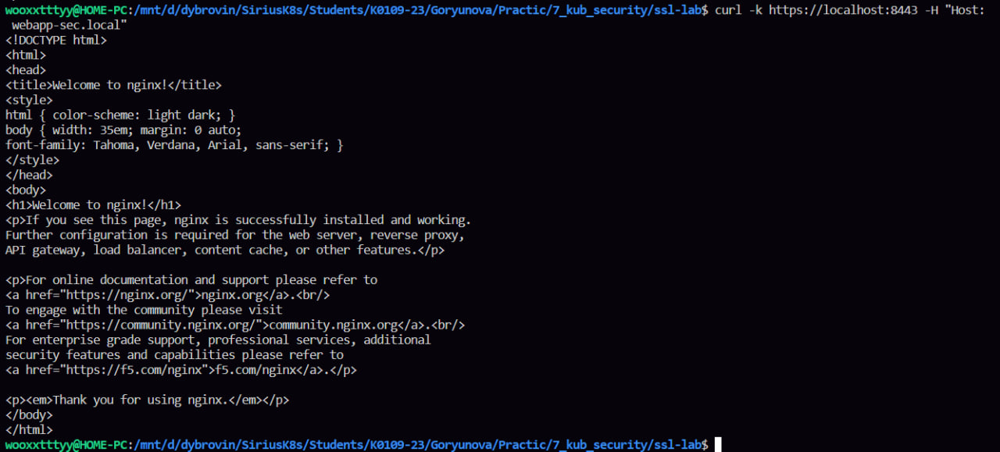

некая помарочка, если в предыдущих лабах я понимала хоть что то, то в этой я не поняла ничего от слова совсем 

первый блок управление правами доступа в кубернетис 
сперва создали отдельное пространство так называемый неймспейс, чтобы ограничить права доступа только там 
далее скопировали и применили файлик, оч нравится мне данное действие, контрс контрв без ошибок получается 
и была выполнена проверка, один yes и два no, так что все ок идем дальше

второй блок контроль сетевого взаимодействия между подами 
создали неймспейс, три пода фронт бэк и база, до применения политик они все общаются между собой 
дальше копируем файлик с политиками и применяем его и снова проверяем как они общаются, и тут они у меня через чур общительные и все конект меж собой, я чекала почему и как решить, но у меня не получилось, хз мозгов не хватило простите

в третьем блоке создаем свой сертификат
сперва создаем приватный ключ центра сертификации, это главный ключ, которым подписываются сертификаты
дальше создаем корневой сертификат, это типо доверенного центра, который подписывает другие сертификаты и сам себе доверяет, какой милосердный я не могу
в конце проверочку выполняем, что все ок 
создаем конфиг с san, san это список адресов, для которых действует сертификат, затем создаем ключ сервера, сервер будет использовать его для шифрования и дальше кидаем заявочку на подписание сертификата для нашего webapp.local, и потом делаем проверочку что все ок 
теперь подписываем сертификат уже наконец-то и обязательно проверочка что все ок
сохраняем сертификат и ключ в наш кубернетис, ингрес именно оттуда будет брать сертификат
дальше копируем файлик для ингреса, где прописан сикретнейм как раз наш сертификат, и применяем файлик
через керл проверяем соединение, все ок, через openssl смотрим сертификат и цепочку доверия, у меня в выводе был 0, значит все супер
ну в конце просто посмотрели что хранится в сикрет и сроки действия 

последний блок Что сдать преподователю 
1. kubectl auth can-i list pods -n rbac-demo --as=system:serviceaccount:rbac-demo:app-reader → yes

2. kubectl auth can-i delete pods -n rbac-demo --as=system:serviceaccount:rbac-demo:app-reader → no

3. kubectl exec frontend -- wget database-svc → timeout (NetworkPolicy работает)

у меня не работает, написала выше, я хз чд, не смогла решить
4. kubectl exec backend -- wget database-svc → 200 OK

5. openssl verify -CAfile ca.crt webapp.crt → webapp.crt: OK

6. curl --cacert ca.crt https://webapp.local → ответ от nginx (TLS работает)

тут как в какой то лабе предыдущей мне надо было делать проброс портов чтоб керл работал

