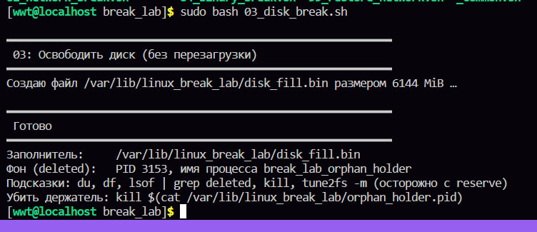
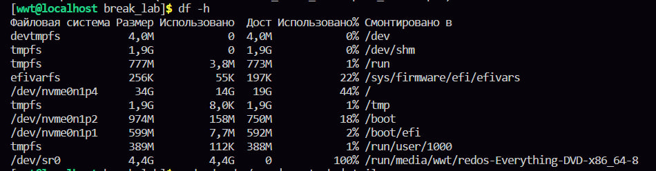
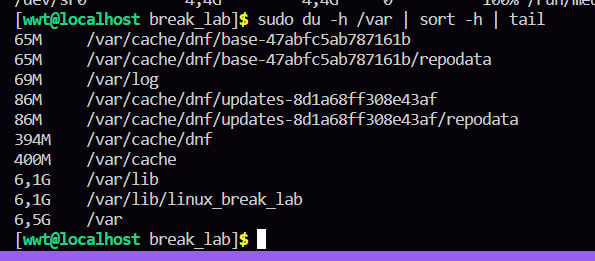
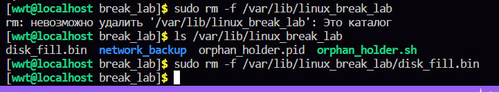
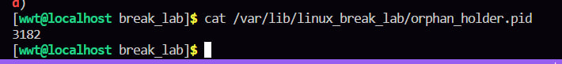
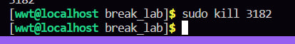
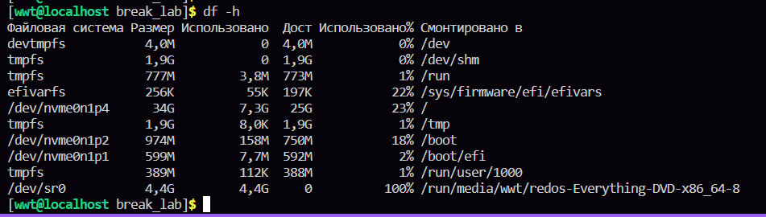

в третьей лабе скрипт заполняет нам диск и надо без перезагрузки его очистить 

сперва смотрим нашу память, в корневом каталоге видно что она забита, нооо, чекнула в инете написано что должна быть забита на сто процентов, у меня нет, я все равно продолжила делать лабу, и в конце память очистилась, так что я думаю норм, хз правильно или нет 

дальше смотрим в целом какие есть большие файлы в системе и опааа, есть файлик брейк лаб

мы его удаляем. 

после запуска скрипта в условии задания, как я поняла, запущен еще какой то фоновый процесс, мб который держит как то этот файл, ну мы его тоже убьем)))))

в конце делаем проверочку памяти, место освободилось 

память в корневом уменьшилась, все ок 