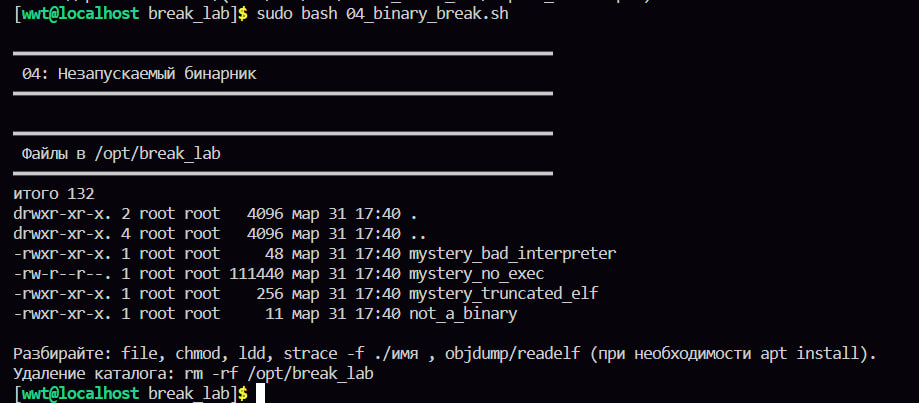
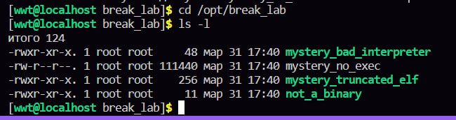
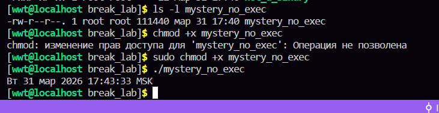
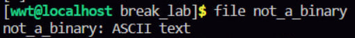
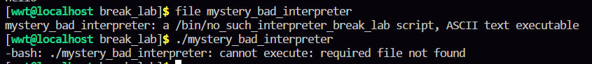
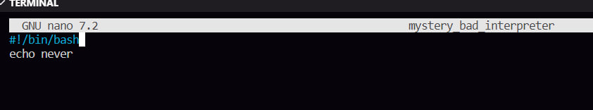
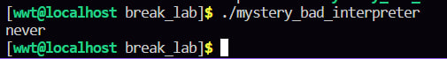
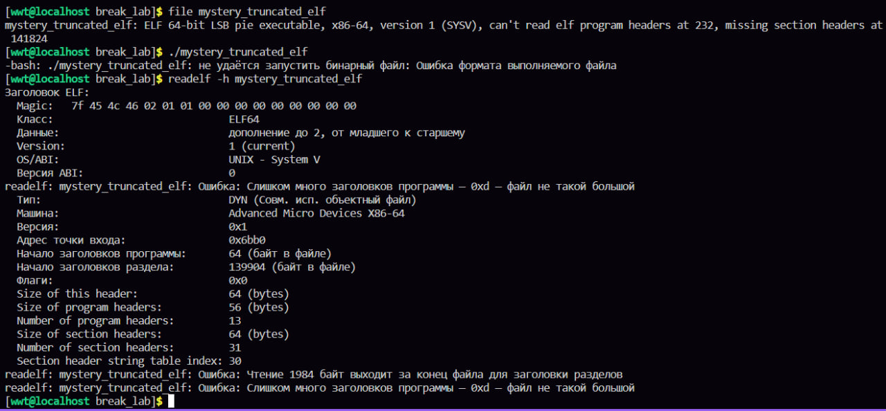

тут крч лаба направлена на то, чтобы проверить на сколько мы умные и умеем ли мы понимать поч не зупскается бинарник 

так у нас появился каталог в котором есть четыре бинарника, ну или не бинарника, проверим

проверяем первый файлик, видим что там нет x, значит этот файл выполнять нельзя, поэтому решением данной проблемы будет добавить право на выполнение и попробовать запустить

ура ура хепи хепи починили

чекаем второй файл, и видим интересный ответ, что это вообще не бинарник, так что исправить мы это не исправим и никак не запустим

смотрим третий файл, в скрипте этого бинарника будет ошибка интерпретатора, да это и из названия понятно 

надо поменять первую строчку в этом файле на бин баш и попробовать запустить 

ура работает идем дальше

когда смотрим последний файл можно сделать вывод что он обрезан наполовину, то есть поврежден, как будто мы че то качали и прервали на половине, это не починится

