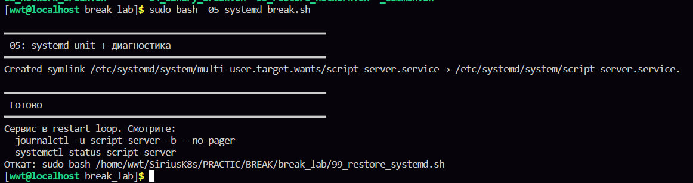
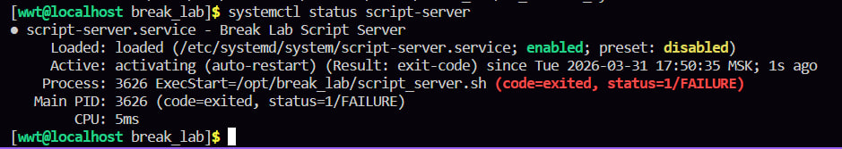
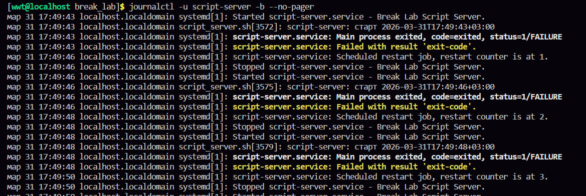
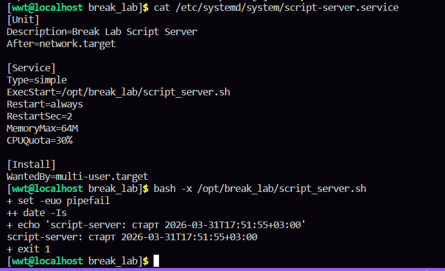
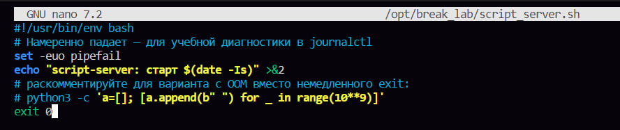
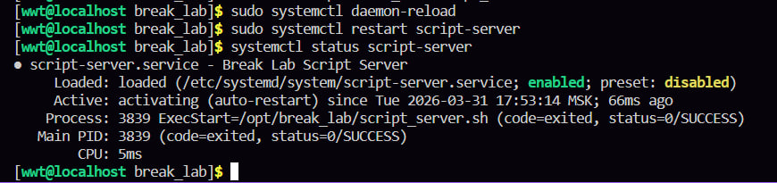

в этой лабе у нас такая ситуация что сервис запускается и сразу падает, надо это исправить 

смотрим статус script-server, он будет фейл

смотрим логи и там ищем ошибку 

там вот в желтой строчке написано эксит код, вот я решила опираться на это, чекнула в гпт, так и есть, это первый раз когда я поняла ошибку из логов сама!!!!!!!!!!!!!!!!! на меня михайлов всегда ругался, что я не умею логи читать и сразу все в гпт заливаю

в логах в этой строчке желтой написано название файла, катнем его, запустим и видим эксит 1, а это ошибка, должен быть 0, поэтому просто меняем в файле 

перезапускаем и проверяем статус 

все актив у нас, не пассив, альфа, не омега 
