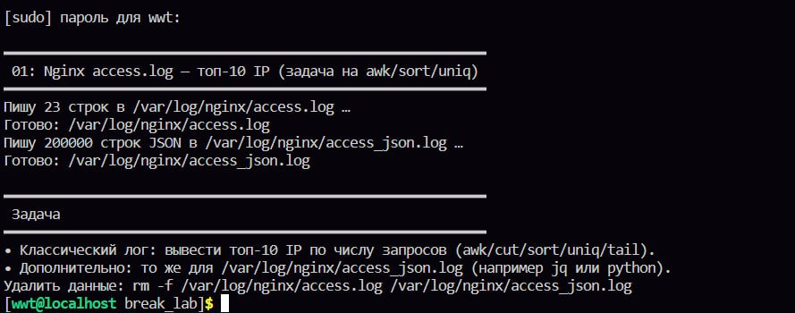
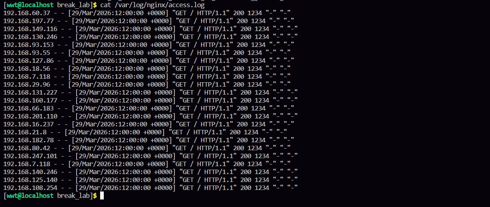
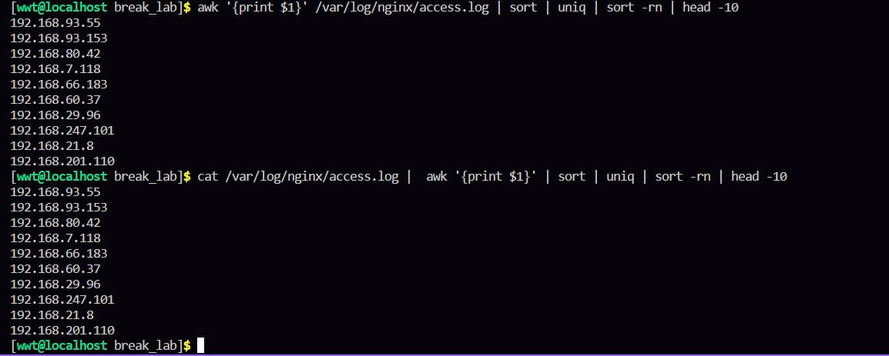
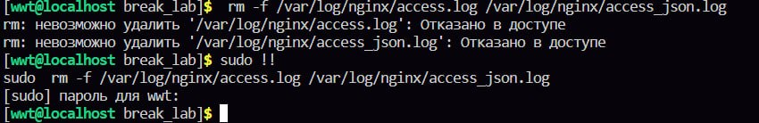

для брейк лаб я создала виртуалку и на ней все делала

в первой лабе был готовый скрипт, который генерирует 1м строк /var/log/nginx/access.log
/var/log/nginx/access.log файл журнала доступа, в который по умолчанию записываются все запросы, обрабатываемые веб-сервером NGINX. Этот лог позволяет отслеживать активность пользователей, анализировать трафик, выявлять проблемы и изучать поведение посетителей сайта
как я поняла, что если мы загружаем такое количество строк, диск заполнится и будет невозможно войти в систему

первым делом запускаем готовый скрипт который предоставил нам великий игорь петрович

если все ок идем дальше, если не ок надо решать, тут я уже не помогу, у меня все хорошо было, 
потом выполняем задачи которые нам вывелись

сначала надо вывести топ десять айпи по числу запросов, ну сначала просто чекнули в целом какие там есть, а потом я уже выводила 10 штук 

awk это язык обработки текста, потом вот это в фигурных скобках, это значит что мы выводим первое поле, сорт затем сортирует по алфавиту, юник удаляет дубликаты, сорт рн сортирует айпи адреса в обратном числовом порядке, head выводит первые 10, ну он их выводит потому что мы указываем число 10, и крч как работает это длинная команда: вывод каждой команды передается другой, и следующая команда уже выполняется на основе вывода предыдущей 

потом было сказано удалить два файла /var/log/nginx/access.log и /var/log/nginx/access_json.log, они оба для просмотров логов только в разном формате, что будет если их удалить я не поняла и прям четкого ответа в инете не нашла, но сказали удалить - я удалила 

