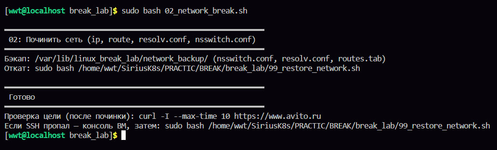
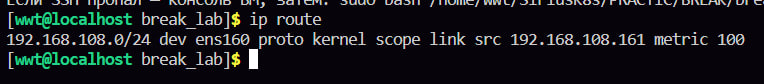
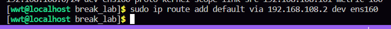
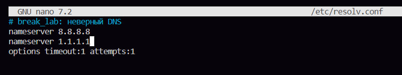
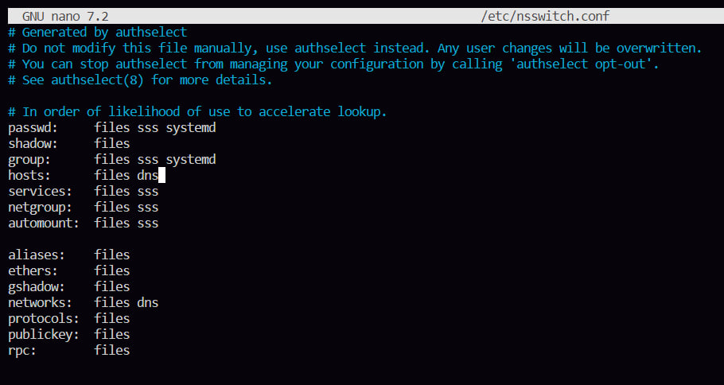
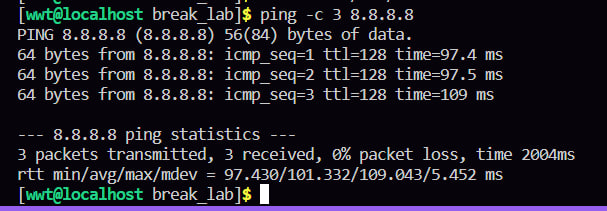
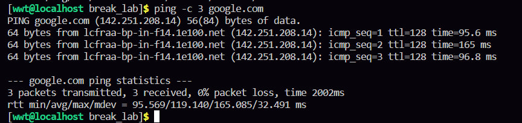
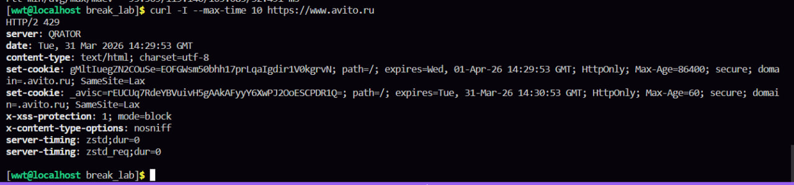

во второй лабе скрипт убивает нам сеть и надо вручную все восстановить

сначала смотрим че у нас не так, видим только интерфейс и что нет строки default via .., которая должна быть, это означает, что системе не известно, куда отправлять пакеты, предназначенные для внешних сетей

добавляем шлюз, обычно это первый адрес в подсети, как сказали в интернете, я придумала какой то на рандом

дальше заходим в файлик /etc/resolv.conf и прописываем две строчки 
nameserver 8.8.8.8
nameserver 1.1.1.1

в этом файле мы прописали норм доменные публичные адреса, а то после запуска скрипта там хз какой то адрес левый был

катнем файл /etc/nsswitch.conf, если в строке хостс написано только файлс, то надо рядом еще дописать dns 

для чего зачем и почему мы это сделали именно в этом файле я не объясню, не знаю 

дальше через пинг выполняем проверочку, и потом проверочку по заданию через авито 

все ок идем дальше 