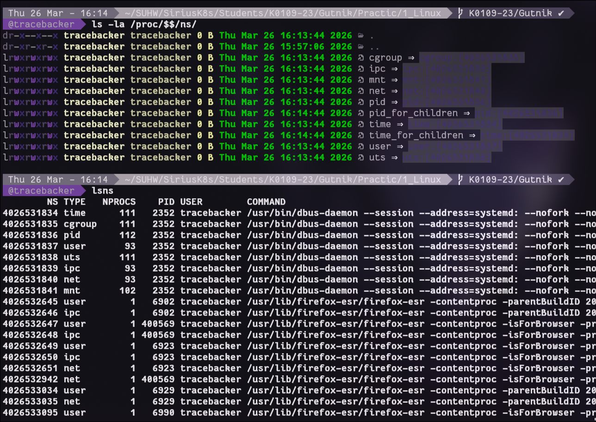
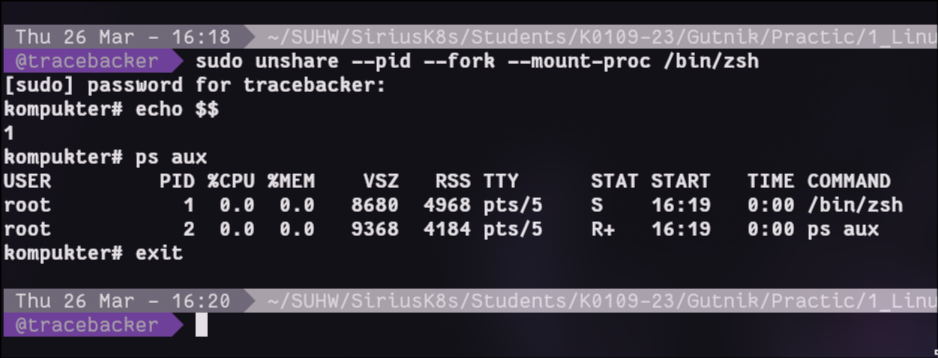
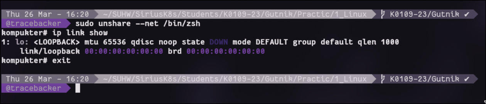
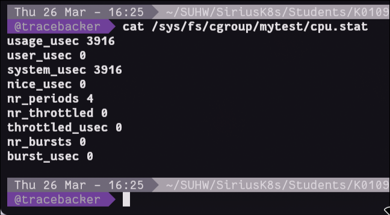
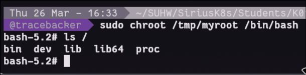

Все скрины в каталоге `screens`.

# Ход работы
## Блок 1 — Пространства имен (Namespaces)
Сначала мы смотрим, какие «изолированные пространства» есть у текущего процесса оболочки (bash). 
Пространства имен изолируют процессы от системы.

Мы запускаем новый bash, но в своем собственном пространстве процессов (PID namespace). 
Внутри него наш bash считает себя главным процессом с PID 1, хотя снаружи это обычный процесс. 

Мы видим, что список процессов внутри «пустой» — там только мы и наши дочерние процессы, а все остальные процессы хоста не видны. Выходим — и все возвращается как было.
Аналогично запускаем bash в новом сетевом пространстве (net namespace). 
Внутри видна только сетевая петля (loopback), никаких физических сетевых интерфейсов нет. Это полная сетевая изоляция.

## Блок 2 — Группы процессов (cgroups)
Здесь мы работаем с механизмом ограничения ресурсов. В современной системе cgroups находятся в /sys/fs/cgroup/. 
Мы создаем свою группу mytest, в неё будет разрешено использовать не больше 20% одного ядра процессора.
Запускаем утилиту stress-ng, которая начинает активно грузить процессор. 
Затем мы помещаем этот процесс в нашу группу. 
Проверяем, что лимит сработал, процесс не может занять больше 20% CPU, даже если очень старается.

## Блок 3 — Смена корневого каталога (chroot)
Мы вручную создаем «мини-систему» в папке /tmp/myroot. 
Копируем туда программу bash и все библиотеки, от которых она зависит (их показывает утилита ldd). 
Также создаем пустые папки для устройств и процессов (proc, dev).
Затем утилитой chroot мы меняем корень на эту папку. 
Внутри мы видим только те файлы, которые сами туда положили. 
Команда ls показывает только наши папки - и это все. Мы в изолированном окружении,
хотя физически все еще на том же компьютере.

## Итог
*То, что мы сделали по шагам, и есть основа любого контейнера:*
- Пространства имен (namespaces) - чтобы процесс видел только свою часть системы (процессы, сеть, пользователей и т.д.).
- Группы процессов (cgroups) - чтобы ограничить, сколько ресурсов (CPU, память) этот процесс может потреблять.
- Смена корня (chroot) - чтобы изолировать файловую систему, 
дав процессу свой собственный «корень» с набором файлов и программ.

Docker и подобные инструменты просто автоматизируют эти три шага, добавляя удобное управление поверх.

# Ответы на контрольные вопросы
### 1. Почему после exit процессы хоста остались нетронутыми?
Связано это с изоляцией пространства имён от unshare.
Процессы с хоста не клонируются, и независят друг от друга.

### 2. Что произойдёт если лимит памяти превысить?
Сработает Out-Of-Memory killer. Ядро сначала попытается освободить swap, но если не поможет тогда активирует OOM-Killer.

OOM-Killer убивает несколько процессов в cgroup, обычно самые тяжелые по ресурсам.

### 3. Чем namespace отличается от cgroup?
Namespace полностью изолирует процессы от системы.
Cgroup ограничивает ресурсы у группы процессов.

