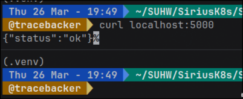
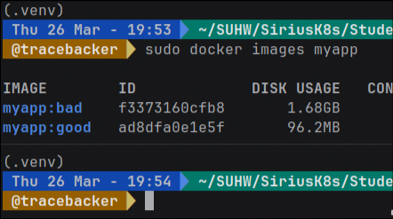
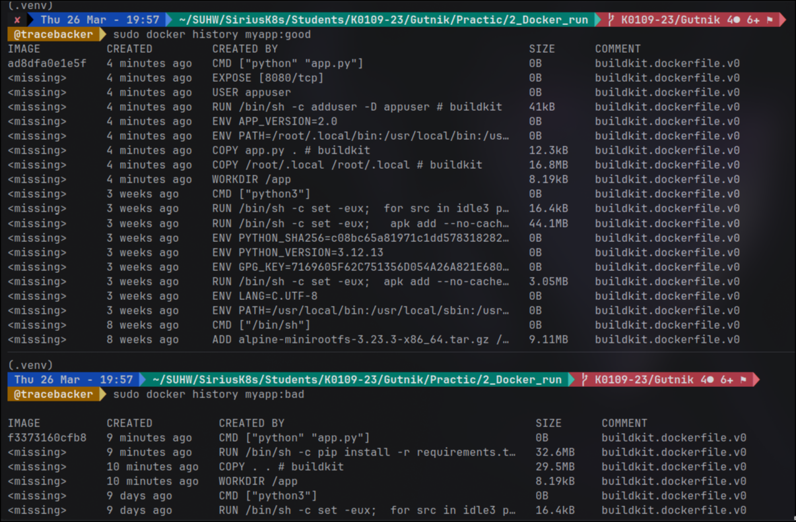
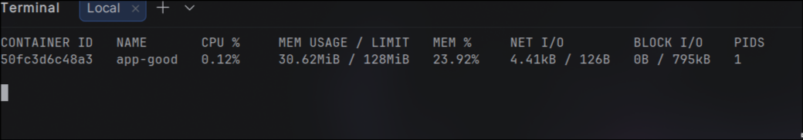
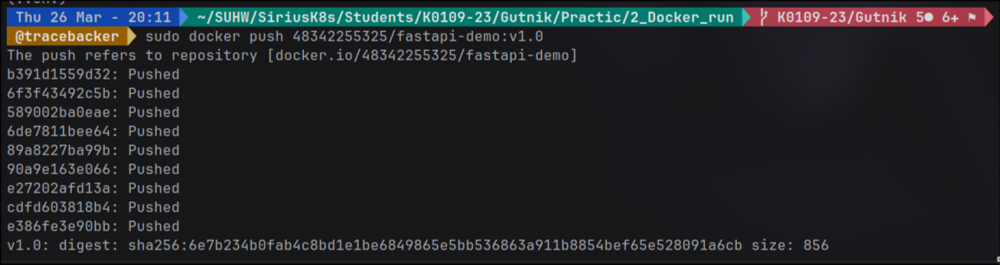

# 1. Написал первый Dockerfile

Создал простенькое fastapi-приложение с двумя эндпоинтами. 
Написал Dockerfile, который берет образ python:3.12, копирует всё внутрь, ставит зависимости и запускает приложение. 
Собрал образ myapp:bad, посмотрел размер - получилось больше гигабайта. 
Запустил контейнер, проверил, что работает. 

Разобрался, почему образ такой большой: 
потому что базовый образ python:3.12 полный, со всем компилятором и системными утилитами, 
плюс зависимости ставятся в системную папку, и нет никакой очистки.

# 2. Сделал multistage build

Переписал Dockerfile нормально. 
На первом этапе установил зависимости. На втором этапе скопировал из builder только установленные пакеты, 
добавил app.py, создал непривилегированного пользователя и переключился на него. 
Еще добавил .dockerignore, чтобы не тащить в образ мусор типа pycache и .git. 
Собрал myapp:good, сравнил размеры - разница больше чем в три раза.

# 3. Запустил с ограничениями ресурсов

Запустил контейнер с параметрами --memory="128m" и --cpus="0.5", чтобы он не жрал всё подряд. 
Добавил --restart=unless-stopped, чтобы при падении сам поднимался. 
Через docker stats проверил, что ограничения применились - контейнер видит только пол-ядра и 128 мегабайт памяти.

# 4. Исследовал слои образа

Посмотрел историю слоев через docker history - увидел, что каждый RUN, COPY и ADD создает отдельный слой. 
У хорошего образа слоев меньше и каждый слой легче. 
Через docker inspect посмотрел RootFS, убедился, что слои действительно есть. 
Установил dive, запустил визуализацию - наглядно увидел, какие файлы попали в образ из каждого слоя, 
нашел лишнее, что можно было бы еще исключить. 
Еще через docker create и docker export залез внутрь образа без запуска, посмотрел структуру файлов.

# 5. Опубликовал на Docker Hub

Зарегистрировался на hub.docker.com, залогинился через docker login. 
Затегировал свой образ с ником, запушил. Потом удалил локально, скачал обратно - убедился, 
что всё работает. Запустил свежескачанный образ на другом порту, проверил.

# Результат

К концу лабораторной работы научился писать Dockerfile, собирать образы, уменьшать их размер через multistage build, 
ограничивать ресурсы контейнера, анализировать слои и публиковать образы в реестр.