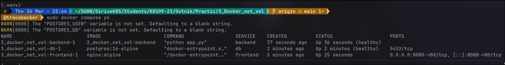
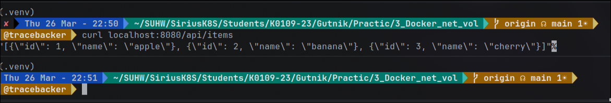
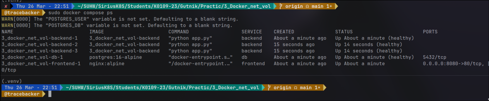

# 1. Изучил Docker сети

Посмотрел список существующих сетей и изучил стандартную bridge-сеть. 
Создал собственную изолированную сеть app-network с драйвером bridge. 
Запустил в этой сети контейнер с PostgreSQL и второй контейнер с alpine. 
Внутри alpine проверил, что контейнеры видят друг друга по имени - DNS внутри сети работает, 
ping db успешно прошел, порт 5432 оказался открыт. 
Для сравнения запустил контейнер alpine без указания сети - он не смог найти контейнер db по имени. 
Убедился, что каждая сеть создает отдельный network namespace и предоставляет свой DNS.

# 2. Разобрался с persistent volumes

Создал volume pgdata и запустил PostgreSQL с его монтированием. 
Внутри контейнера создал тестовую таблицу и добавил строку. 
Удалил контейнер, но volume оставил. Запустил новый контейнер с тем же volume - данные сохранились, 
таблица и записи были на месте. Через docker volume inspect посмотрел, где физически хранятся данные на хосте.

# 3. Собрал многоконтейнерное приложение через docker-compose

Создал структуру проекта с тремя сервисами: база данных PostgreSQL, backend и frontend.

Backend - написал простое fastapi-приложение с двумя эндпоинтами: /api/items для получения списка записей 
из базы и /health для проверки состояния. 
Создал Dockerfile для него.

Frontend - написал конфиг nginx, который проксирует запросы с /api/ на backend:5000, 
а на корень отдает простую HTML-страницу с ссылкой на API.

docker-compose.yaml - описал три сервиса:

- db использует официальный образ postgres, задает переменные окружения для БД, монтирует volume pgdata для сохранения данных, добавил healthcheck через pg_isready
- backend собирается из локальной папки, получает переменные окружения для подключения к БД, зависит от db с условием service_healthy
- frontend использует nginx:alpine, пробрасывает порт 8080 на 80 внутри контейнера, монтирует конфиг nginx, зависит от backend с условием service_healthy

Поднял весь стек командой docker compose up -d --build.
Проверил состояние сервисов, посмотрел логи. 

Зашел в контейнер с БД и создал таблицу items, добавил несколько тестовых записей. 
Через curl проверил цепочку frontend -> backend -> db - по адресу localhost:8080/api/items пришел JSON с данными.

# 4. Масштабировал сервис

Выполнил docker compose up -d --scale backend=3 - запустились три экземпляра backend. 
Проверил через docker compose ps, что все три работают. Nginx балансирует запросы между ними.

# 5. Протестировал healthcheck

В compose-файле были прописаны healthcheck для db и backend. 
Через docker compose ps наблюдал, как сервисы сначала были в состоянии starting, 
а после прохождения проверок перешли в healthy. 
Зависимости с condition: service_healthy гарантируют, что backend не стартует, 
пока БД не будет готова принимать соединения, а frontend - пока backend не станет здоров.

# 6. Очистил всё

Остановил стек docker compose down, затем удалил volumes командой docker compose down -v. 
Выполнил docker system prune -f для очистки неиспользуемых ресурсов.

# Результат

К концу лабораторной работы научился создавать пользовательские bridge-сети, поднимать PostgreSQL 
с persistent volume, писать docker-compose.yml для многоконтейнерного стека 
из трех сервисов, настраивать healthcheck, масштабировать сервисы и понимать, как контейнеры 
общаются между собой по имени внутри сети.