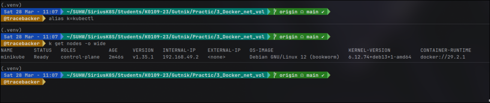
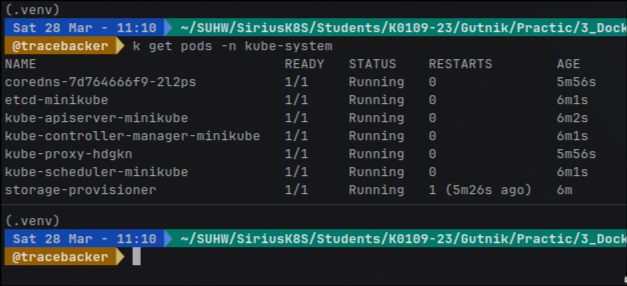
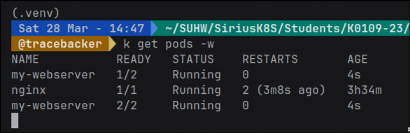
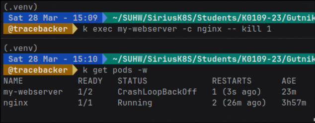

### Цель работы  
Целью работы было научиться запускать Kubernetes-кластер, 
понять его внутреннюю структуру и освоить базовые операции с подами.

---

## Ход работы

### 1. Запуск и проверка кластера

Я развернул кластер с помощью **minikube**, так как это самый 
простой способ для локальной работы. 
После запуска я проверил состояние кластера.

В результате я убедился, что:
- нода находится в состоянии **Ready**
- компоненты кластера работают корректно
- системные поды находятся в пространстве имён `kube-system`

Особое внимание я обратил на системные поды, такие как:
- kube-apiserver  
- kube-controller-manager  
- kube-scheduler  
- etcd  
- coredns  

Все они должны находиться в состоянии **Running**, 
так как обеспечивают работу Control Plane.

---

### 2. Запуск первого Pod

Далее я создал свой первый Pod с образом nginx.

После запуска я:
- проверил, на какой ноде он запущен  
- посмотрел его жизненный цикл  
- подключился внутрь контейнера  

Внутри пода я изучил:
- имя хоста (оно совпадает с именем пода)  
- сетевые настройки и IP-адрес  
- переменные окружения Kubernetes  
- список процессов  

Я заметил, что контейнер изолирован (имеет собственные namespace), 
но при этом управляется кластером.

---

### 3. Работа с Pod через YAML

После этого я создал Pod с помощью YAML-манифеста.

В этом поде было уже два контейнера:
- основной (nginx)  
- sidecar-контейнер для логирования

Я убедился, что оба контейнера работают внутри одного 
Pod и могут взаимодействовать через общий volume.

---

### 4. Проверка самовосстановления

Я принудительно завершил основной процесс контейнера nginx.

После этого я увидел, что:
- Pod не удалился  
- контейнер автоматически перезапустился  
- увеличился счётчик **RESTARTS**

Это происходит потому, что Kubernetes следит за состоянием 
контейнеров через **kubelet**, который и перезапускает их при сбое.

---

## Ответы на вопросы

**Какие поды в kube-system должны быть Running?**  
Все ключевые компоненты Control Plane и сетевые сервисы (kube-apiserver, 
scheduler, controller-manager, etcd, coredns и др.) должны быть в состоянии Running.

---

**Почему Pod не удалился, а перезапустился? Кто за это отвечает?**  
Pod не удалился, потому что его политика перезапуска установлена в значение 
`Always`. За перезапуск контейнера отвечает kubelet на ноде.

---

**Отличие Pod от Container**  
Pod — это минимальная единица в Kubernetes, которая может 
содержать один или несколько контейнеров. Контейнер — это отдельный 
запущенный процесс внутри Pod.

---

## Вывод

В ходе лабораторной работы я научился разворачивать Kubernetes-кластер 
с помощью minikube, создавать и управлять подами, а 
также понял принципы их работы и самовосстановления. 
Я получил базовое представление о структуре кластера и 
роли его компонентов.