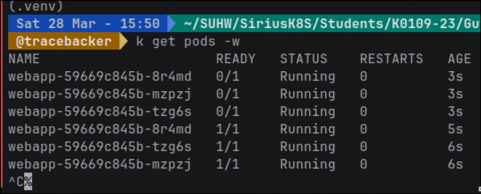
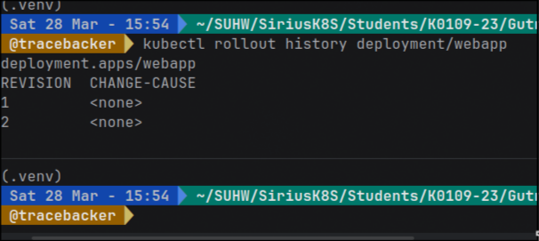
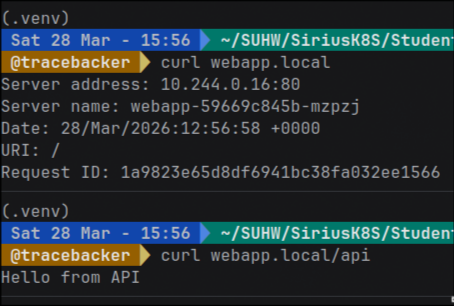

### Цель работы  
Целью данной лабораторной работы было научиться развёртывать приложение в Kubernetes 
с возможностью обновления без даунтайма, выполнять откат версии и 
настраивать маршрутизацию трафика через Ingress.

---

## Ход работы

### 1. Создание Deployment

В начале работы я создал Deployment для веб-приложения с тремя репликами.  
Это позволило обеспечить отказоустойчивость и распределение нагрузки между подами.

Я настроил стратегию обновления типа RollingUpdate, при которой:
- новые поды запускаются постепенно,
- старые поды удаляются только после готовности новых.

Таким образом, приложение остаётся доступным даже во время обновления.  
После применения конфигурации я убедился, что все 3 пода успешно запущены и находятся в состоянии *Running*.

---

### 2. Настройка Service и Rolling Update

Далее я создал Service типа NodePort, чтобы получить доступ к приложению извне кластера.

Я проверил работу балансировки нагрузки с помощью цикла запросов.  
В ответах отображались разные имена хостов, что подтвердило распределение трафика между подами.

После этого я выполнил обновление образа контейнера.  
Во время rolling update я наблюдал, что:
- поды обновлялись поочерёдно,
- приложение продолжало отвечать без прерываний.

Это подтвердило отсутствие даунтайма.

Затем я выполнил откат к предыдущей версии и убедился, что Deployment вернулся к прошлому состоянию.  
История ревизий также отобразила изменения.

---

### 3. Настройка Ingress

На следующем этапе я настроил Ingress для маршрутизации HTTP-трафика.

Я создал дополнительный backend-сервис и настроил правила:
- `/` → основной веб-сервис  
- `/api` → backend API

После настройки я добавил локальную запись хоста и проверил работу:
- при обращении к корню возвращался ответ веб-приложения,
- при обращении к `/api` — ответ от API.

Это показало, что маршрутизация по путям работает корректно.

---

### 4. Сравнение типов Service

В конце работы я изучил различия между типами сервисов:

- **ClusterIP**  
  Используется только внутри кластера. Подходит для внутреннего взаимодействия сервисов.

- **NodePort**  
  Открывает порт на каждой ноде, позволяя получить доступ извне. Удобен для тестирования.

- **LoadBalancer**  
  Используется в облачных средах и предоставляет внешний IP. Автоматически распределяет трафик.

Я проверил работу ClusterIP, подключившись к сервису изнутри кластера, и убедился, что он недоступен снаружи.

---

## Результаты работы

В ходе выполнения лабораторной работы я:
- развернул Deployment с 3 репликами;
- выполнил обновление приложения без даунтайма;
- откатился к предыдущей версии;
- настроил Service для доступа к приложению;
- реализовал маршрутизацию через Ingress;
- разобрался с различиями типов сервисов.

---

## Вывод

В данной работе я получил практический опыт работы с основными объектами Kubernetes.  
Я научился обеспечивать отказоустойчивость приложения, выполнять безопасные обновления и настраивать внешний доступ.

Полученные знания являются важной частью работы с микросервисной архитектурой и контейнеризированными приложениями.