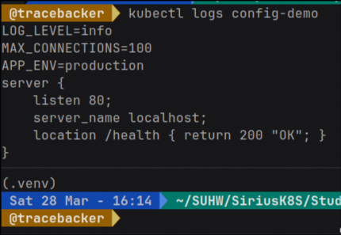
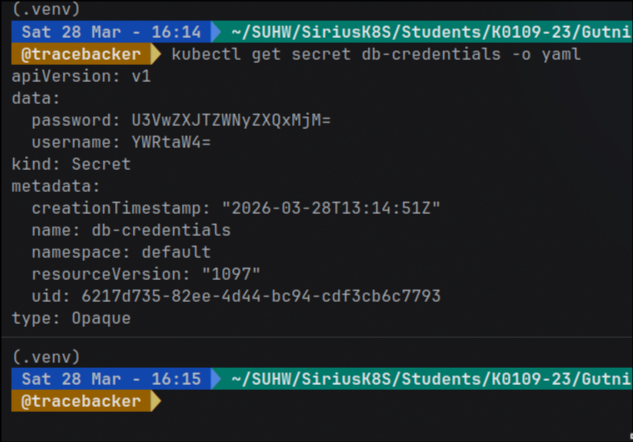
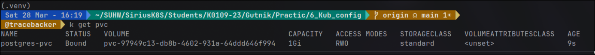
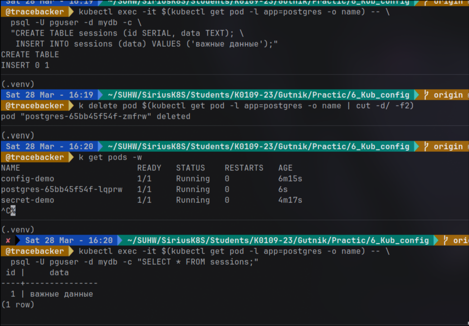

### Цель работы  
Целью данной лабораторной работы было изучение способов управления 
конфигурацией приложений в Kubernetes, а также работа с постоянным хранилищем данных. 
Я должен был научиться выносить конфигурацию из кода, использовать ConfigMap и 
Secret, а также подключать PersistentVolume для сохранения данных.

---

## Ход работы

### 1. Работа с ConfigMap  

Сначала я создал ConfigMap, в котором задал переменные окружения для приложения. 
Это позволяет хранить конфигурацию отдельно от контейнера, не пересобирая образ при изменении параметров.

Далее я подключил ConfigMap к pod несколькими способами:
- через `envFrom` — все значения сразу как переменные окружения  
- через `env` — выборочно по ключу  
- через volume — в виде файла внутри контейнера  

После запуска pod я проверил логи и убедился, что:
- переменные окружения корректно передаются  
- файл конфигурации доступен внутри контейнера  

Таким образом, я понял, что ConfigMap удобно использовать для хранения обычных настроек приложения.

---

### 2. Работа с Secret  

Далее я создал Secret для хранения чувствительных данных (логин и пароль). 
После этого я посмотрел его содержимое и убедился, что данные представлены в формате base64.

Я декодировал значение и увидел, что это не шифрование, а просто кодирование. 
Это означает, что данные можно легко получить обратно.

Затем я подключил Secret к pod через переменные окружения и проверил, что 
значения успешно передаются в контейнер.

**Вывод:**  
По умолчанию Secret в Kubernetes не является безопасным способом хранения данных, так как:
- данные хранятся в base64  
- без дополнительной настройки они не шифруются в etcd  

Для повышения безопасности необходимо:
- включать `EncryptionConfiguration`  
- использовать алгоритмы шифрования (например, AES)  
- либо применять внешние системы хранения секретов (Vault и др.)

---

### 3. Работа с PersistentVolume  

На следующем этапе я развернул базу данных PostgreSQL с использованием PersistentVolumeClaim.

Сначала я создал PVC, который автоматически связался с PersistentVolume. 
После этого я развернул Deployment с PostgreSQL и подключил к нему том для хранения данных.

Затем я:
1. Подключился к базе данных  
2. Создал таблицу  
3. Добавил запись  

После этого я удалил pod и дождался, пока Kubernetes создаст новый.

Далее я снова подключился к базе и выполнил SELECT-запрос. Я убедился, что данные сохранились.

**Вывод:**  
PersistentVolume позволяет сохранять данные независимо от жизненного цикла pod, 
что критически важно для баз данных и других stateful-приложений.

---

## Результаты работы

В ходе выполнения лабораторной работы я:
- создал и использовал ConfigMap разными способами  
- настроил передачу конфигурации в контейнер  
- создал Secret и убедился в особенностях его хранения  
- развернул PostgreSQL с использованием PersistentVolume  
- доказал сохранность данных после пересоздания pod  

---

## Общий вывод  

В ходе лабораторной работы я понял, что правильная архитектура приложения в Kubernetes предполагает разделение:
- кода  
- конфигурации  
- данных  

Хранение конфигурации внутри образа является плохой практикой, так как 
усложняет поддержку и масштабирование. Использование ConfigMap и Secret 
делает приложение гибким, а PersistentVolume обеспечивает надежное хранение данных.

Также я сделал вывод, что безопасность Secret требует дополнительной 
настройки и не должна восприниматься как защищённая по умолчанию.