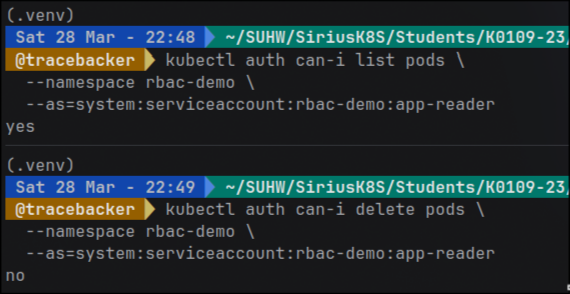
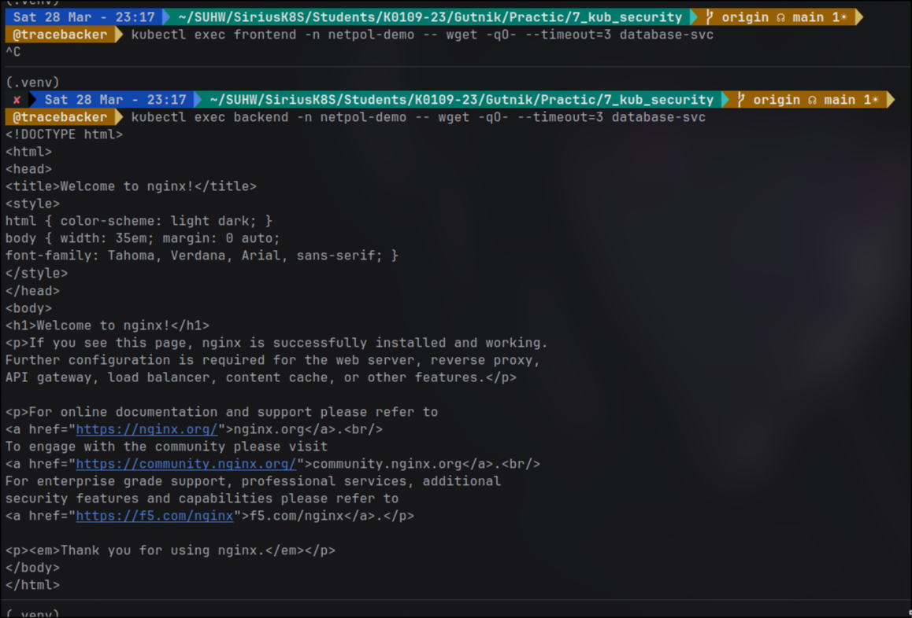
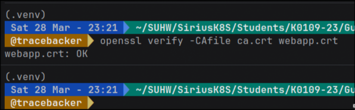
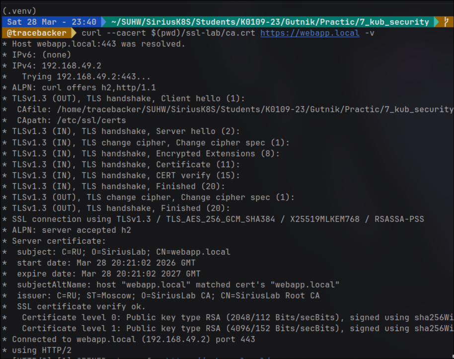

# Цель работы

Реализовать комплексную защиту кластера Kubernetes на трех уровнях: 
идентификация (RBAC), сетевая изоляция (NetworkPolicy) и криптографическая защита (TLS/PKI), 
а также настроить систему обнаружения вторжений в реальном времени.

# Ход работы
## 1. Реализация принципа минимальных привилегий (RBAC)

Первым делом я занялся разграничением прав доступа. 
Идея проста: приложение не должно иметь прав «админа», если ему нужно просто смотреть список запущенных подов.

Я создал отдельный ServiceAccount в изолированном namespace. 
Для него я описал роль pod-reader, которая разрешает только get, 
list и watch. Самое важное здесь - отсутствие прав на удаление или изменение ресурсов.

Проверку проводил через kubectl auth can-i. Это очень удобный 
инструмент: он позволяет «примерить» на себя чужую роль, не переключая контексты. 
Результаты подтвердили теорию:
- Чтение подов в своем namespace - разрешено.
- Удаление подов - запрещено (403 Forbidden).
- Доступ к соседним namespace - запрещено.

## 2. Сетевая изоляция (NetworkPolicy)

По умолчанию в Kubernetes «все видят всех». 
В рамках лабы я реализовал классическую трехзвенную архитектуру: Frontend -> Backend -> Database.

Сначала я применил политику default-deny-all. 
Без этого шага любая дыра во фронтенде позволила бы злоумышленнику напрямую достучаться до базы данных.

Я настроил цепочку так, чтобы база принимала соединения только от бэкенда.
Проверка через wget показала, что фронтенд при попытке обратиться к 
БД уходит в таймаут, что и требовалось доказать.

## 3. Управление сертификатами и TLS

В этом блоке я почувствовал себя сотрудником удостоверяющего центра. 
Вместо использования готовых решений, я вручную прошел весь путь выпуска сертификатов через openssl.

Что я сделал:
- Сгенерировал корневой ключ и самоподписанный сертификат нашего локального CA.
- Создал запрос на подпись (CSR) для домена webapp.local. Важный момент: обязательно прописывал Subject Alternative Names (SAN), так как современные браузеры и инструменты (типа curl) больше не доверяют сертификатам только по полю CN.
- Подписал запрос своим CA и добавил результат в Kubernetes в виде Secret типа tls.

В итоге я настроил Ingress, который использует этот секрет. 
Теперь при обращении по HTTPS соединение зашифровано, 
а проверка через curl --cacert подтверждает валидность цепочки доверия.

# Вывод

В ходе работы я убедился, что безопасность в K8s - не так просто. 
Недостаточно просто закрыть порты; нужно ограничивать права внутри кластера (RBAC), 
сегментировать сеть (NetPol) и шифровать трафик (TLS).