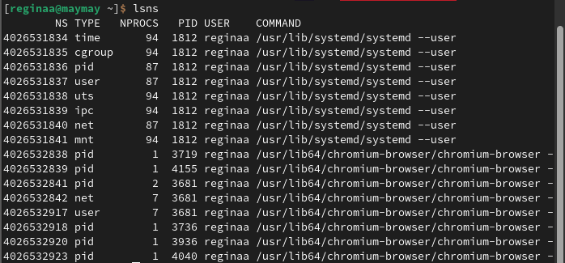
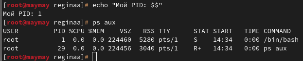
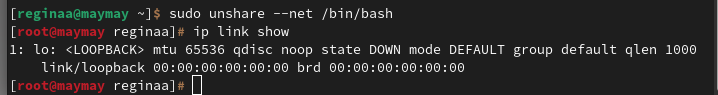
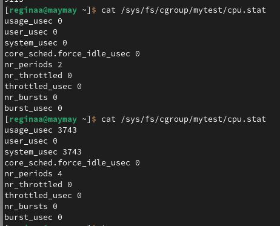
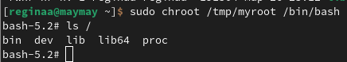

## Пара 1 - Linux-основы контейнеризации 

Блок 1 Namespaces (изоляция процессов)

Для начала пыталась вспомнить теорию, которую как всегда забыли 
Namespaces это такой механизм, который позволяет "обмануть" процесс, заставляет его думать, что он один в системе. (это очень грустно звучит) Каждый namespace изолирует определенный аспект системы.

В начале посмотрела namespace текущего терминала, а затем всех namespace в системе, командой lsns. В выводе можно увидеть сколько изолированных пространств уже создано системой. (скриншот 1)
Затем запустила bash в новом PID namespace с помощью unshare убедилась, что процесс стал PID 1, а ps aux показал только процессы внутри изоляции (скриншот 2)
Значит процесс думает, что он единственный в системе.

Потом запустили bash в изолированной сети. Внутри выполнили ip link show и увидели только loopback (lo), никаких реальных сетевых карт, сеть полностью отрезана от хоста.

Блок 2 Cgroups

Здесь учились ограничивать ресурсы. Создала свою группу процессов и ограничила использование центрального процессора "не больше 20% CPU". Записала лимит 20000 100000 в файл cpu.max. Таким образом лимит установлен.

Вот здесь я немного тупила... Запустила программу stress-ng, которая грузит процессор. Но не могла понять почему он грузит его с такой задержкой, никак не могла поймать время когда шла нагрузка из-за чего не хватало аргументов для перемещения в группу. Потом поняла как словить тайминг и  поместила её в созданную группу. (всё еще не поняла почему так криво отображается вывод) 
Открыла top и увидела, что нагрузка упала до 20%, хотя программа пыталась съесть все ядра. Лимит сработал. ( скриншот 3)

Блок 3 Chroot

Создала отдельную папку /tmp/myroot, которая будет казаться программе корнем всей системы. Положила туда bash и ls.
Сначала ls не работал — ругался на отсутствие библиотек, поэтому посмотрела командой ldd, какие библиотеки нужны, и всех их скопировала.Зашли внутрь этой коробки командой chroot и выполнили ls /. Увидела только те папки, которые сама создала (bin, lib, lib64, proc, dev) — ничего от настоящей системы не видно. Полная изоляция файлов.

К сожалению это весь маскимум который я успела сделать за время, которое нам было выдано, потому что у нас было 6 пар и дедлайн по Серову.. Все остальные работы будут сделаны к следующему занятию. Теперь я пошла плакать потому что не успела по дедлайну на пару минут (╥﹏╥)

## Результаты выполнения

### 1. Namespaces
**Список всех namespace:**

**PID namespace (внутри PID=1):**

**NET namespace (только lo):**

### 2. Cgroups
**Лимит CPU 20%:**

### 3. Chroot
**Изоляция файловой системы:**
