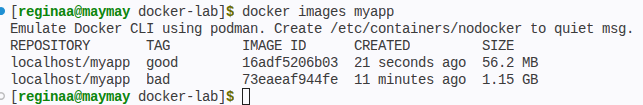
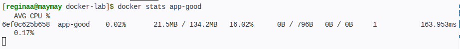
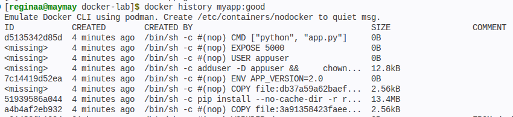

## Пара 2 - Docker: образы, Dockerfile, запуск

Блок 1 — Первый Dockerfile

Создала простое Flask-приложение в папке ~/docker-lab. Написала app.py с двумя маршрутами и requirements.txt.

Собрала "плохой" образ. Размер получился огромный — 1.15 GB, потому что использовала полный образ Python, скопировала абсолютно файлы из директории (включая ненужные). 

Блок 2 — Multistage build 

Затем для сравнения собрала второй хороший образ, который отличался тем что в нем применяем multistage сборку с минимальным Alpine-образом, .dockerignore и непривилегированным пользователем, уменьшая размер и повышая безопасность. Размер образа сократился до 56.2 МБ. Класс (1 скриншот)

В ходе работы изменяла некоторые файл и команды тк работала в эмуляции докера через подман

Потом запустила контейнер с ограничениями ресурсов: 128 MB RAM, 0.5 CPU, а командой curl и stats убедилась, что приложение отвечает и лимиты работают ( 2 скриншот)

Блок 3 — Исследование образа

Посмотрела слои обоих образов через docker history (3 скриншот)
У хорошего образа слоев больше, но зато логичнее: зависимости кэшируются отдельно, код копируется позже, запуск от непривилегированного пользователя.

Через docker inspect посмотрела RootFS 8 слоев с уникальными хэшами.

Потом попробовала установить dive для визуализации, но в моем любимом ред осе пакет не установился через dpkg (что логично), пришлось использовать стандартные команды.

Блок 4 — Docker Hub

Самое легкое в лабе

На парах с мацуевым мы уже регались на докер хаб, поэтому я просто затегировала образ и запушила. Ну и проверила что образ опубликован.

## Результаты выполнения

### 1. Dockerfile
**Сравнение размеров:**

### 2. Multistage build
**Лимиты CPU/RAM:**

### 3. Исследование образа
**Слои гуд образа:**

 
### URL на докер хаб 
https://hub.docker.com/u/maymayy