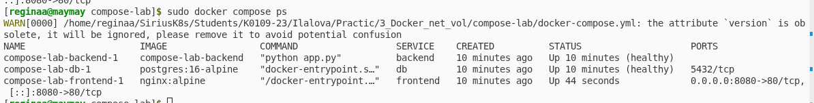
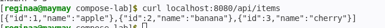
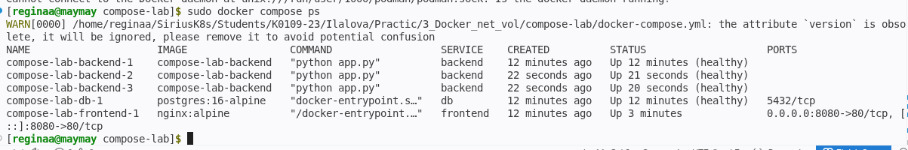

## Пара 3 - Docker: сети, volumes, docker-compose

Блок 1 - Docker networking

В начале работы просто посмотрела список доступных сетей и посмотрела  инфу о мосте, точнее сети по умолчанию bridge. Затем создала свою изолированную сеть app-network и запустила в ней контейнер с PostgreSQL. После этого запустила временный контейнер с Alpine в той же сети и проверила, что контейнеры видят друг друга по имени, пакеты все дошли. Контейнер без моей сети не смог найти db по имени, что подтвердило изоляцию.

Блок 2  Volumes и persistent data

Для сохранения данных я создала том pgdata и запустила PostgreSQL с этим томом. Внутри контейнера создала тестовую таблицу и добавила запись. После удаления контейнера и запуска нового с тем же томом данные сохранились, что подтвердило работу persistent storage  (система хранения данных на длительный срок)

Блок 3 - docker-compose и многоконтейнерное приложение

Я создала проект с тремя сервисами: база данных PostgreSQL, бэкенд на Flask и фронтенд на nginx. В бэкенде написала два маршрута: один возвращает данные из базы, второй используется для healthcheck. Для фронтенда настроила nginx, который проксирует запросы к API на бэкенд.

В docker-compose.yml описала все три сервиса с healthcheck для каждого, зависимостями и томом для базы данных. Запустила стек, все контейнеры успешно поднялись в статусе healthy. (скриншот 1)
Создала в базе данных таблицу и добавила три записи. Проверила API через curl на порту 8080 и получила корректный JSON с данными. (скриншот 2)

Затем выполнила масштабирование бэкенда до трёх экземпляров. Очень удобная штука, позволяет увеличить количество работающих копий одного сервиса. 
После масштабирования все три контейнера работали, и API продолжал корректно отвечать.

Блок 4 - Итог

В ходе работы я изучила ну или пыталась вспоминать сети Docker, работу с томами, подняла многоконтейнерное приложение через docker-compose, настроила healthcheck и выполнила масштабирование сервиса.
В этой лабе особо ошибок не было и славу богу, больше всех понравилась 

## Результаты выполнения

### 3. docker-сompose
**Поднятые сервисы**

**Данные из Бд через nginx:**

**+3 экземпляра бэкенда:**

