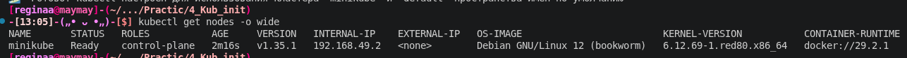
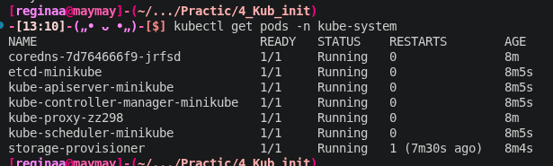
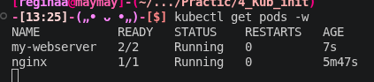
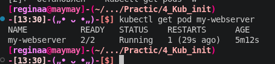

## Пара 4 - Kubernetes: установка кластера, первые поды

Блок 1 - Состояние кластера

Перед началом установила minikube и kubectl, хоть мы с ними работали на других парах, но я сносила редосик, поэтому в системе их не было

Kubernetes в моём понимании (которое может быть не точным) это система для управления контейнерами, которая условно решает как запустить контейнер. Следит за их состоянием, перезапускает если упали и все такое

Через миникубик запустила кластер и проверила, что кластер живой. Нод миникуба в статусе Ready всё ок (скриншот 1)
Посмотрела поды (etcd, apiserver, scheduler, controller-manager, coredns) и что они все запущены, без них ничего не будет работать (скриншот 2)

Потом попробовала посмотреть конфиги подов через ls etc/kubernetes/manifests/, но у меня не было такой папки. Как мне объяснил любимый дипсик данная папка существует только в кластерах, установленных через kubeadm (ну или похожие инструменты) где компоненты контрол плане запускаются как static pods
Ну вот а я запускала все через миникуб, поэтому все компоненты это просто докер-контейнеры которые управляются самим миникубом.
Вообщем я залезла внутрь миникуба minikube ssh и посмотрел все контейнеры 

Далее посмотела список всех объектов через kubectl api-resources 
pods, services, nodes. У каждого есть короткое имя (po, svc, no), удобно для быстрого ввода.

Отвечая на вопрос в kube-system всегда должны быть Running: kube-apiserver, etcd, kube-scheduler, kube-controller-manager, coredns, kube-proxy.

Блок 2 - Первый Pod 

Запустила под. Сначала был ContainerCreating (образ качался), а через пару секунд Running ура. Зайдя внутрь пода его параметры:
 - hostname → nginx 
 - env | grep KUBE → переменные с адресом API сервера (10.96.0.1) 
 - ps aux → только nginx и моя сессия, процессов ОС не было 
 - ip addr → только lo и eth0 с IP 10.244.0.3

Посмотрела логи запуска и как nginx поднял 20 worker процессов под все ядра. И последнее в этом блоке посмотрела еще одну команду для диагностики, а имено журнал событий пода. Типо что происходило с моим подом в хронологии (назначили ноду, kubelet начал скачивать докер образ и так далее)

Ещё увидела QoS: BestEffort - без requests/limits под убьют первым при нехватке ресурсов (бедный мой под...)

Блок 3 - Pod через YAML

Создала pod.yaml с готовым кодом в котором два контейнера: nginx и sidecar на busybox, так же пишет дату в файл /var/log/access.log. Добавляет общий volume типа emptyDir, чтобы контейнеры могли шарить файлы, прописан probes и ограничения по CPU и памяти. 

Применила файл - под запустился со статусом 2/2 Running, то есть оба контейнера работают. Nginx работал ещё когда подняли его, но решила показать все в одном скрине (скриншот 3)

Попробовала посмотреть логи sidecar-контейнера обычной командой, но вывод был пустым. Поэтому логи нужно читать напрямую из файла внутри контейнера.

Ещё зашла в контейнер с nginx и попробовала выполнить kubectl и получила ошибку, что команда не найдена. Как я поняла это потому что kubectl есть только на хосте, внутри прикладных контейнеров его нет. Выполнила команду на хосте через kubectl увидела нормальный вывод: список подов, логи из файла sidecar и полный YAML пода с добавленными Kubernetes'ом полями.

Блок 4 - Самовосстановление 

Убила nginx внутри контейнера и включила kubectl get pods -w  и посмтрела на статус который стал 1/2 Running (один контейнер перезапускается), через пару секунд снова 2/2. Счётчик RESTARTS увеличился с 0 до 1. (скриншот 4)

Ещё один ответ на вопрос: Pod не удалился, потому что pod это абстракция над контейнерами. Перезапуском занимается kubelet на ноде: он следит за PID 1 и livenessProbe.

## Результаты выполнения

### 1. Состояние кластера
**Ноды кластера**

**Поды в kube-system:**

### 3. Pod через YAML
**Поднятые контейнеры:**

### 4. Самовосстановление
**Счётчик рестартов **

P.s классный у меня терминал? обожаю его