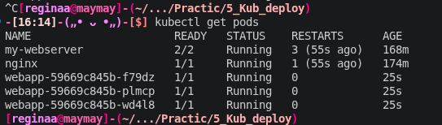
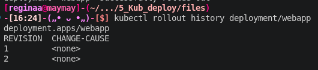
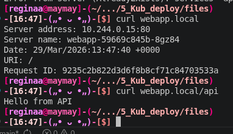

## Пара 5 -  Kubernetes: Deployment, Service, Ingress

Блок 1 - Deployment 

Создала деплоймент webapp на 3 реплики. (скриншотик 1)

В конфиге прописана стратегия RollingUpdate с параметрами maxSurge: 1 и maxUnavailable: 0. Это значит, что при обновлении K8s сначала поднимает один новый под, ждет его готовности, и только потом гасит старый.
Для проверки готовности есть readinessProbe без неё кубернетес может начать лить трафик на приложение, которое еще не успело прогрузиться.В общем после создания через kubectl get rs увидела, как Deployment управляет наборами реплик (ReplicaSet). 

Блок 2 - Service + Rolling Update

Создала сервис типа NodePort на порту 30080. Это чтобы 3 пода были доступны по одному адресу. Запустила бесшовное обновление, ну обновление без перезагрузки. Потом запустила в соседнем терминале бесконечный цикл с curl. Благодаря тому что сервис как бы "знает", какой под уже готов, а какой еще обновляется, связь не обрывалась
Пока в одном окне крутились запросы, в другом написала kubectl set image на версию latest. В консоли было видно, как имена хостов (ID подов) начали меняться. Хотя когда анализируешь это кажется все понятно, но в моменте запуталась в каком терминале , что вводить и че смотреть
Потом попрактиковалась с откатами: через rollout history посмотрела историю деплойментов, потом вернула версию до прошлого состояния через undo (скриншотик 2)

Блок 3 - Ingress

Создала yml с ingress. Как аналогия он администратор и нужен, чтобы не открывать кучу разных портов для каждого микросервиса. Он смотрит на URL:

-Если в адресе есть /api, он отправляет запрос в бэкенд.

-Если просто /, то на фронтенд.

Это позволяет держать всё приложение за одним стандартным 80-м портом и распределять трафик по путям. Мега удобно

Ну вот после создания добавила запись для теста в /etc/hosts чтобы комп понимал адрес и отправила запрос curl (скриншот 3)

Блок 4 - Сравнение типов Service

Я не поняла устно это пойти вам рассказать про разницу? ну я тут тоже написала на всякий

ClusterIP виден только внутри кластера. Удобно для баз данных, чтобы никто снаружи не залез. Проверила через временный под с `alpine`, `wget` отработал.
NodePort Открывает порт на всех железных (или виртуальных) нодах. Грубо, но работает для тестов.
Команды не вводила и не проверяла но LoadBalancer самая наверное крутая штука, которая заказывает реальный балансировщик у облачного провайдера (AWS/GCP).

## Результаты выполнения

### 1. Deployment 
**3 пода webapp**

### 2. Service + Rolling Update
**Список ревизии**

после undo revision 2 и 3 

### 3. Ingress
**Ответы на curl**

 
