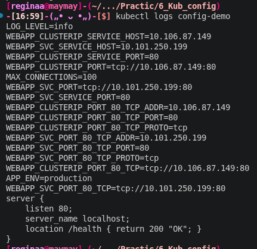
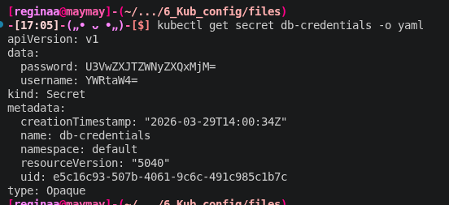
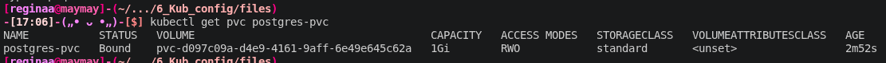
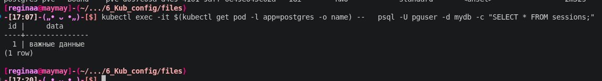

## Пара 6 - Kubernetes: ConfigMap, Secret, PersistentVolume

На этой лабе я уже устала, в воскресенье надо кушать мороженое и отдыхать , а не делать лабы =((((

Блок 1 - ConfigMap

Создала ConfigMap ,app-config с переменными окружения и отдельный конфиг из файла nginx.conf. В манифесте пода короче протестировала сразу три способа доставки данных через оптом, поштучно и монтированием конфига как реального файла в /etc/config. Через логи пода убедилась, что приложение видит и переменные, и файл. Теперь для смены настроек не нужно пересобирать Docker-образ - достаточно поправить конфиг в кубере. (1 скриншот)

Блок 2 - Secrets

Создала секретик.., ну ладно secret для базы данных и сразу проверила его а-ля на прочность. При просмотре через kubectl get secret -o yaml данные выглядят зашифрованными, но на самом деле это обычная кодировка base64. Я легко декодировала пароль прямо в терминале одной командой ай-ай. Поэтому можно сделать важный вывод, что по умолчанию секреты в K8s защищают только от случайного взгляда в монитор. Для реальной безопасности в проде нужно настраивать шифрование в etcd или подключать внешний Vault. (2 скриншот)

Блок 3 - PersistentVolume

Короче надо запустить посгрю с постоянным хранилищем. Создала PVC (PersistentVolumeClaim), который автоматически занял диск в миникубе. Проверила статус Bound это значит, что ваши данные никуда не улетят после перезагрузки. Ну вот это мы щас и проверим 

Я зашла в под, создала таблицу с записями, а потом полностью удалила этот под. Deployment тут же поднял новый экземпляр, и благодаря привязанному PVC все данные в базе остались на месте.Уху. А ведь без этой связки база бы просто обнулилась при любом сбое или обновлении пода. (4 скриншот)

Короче я вроде поняла, почему хранить конфиги и данные внутри образа фиговая идея. ConfigMap и Secret дают гибкость (один образ для теста и прода), а PersistentVolume превращает «одноразовые» контейнеры в полноценную инфраструктуру для баз данных.

## Результаты выполнения

### 1. ConfigMap
**3 способа работают:**

### 2. Secrets
**Данные в base64:**

### 3. PersistentVolume 
**Статус Bound**

**Проверка сохранности данных**
