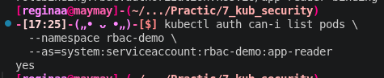
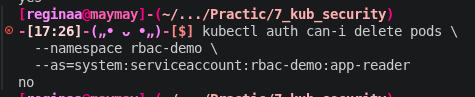
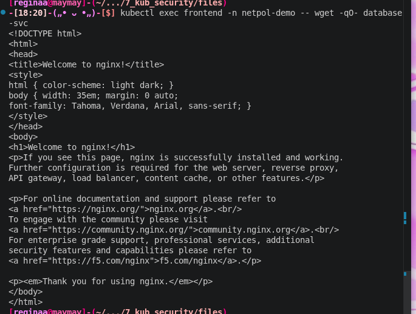
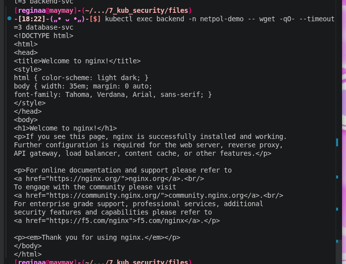
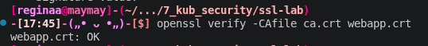
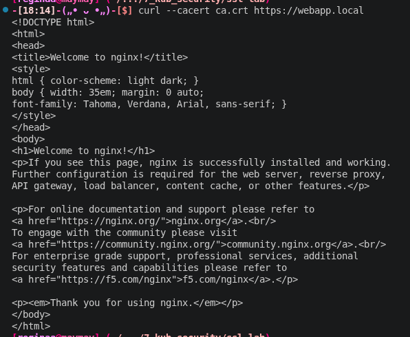

## Пара 7 - Безопасность Kubernetes: RBAC, NetworkPolicy, Falco

Блок 1 - RBAC

Короче надо было разобраться с минимальными привилегия, чтобы приложение не офигивало, поэтому вот создала ServiceAccount app-reader и ограничила его ролью, которая разрешает только просмотр списка подов в конкретном namespace rbac-demo. 

Потом это проверила через kubectl auth can-i: удалять поды или лезть в соседние пространства имен нельзя . система выдает forbidden. Внутри тестового пода убедилась, что даже если получить доступ к контейнеру, возможности будут ограничены только чтением, и например разнести кластер кому-то не выйдет. (1 скриншот)

Блок 2 - NetworkPolicy
Развернула цепочку Frontend → Backend → Database и сначала применила политику default-deny-ingress, которая просто вырубила всю сеть. Затем прописала правила: фронтенд принимает трафик снаружи, бэкенд - только от фронтенда, а база - только от бэкенда. Проверила через wget: если пытаться достучаться из фронтенда сразу в базу, запрос падает по таймауту. Это и есть правильная сегментация трафика. (2 скриншот)

Блок 3 - TLS Сертификаты и OpenSSL

Божеее вот тут я буду опять ныть. 
С начало сгенерировала корневой ключ, создала запрос на сертификат (CSR) для домена webapp.local и сама же его подписала. Весь этот набор данных упаковала в TLS Secret и хотела подключить к Ingress.

Но я не учла тот факт, что в 5 лабе мы уже создавали Ingress с таким же именем хоста. В моменте попыталась просто заменить имя добавив ещё одну букву, но естественно это не помогло ведь сертификат был для другого. Я ещё как назло до этого момента думала " ой какие не сложные были 4-6 лабы. Щас эту доделаю и пойду гулять"

А в итоге я с начало не сдавалась и попыталась переделать ключ и сертификат для нового webaapp.local. Но ничего не получилось, пришлось удалить нафиг и сделать заново.

Короче после правки /etc/hosts проверила соединение через curl --cacert ca.crt: всё работает по защищенному протоколу HTTPS. Также декодировала secret обратно из base64, чтобы проверять срок годности сертификата прямо в терминале через openssl x509. (3 скриншот)

## Результаты выполнения

### 1. ConfigMap
**Вывод yes**

### 2. Secrets
**Вывод no:**

### 3. PersistentVolume 
**200 OK**

**timeout**

**webapp.crt: OK**

**ответ от nginx**

