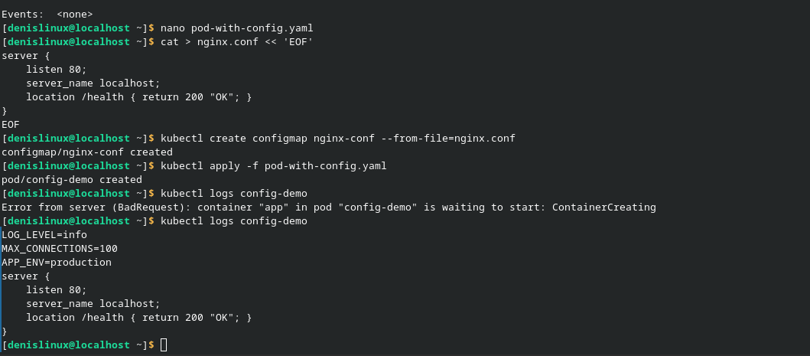
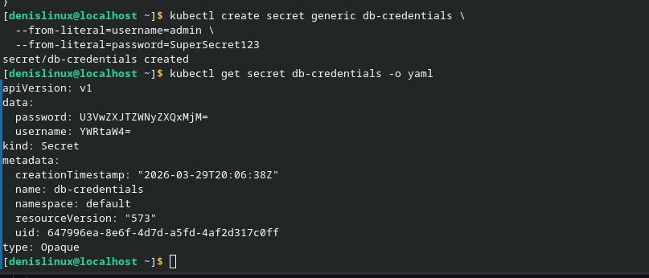
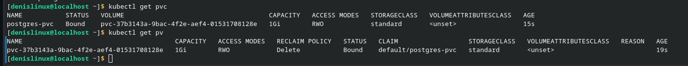
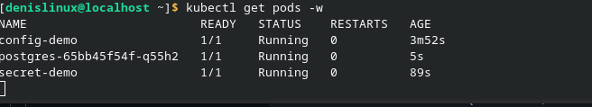
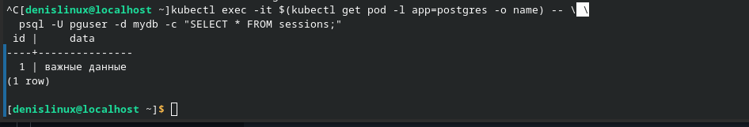

## Что должно быть сделано к концу пары ✅
 - Создать ConfigMap и передать в pod как env и как файл
 - Создать Secret и убедиться что он в base64, но не зашифрован в etcd
 - Запустить PostgreSQL с PersistentVolumeClaim
 - Доказать что данные сохранились после удаления пода
 - Использовать envFrom для загрузки всего ConfigMap сразу
 - Пояснить: почему Secret небезопасен по умолчанию и что делать

в самой работе я Создал ConfigMap и передал его в pod через env, envFrom и файл + 
оздал secret и проверил, что он хранится в base64
Запустил postgre , проверил сохранение данных после удаления подиков
## Скриншоты

