## Что должно быть сделано к концу пары ✅
 - Создать ServiceAccount с ограниченными правами (только read pods)
 - Убедиться что SA не может удалять поды (kubectl auth can-i)
 - Создать NetworkPolicy default-deny-all и разрешить только нужный трафик
 - Проверить изоляцию — один под не видит другой
 - (Бонус) Запустить Falco и сгенерировать alert при входе в контейнер

 Что сдать преподавателю
kubectl auth can-i list pods -n rbac-demo --as=system:serviceaccount:rbac-demo:app-reader → yes
kubectl auth can-i delete pods -n rbac-demo --as=system:serviceaccount:rbac-demo:app-reader → no
kubectl exec frontend -- wget database-svc → timeout (NetworkPolicy работает)
kubectl exec backend -- wget database-svc → 200 OK
openssl verify -CAfile ca.crt webapp.crt → webapp.crt: OK
curl --cacert ca.crt https://webapp.local → ответ от nginx (TLS работает)

В ходе работы, я случайно скопировал файл rbac.yaml как rbac.yaml: и долго думал че не так
а так лаба инетересная

## Скриншоты

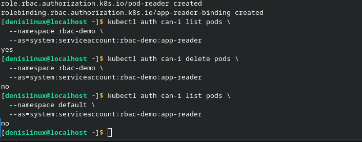
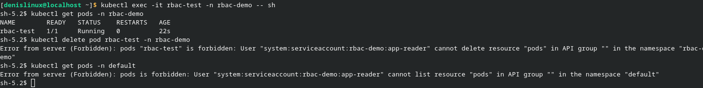
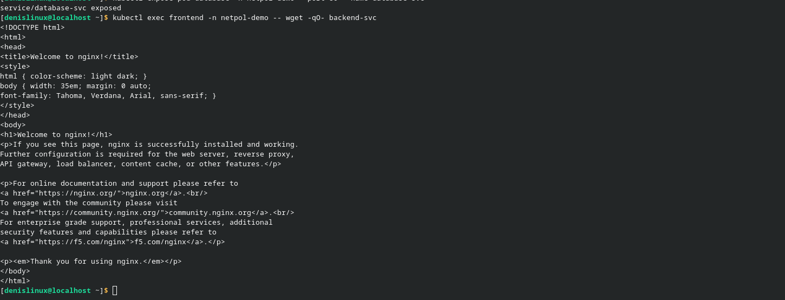
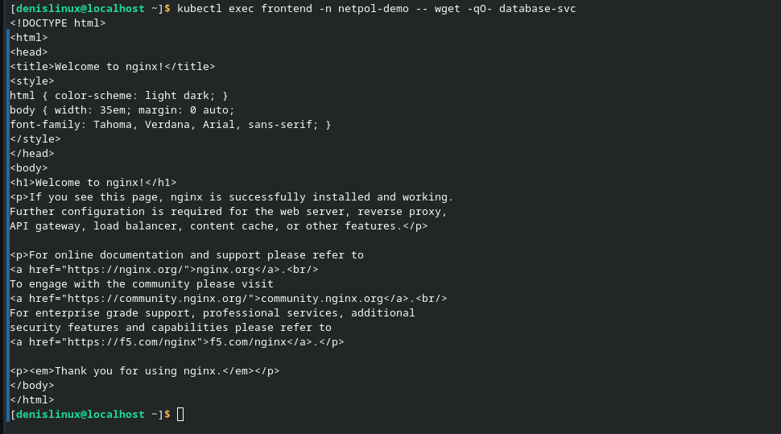
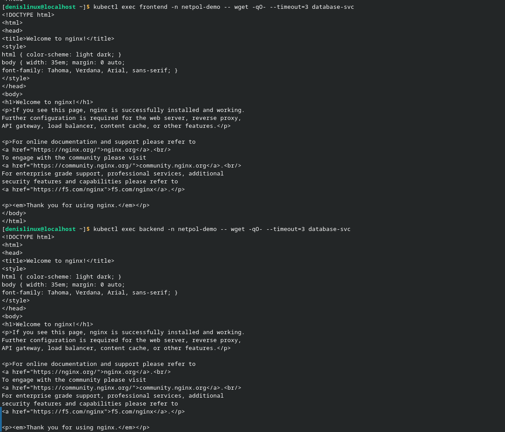
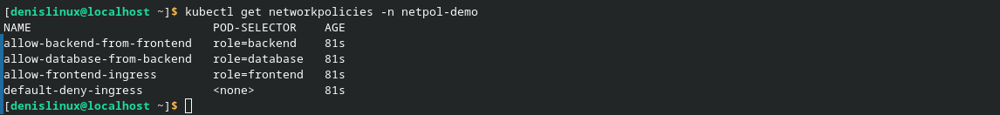
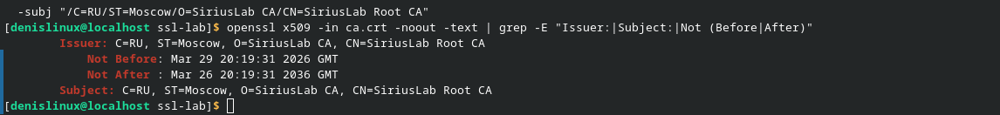
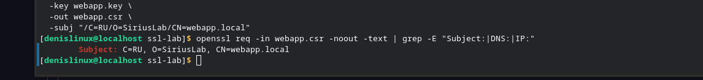
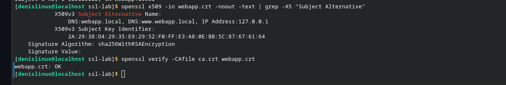
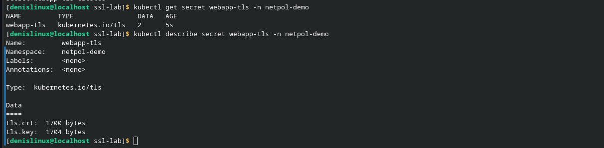
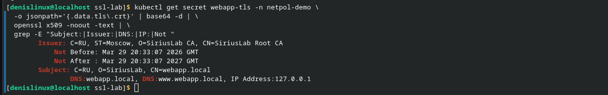