# Лабораторные работы: Docker и Docker Compose

## Пара 2 – Docker: образы, Dockerfile, запуск

**Что выполнено:**
- Написан Dockerfile для Python-приложения (Flask)
- Собран образ, запущен контейнер
- Применён multistage build (размер образа уменьшен более чем в 3 раза)
- Контейнер запущен с ограничениями CPU (0.5) и RAM (128M)
- Просмотрены слои образа (`docker history`, `docker inspect`)
- Использован `.dockerignore`
- Образ опубликован на Docker Hub

## Пара 3 – Docker: сети, volumes, docker-compose

**Что выполнено:**
- Создана bridge-сеть, проверено разрешение имён
- PostgreSQL с persistent volume (данные сохранены после перезапуска)
- Написан `docker-compose.yml` для трёх сервисов (nginx → Flask → PostgreSQL)
- Стек поднят, сервисы имеют healthcheck
- Выполнено масштабирование backend до 3 экземпляров
- Проверена работа через nginx (`curl localhost:8080/api/items`)

## Пара 4 – Kub_init
 - роверить состояние кластера (все ноды Ready, все компоненты healthy)
 - Запустить первый под и зайти в него
 - Изучить что внутри пода (hostname, env, filesystem)
 - Создать Pod вручную через YAML
 - Убедиться что kubelet перезапускает упавший контейнер
 - Посмотреть системные поды Control Plane
 - Написать отличие Pod vs Container (1–2 предложения письменно)

## Пара 5 – Kub deploy
 - Создать Deployment с 3 репликами
 - Сделать rolling update без даунтайма (проверить через curl в цикле)
 - Откатиться на предыдущую версию (rollout undo)
 - Создать Service типа ClusterIP и NodePort
 - Настроить Ingress с rules по пути (/api → backend, / → frontend)
 - Объяснить разницу между ClusterIP / NodePort / LoadBalancer
---

## Скриншоты выполнения

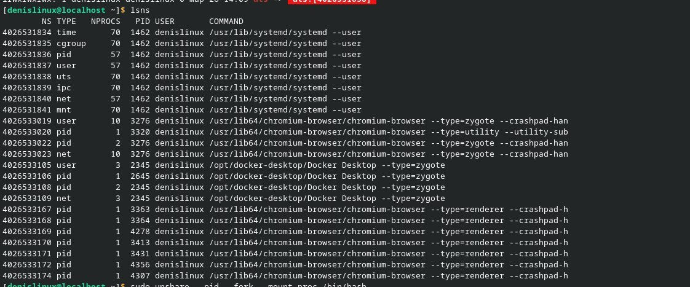
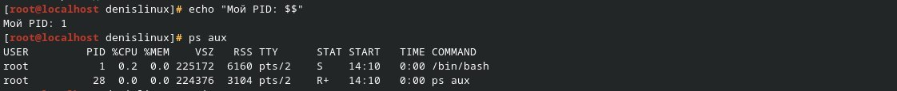
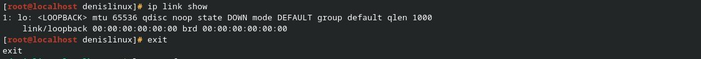
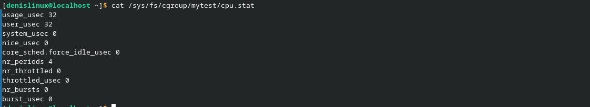
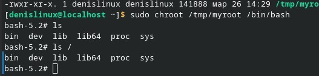

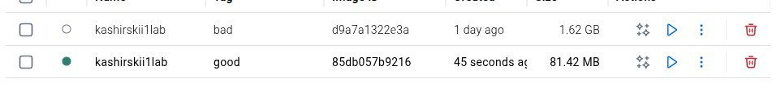
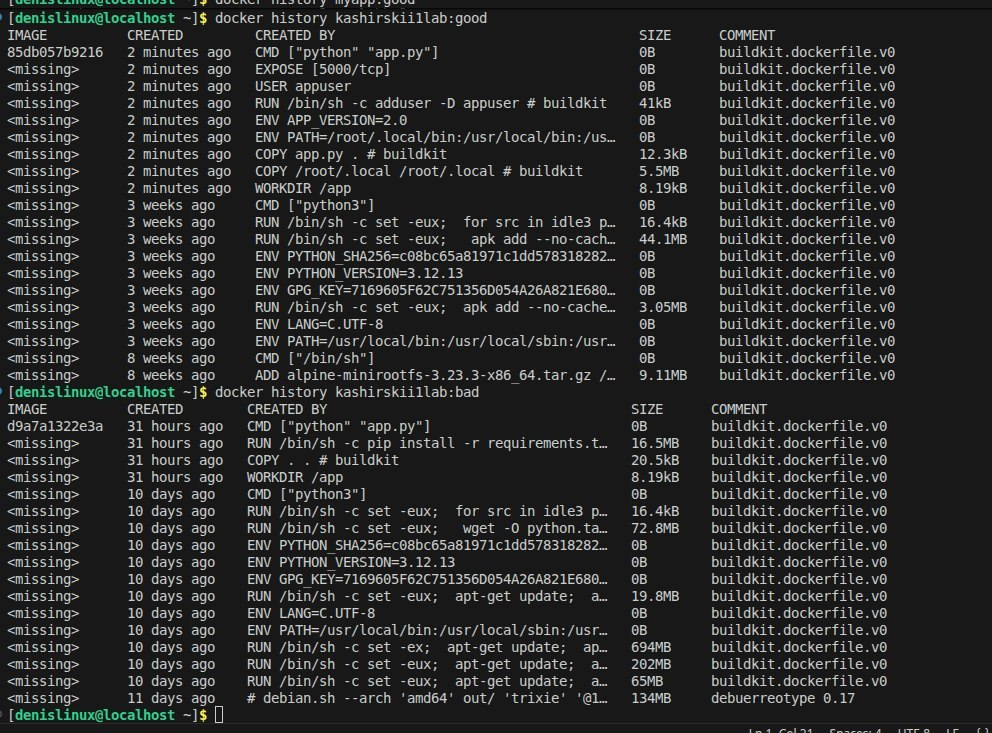

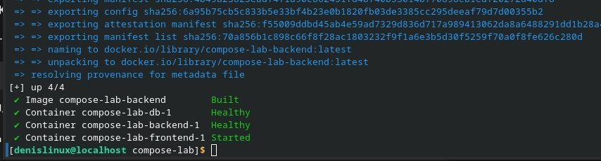

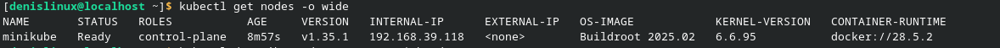
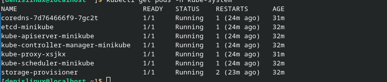
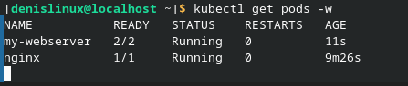
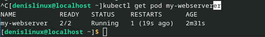
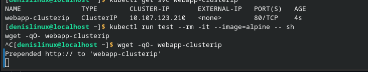
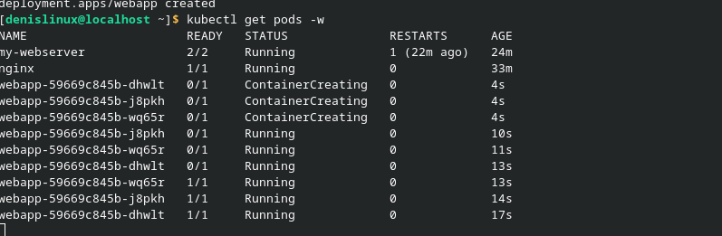
