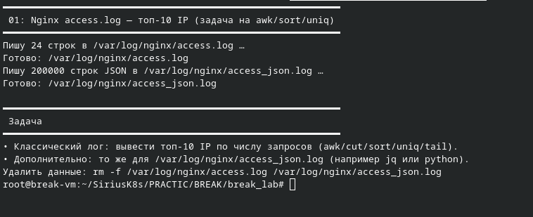

## 1 LAB

В первой лабе была проблема что в скрипте неверно прописан код 
В строке с weights используется переменная i, но цикл идёт по _

Необходимо было исправить это и запустить скрипт при помощи судо прав 

Сначала необходимо вывести 10 айпишников по запросу 

Потом была задача вывести топ 10 из джосона на моей виртуалке не было jq для этого поэтому пришлось обходиться 
питончиком, обычным скриптом 

После выполнения всех заданий произошла очистка

## 2 LAB

во второй лабе у меня полностью полетела комадная строка и в ней было ничего не разобрать 
сразу был проверен днс и вместо вывода files dns выводилось files понятно что он не воркиш с помощью регулярного выражения это было проверено 
^hosts: Строка начинается с hosts:Целевая настройка именно для резолвинга имён
.* Любые символы (пробелы, табы) Учёт форматирования (в файле могут быть лишние пробелы)
files Ключевое слово "files" Всегда должно присутствовать — это проверка /etc/hosts
.* Любые символы после Захватывает dns, если он есть, или пустоту, если удалён

далее был добавлен днс по дефолту 8.8.8.8 и 1.1.1.1

далее произошла тема, что вывод комадной строки был просто не понятен и дальнейшая работа не могла так продолжаться поэтому я выполнил откат через готовый конфиг и проверил что все воркиш 

## 3 LAB 

самая интересная лаба была именно третья, так как сам постоянно очищаю свой диск и маленький опыт уже в этом есть, правда для этого я использовал графические утилиты

нужно посмотреть нашу память  и посмотреть какие файлы занимают им оказывается break_lab который мы удаляем
так как есть вероятность что есть фоновый процесс который удерживает этот файл необходимо его стопнуть

в конце получаем что памяти правда стало больше 

## 4 LAB 

4 лаба была самая не интересная из за проблем с выводом строки нормально было тяжело увидеть и получилось починить только 3 бинарника из 5-6 

основные проблемы были что 

mystery_no_exec Нет бита исполнения - chmod +x mystery_no_exec
mystery_bad_interpreter Неверный - shebang sudo sed -i 's
mystery_truncated_elf Усечённый ELF - sudo cp /bin/ls mystery_truncated_elf mystery_dyn
Нет interpreter Пропустить или установить gcc+patchelf
not_a_binary нет shebang - sudo sed -i '1i#!/bin/bash' not_a_binary

## 5  LAB

здесь проблема что сервис сразу падает посмотрев логи можно увидеть в чем проблема там где будет написано 0 значит не работает 
с помощью гпт стало понятно в чем ошибка ну и собственно файйл был исправлен, выполнена перезагрузка и после этого все работает

