# Lab 3

## Блок 1. Работа с Docker networking

В первом блоке лабораторной работы была изучена работа Docker-сетей и проверено взаимодействие контейнеров внутри одной пользовательской сети.

Сначала был выведен список доступных Docker-сетей:

```
docker network ls
```

После этого была просмотрена информация о стандартной сети bridge:

```
docker network inspect bridge
```

Далее была создана новая пользовательская 
bridge-сеть с именем app-network

```
docker network create --driver bridge app-network
```

После создания сети в неё был запущен контейнер с PostgreSQL:

```
docker run -d --name db --network app-network -e POSTGRES_PASSWORD=secret postgres:16-alpine
```

Затем для проверки сетевого взаимодействия был запущен временный контейнер на базе Alpine Linux, подключённый к той же сети:

```
docker run -it --rm --network app-network alpine /bin/sh
```
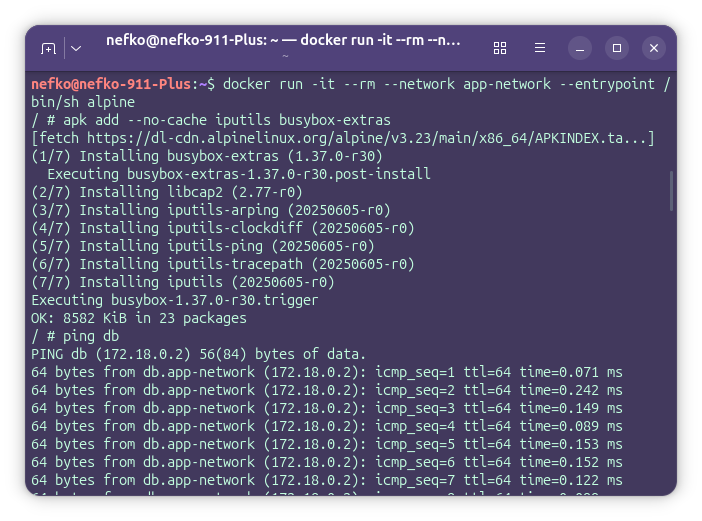
После входа в контейнер были установлены необходимые утилиты:

```
apk add --no-cache iputils busybox-extras
```

Затем были выполнены команды проверки связи:
```
ping db
nc -zv db 5432
```
Команда ping db показала, что контейнер db успешно определяется по имени внутри сети app-network.
Команда nc -zv db 5432 подтвердила, что порт 5432, на котором работает PostgreSQL, доступен из другого контейнера в этой же сети.

Это означает, что Docker автоматически предоставляет контейнерам внутри одной пользовательской сети возможность обращаться друг к другу по имени через встроенный DNS-механизм.
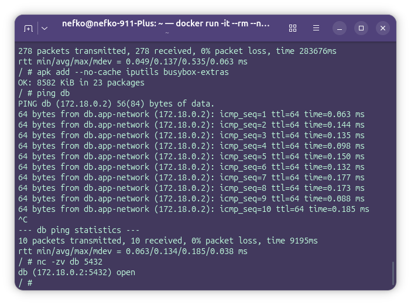

После этого была проведена дополнительная проверка из контейнера, который не подключён к сети app-network:

docker run -it --rm alpine /bin/sh

Внутри контейнера была выполнена установка утилиты ping:

apk add --no-cache iputils

Затем была выполнена команда:

ping db

В данном случае имя db не было найдено, так как контейнер находился вне пользовательской сети. Это подтверждает, что сетевое взаимодействие по имени работает только между контейнерами, подключёнными к одной и той же Docker-сети.

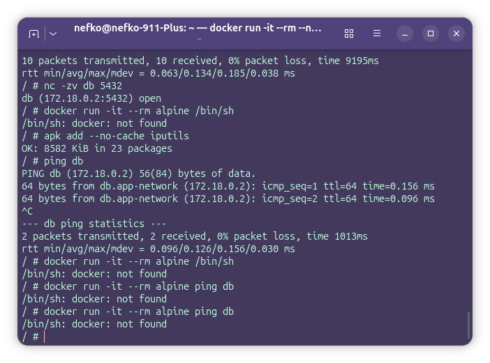

Итог

В ходе выполнения первого блока была создана собственная bridge-сеть Docker, в которой были размещены контейнеры. Проверка показала, что контейнеры внутри одной сети могут обмениваться данными и находить друг друга по имени. Контейнеры, не подключённые к этой сети, не имеют доступа к таким именам и не могут взаимодействовать с ними напрямую.

## Блок 2. Работа с Docker Volumes и сохранением данных

Во втором блоке лабораторной работы была изучена работа Docker Volumes и проверена возможность сохранения данных после удаления контейнера.

Сначала был создан отдельный Docker volume с именем `pgdata`:

```bash
docker volume create pgdata
```

Далее был запущен контейнер PostgreSQL с подключением созданного volume:

```bash
docker run -d \
  --name postgres-persistent \
  -e POSTGRES_DB=mydb \
  -e POSTGRES_USER=user \
  -e POSTGRES_PASSWORD=pass \
  -v pgdata:/var/lib/postgresql/data \
  postgres:16-alpine
```

После запуска контейнера в базе данных были созданы тестовые данные:

```bash
docker exec -it postgres-persistent psql -U user -d mydb -c "CREATE TABLE items (id SERIAL, name TEXT); INSERT INTO items VALUES (1, 'test');"
```

В результате в базе данных была создана таблица `items`, в которую была добавлена тестовая запись.
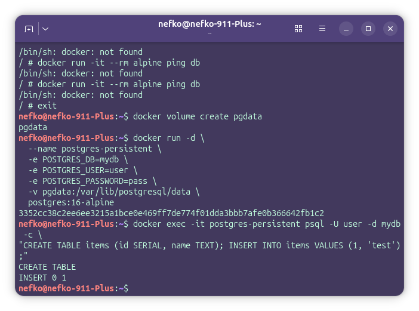

После этого контейнер был удалён, но сам volume удалён не был:

```bash
docker rm -f postgres-persistent
```

Затем контейнер PostgreSQL был запущен повторно, но уже с другим именем и с подключением того же самого volume `pgdata`:

```bash
docker run -d \
  --name postgres-restored \
  -e POSTGRES_DB=mydb \
  -e POSTGRES_USER=user \
  -e POSTGRES_PASSWORD=pass \
  -v pgdata:/var/lib/postgresql/data \
  postgres:16-alpine
```

После повторного запуска была выполнена проверка содержимого таблицы:

```bash
docker exec postgres-restored psql -U user -d mydb -c "SELECT * FROM items;"
```

Проверка показала, что ранее созданная таблица и запись сохранились. Это подтверждает, что данные PostgreSQL хранились не внутри контейнера, а в подключённом Docker volume, поэтому они не были потеряны после удаления контейнера.
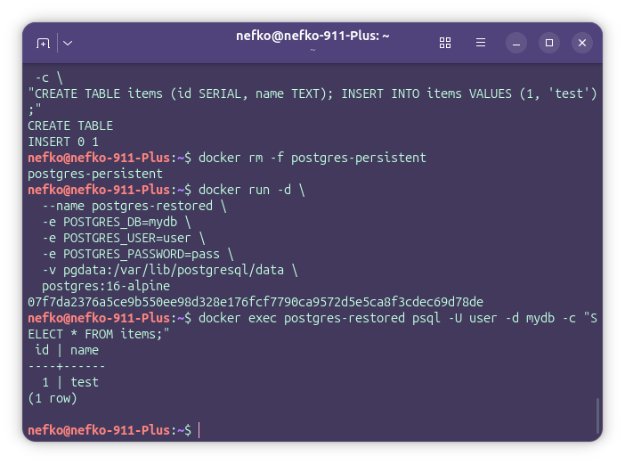

В завершение была просмотрена информация о созданном volume:

```bash
docker volume inspect pgdata
```

Эта команда позволяет увидеть параметры тома и путь, где Docker хранит его данные на хостовой системе.
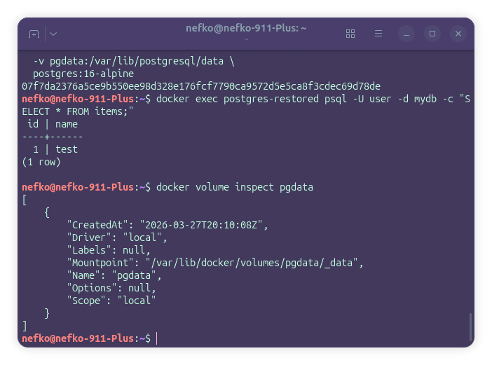

### Итог

В ходе выполнения второго блока была проверена работа Docker Volumes. Был создан отдельный том `pgdata`, подключённый к контейнеру PostgreSQL. После создания тестовой таблицы и удаления контейнера данные не были потеряны. При повторном запуске контейнера с тем же volume таблица и запись остались доступными. Это доказывает, что Docker volume используется для постоянного хранения данных и позволяет сохранять информацию независимо от жизненного цикла контейнера.

## Блок 3. Развёртывание многоконтейнерного приложения через docker-compose

В третьем блоке лабораторной работы было создано многоконтейнерное приложение, состоящее из трёх сервисов: базы данных PostgreSQL, backend-приложения на Flask и frontend-сервиса на Nginx. Все сервисы были объединены в один стек с помощью `docker-compose`.

Сначала была создана структура проекта:

```bash
mkdir ~/compose-lab
cd ~/compose-lab
mkdir -p backend frontend
```

После этого был создан backend на Flask.

Файл `backend/app.py`:

```python
from flask import Flask, jsonify
import psycopg2, os

app = Flask(__name__)

def get_db():
    return psycopg2.connect(
        host=os.getenv("DB_HOST", "db"),
        database=os.getenv("DB_NAME", "mydb"),
        user=os.getenv("DB_USER", "user"),
        password=os.getenv("DB_PASS", "pass")
    )

@app.route('/api/items')
def items():
    conn = get_db()
    cur = conn.cursor()
    cur.execute("SELECT id, name FROM items")
    rows = cur.fetchall()
    conn.close()
    return jsonify([{"id": r[0], "name": r[1]} for r in rows])

@app.route('/health')
def health():
    return {"status": "ok"}

if __name__ == '__main__':
    app.run(host='0.0.0.0', port=5000)
```

Файл `backend/requirements.txt`:

```txt
flask==3.0.0
psycopg2-binary==2.9.9
```

Файл `backend/Dockerfile`:

```dockerfile
FROM python:3.12-alpine

WORKDIR /app

COPY requirements.txt .
RUN pip install --no-cache-dir -r requirements.txt

COPY app.py .

CMD ["python", "app.py"]
```

После этого был подготовлен frontend на Nginx.

Файл `frontend/nginx.conf`:

```nginx
server {
    listen 80;

    location /api/ {
        proxy_pass http://backend:5000/api/;
        proxy_set_header Host $host;
    }

    location / {
        return 200 '
        <h1>Frontend OK</h1>
        <p>API: <a href="/api/items">/api/items</a></p>
        ';
        add_header Content-Type text/html;
    }
}
```

Далее был создан основной файл `docker-compose.yml`, который объединяет все сервисы:

```yaml
version: '3.9'

services:
  db:
    image: postgres:16-alpine
    environment:
      POSTGRES_DB: mydb
      POSTGRES_USER: user
      POSTGRES_PASSWORD: pass
    volumes:
      - pgdata:/var/lib/postgresql/data
    healthcheck:
      test: ["CMD-SHELL", "pg_isready -U user -d mydb"]
      interval: 5s
      timeout: 3s
      retries: 5

  backend:
    build: ./backend
    environment:
      DB_HOST: db
      DB_NAME: mydb
      DB_USER: user
      DB_PASS: pass
    depends_on:
      db:
        condition: service_healthy
    healthcheck:
      test: ["CMD", "wget", "-qO-", "http://localhost:5000/health"]
      interval: 10s
      timeout: 3s
      retries: 3

  frontend:
    image: nginx:alpine
    ports:
      - "8080:80"
    volumes:
      - ./frontend/nginx.conf:/etc/nginx/conf.d/default.conf:ro
    depends_on:
      backend:
        condition: service_healthy

volumes:
  pgdata:
```

После подготовки всех файлов весь стек был запущен одной командой:

```bash
docker compose up -d --build
```
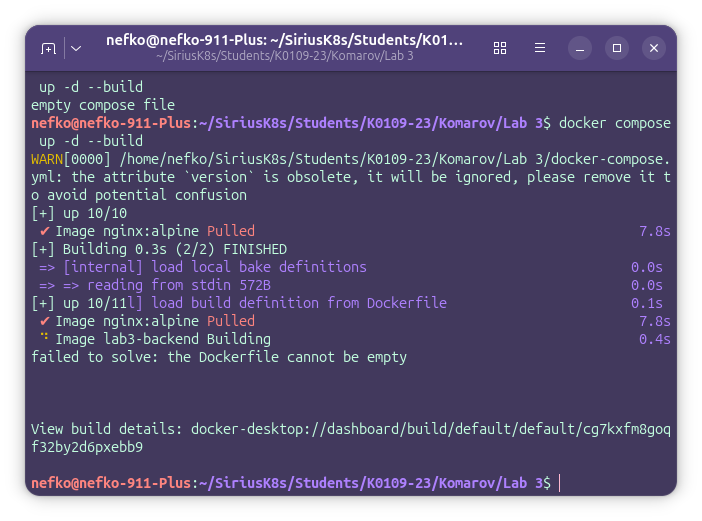

Для проверки состояния контейнеров была использована команда:

```bash
docker compose ps
```

Для просмотра логов сервисов использовалась команда:

```bash
docker compose logs -f
```
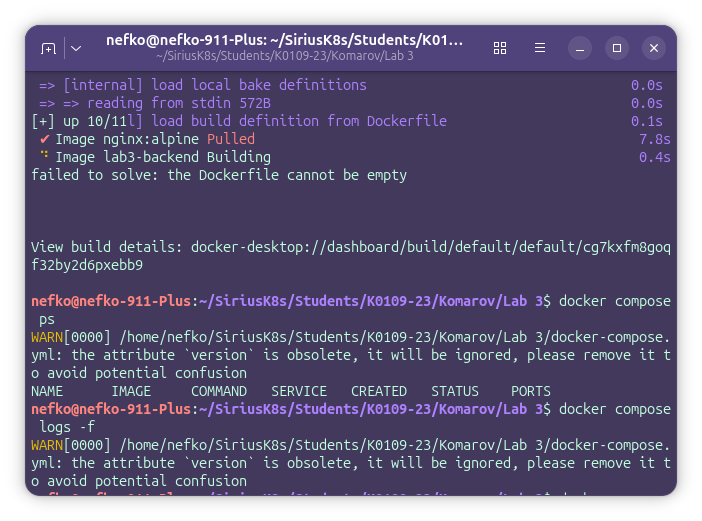
После запуска стека в базе данных были созданы тестовые данные:

```bash
docker compose exec db psql -U user -d mydb -c "CREATE TABLE IF NOT EXISTS items (id SERIAL, name TEXT); INSERT INTO items (name) VALUES ('apple'), ('banana'), ('cherry');"
```

Затем была выполнена проверка полной цепочки взаимодействия сервисов: frontend → backend → database.

```bash
curl localhost:8080/api/items
```
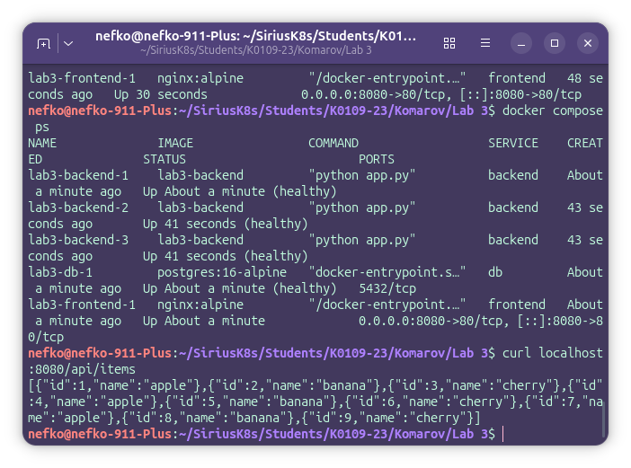

В ответ должен быть получен JSON-список объектов из базы данных. Это подтверждает, что frontend успешно передаёт запрос в backend, backend подключается к PostgreSQL и возвращает данные пользователю.

После этого было выполнено масштабирование backend-сервиса до трёх экземпляров:

```bash
docker compose up -d --scale backend=3
docker compose ps
```
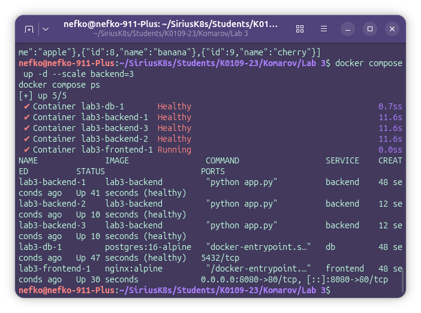
Результат показал, что backend был запущен в трёх экземплярах, что подтверждает возможность масштабирования сервисов с помощью `docker-compose`.

Для завершения работы стек был остановлен:

```bash
docker compose down
```

### Итог

В ходе выполнения третьего блока было создано многоконтейнерное приложение из трёх сервисов. Все контейнеры были объединены через `docker-compose`, настроены зависимости между сервисами, проверена работоспособность healthcheck, а также выполнено масштабирование backend-сервиса. В результате был успешно поднят полный стек приложения, в котором frontend обращается к backend, а backend получает данные из базы PostgreSQL.

## Блок 4. Итоговая проверка и очистка окружения

В заключительном блоке лабораторной работы была выполнена финальная проверка созданного окружения и его последующая очистка.

Сначала был выведен список всех Docker volumes:

```bash
docker volume ls
```
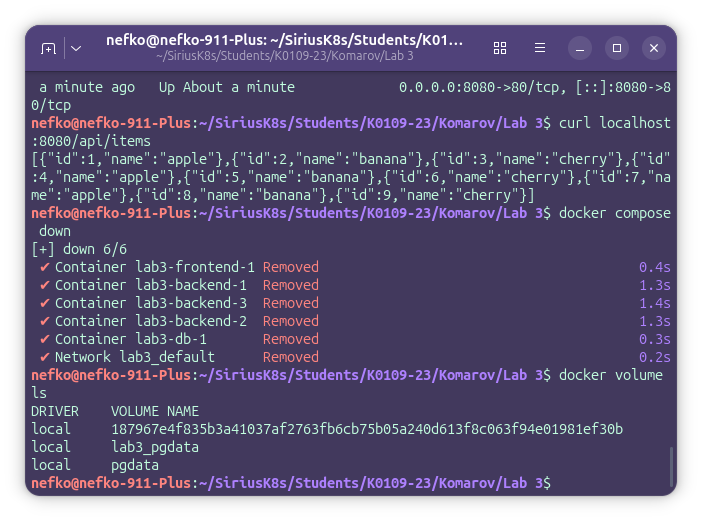
Эта команда позволяет убедиться, что в системе существуют созданные тома, которые использовались для хранения данных PostgreSQL.

После этого была выполнена остановка и удаление контейнеров, сетей и volume, созданных в рамках текущего проекта:

```bash
docker compose down -v
```
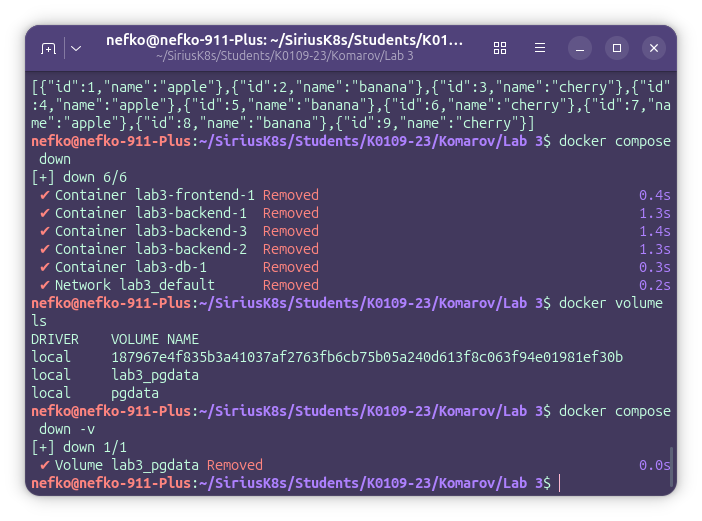

Ключ `-v` используется для удаления томов, подключённых к сервисам из `docker-compose.yml`. Это означает, что после выполнения команды будут удалены не только контейнеры и сеть проекта, но и связанные с ним данные.

Затем была выполнена дополнительная очистка неиспользуемых Docker-ресурсов:

```bash
docker system prune -f
```
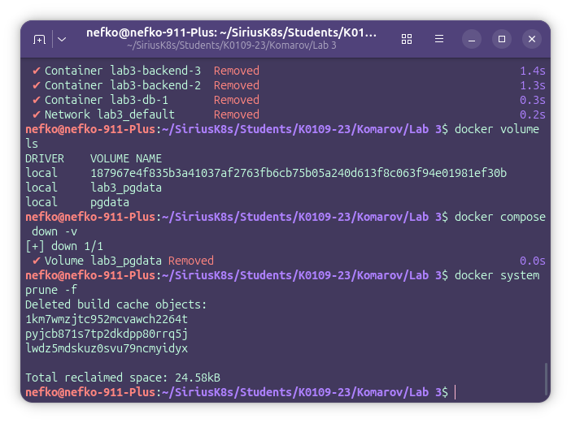

Эта команда удаляет неиспользуемые контейнеры, сети, dangling-образы и другие временные объекты, оставшиеся после работы с Docker.

### Итог

<<<<<<< HEAD:Students/K0109-23/Komarov/Lab 3/lab3 - Docker: сети, volumes, docker-compose.md
В результате выполнения четвёртого блока было завершено тестирование многоконтейнерного приложения и произведена очистка Docker-окружения. Были удалены контейнеры, связанные volume и временные ресурсы, созданные в процессе выполнения лабораторной работы
=======
В результате выполнения четвёртого блока было завершено тестирование многоконтейнерного приложения и произведена очистка Docker-окружения. Были удалены контейнеры, связанные volume и временные ресурсы, созданные в процессе выполнения лабораторной работы
>>>>>>> c3dce67 (Add labs 4-7 for Kubernetes practice):Students/K0109-23/Komarov/Lab 3/README.md
