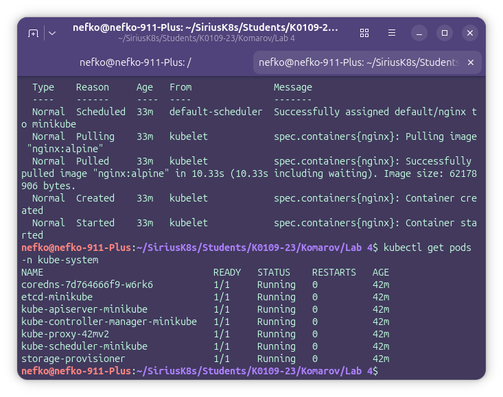
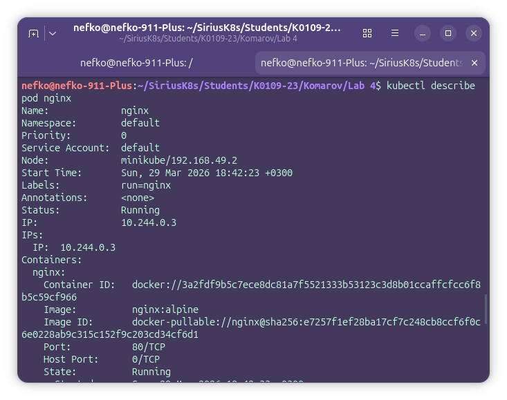
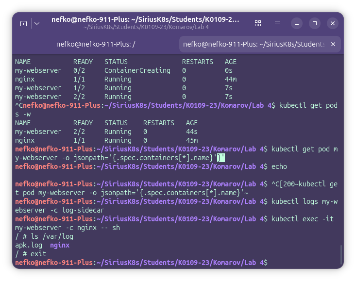
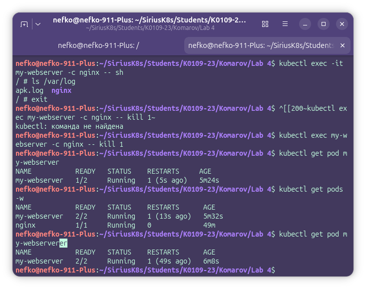

# Lab 4

## 1. Состояние кластера

На первом этапе лабораторной работы был запущен Kubernetes-кластер с помощью Minikube и выполнена проверка его состояния.

Для проверки использовались команды:

`kubectl get nodes`
`kubectl get pods -A`

После чего мы можем увидеть, что нода minikube находится в состоянии Ready, а системные компоненты Kubernetes в запущены и работают в состоянии Running

---

## 2. Первый Pod

На втором этапе лабораторной работы был создан первый Pod с контейнером nginx с помощью команды:

`kubectl run nginx --image=nginx:alpine --port=80`

После запуска Pod была выполнена проверка его состояния командами:

`kubectl get pods`  
`kubectl get pods -o wide`

В результате Pod `nginx` был успешно создан и перешёл в состояние `Running`.

Для просмотра зменений состояния Pod использовалась команда:

`kubectl get pods -w`

После этого был выполнен вход внутрь контейнера с помощью команды:

`kubectl exec -it nginx -- sh`

Внутри контейнера были выполнены следующие команды:

`hostname`  
`cat /etc/hosts`  
`env | grep KUBE`  
`ps`  
`ip addr`

В ходе просмотра контейнера можно наблюдать имя хоста, содержимое файла `/etc/hosts`, переменные Kubernetes, список процессов и сетевые параметры контейнера.

После выхода из контейнера были просмотрены логи и подробное описание Pod:

`kubectl logs nginx`  
`kubectl describe pod nginx`

Таким образом, на данном этапе был успешно создан и исследован первый Pod в Kubernetes-кластере.

## 3. Pod через YAML

На следующем этапе лабораторной работы был создан Pod `my-webserver` с помощью YAML-манифеста.

Для этого был подготовлен файл `pod.yaml`, содержащий описание объекта типа `Pod` с двумя контейнерами: основным контейнером `nginx` и вспомогательным контейнером `log-sidecar`.

После создания файла Pod был запущен командой:

`kubectl apply -f pod.yaml`

Проверка состояния Pod выполнялась командами:

`kubectl get pods`  
`kubectl get pods -w`

В результате было установлено, что Pod `my-webserver` был успешно создан и перешёл в состояние `Running`.

Далее была выполнена проверка контейнеров внутри Pod с помощью следующих команд:

`kubectl get pod my-webserver -o jsonpath='{.spec.containers[*].name}'`  
`kubectl logs my-webserver -c log-sidecar`  
`kubectl exec -it my-webserver -c nginx -- sh`

В ходе выполнения этапа было подтверждено, что внутри Pod работают два контейнера. Основной контейнер `nginx` отвечает за запуск веб-сервера, а контейнер `log-sidecar` выполняет вспомогательную функцию и записывает данные в общий том.

Также было установлено, что контейнеры используют общий том `emptyDir`, а для основного контейнера заданы ограничения ресурсов и проверки `readinessProbe` и `livenessProbe`.

Таким образом, на данном этапе был успешно создан Pod через YAML-манифест и изучена его внутренняя структура.

## 4. Самовосстановление

На заключительном этапе лабораторной работы была выполнена проверка механизма самовосстановления контейнера внутри Pod.

Для этого был принудительно завершён основной процесс контейнера `nginx` командой:

`kubectl exec my-webserver -c nginx -- kill 1`

После этого была выполнена повторная проверка состояния Pod командами:

`kubectl get pod my-webserver`  
`kubectl get pods -w`

В результате было установлено, что сам Pod `my-webserver` не был удалён, однако контейнер `nginx` внутри него был автоматически перезапущен. Это подтверждается увеличением значения `RESTARTS`.

Таким образом, в ходе выполнения данного этапа был подтверждён механизм автоматического восстановления контейнера в Kubernetes после завершения его основного процесса.

## Ответы на контрольные вопросы

### 1. Какие поды в kube-system всегда должны быть Running?

В Kubernetes-кластере должны быть запущены Pod'ы: `coredns`, `etcd`, `kube-apiserver`, `kube-controller-manager`, `kube-scheduler`, `kube-proxy`, `storage-provisioner`. (на первом скрине видно)

### 2. Почему Pod не удалился, а перезапустился? Кто за это отвечает?

Команда `kill 1` завершает основной процесс внутри контейнера, но не удаляет сам объект Pod из Kubernetes. Kubernetes отслеживает состояние контейнеров и автоматически перезапускает завершившийся контейнер, чтобы сохранить состояние Pod.
