# Lab 5

@Dubrovsky18 ого привет

## 1. Deployment

На первом этапе лабораторной работы был создан Deployment `webapp`, управляющий запуском приложения в Kubernetes-кластере.

Для этого был подготовлен файл `deployment.yaml`, в котором был описан объект `Deployment` с тремя репликами.

После создания файла, Deployment был применён командой:

`kubectl apply -f deployment.yaml`

Для наблюдения за запуском Pod'ов использовалась команда:

`kubectl get pods -w`

В результате было установлено, что Deployment `webapp` успешно создал три Pod'а, которые перешли в состояние `Running`.

После этого был проверен статус развёртывания и созданные ReplicaSet с помощью команд:

`kubectl rollout status deployment/webapp`  
`kubectl get rs`  
`kubectl get deployment webapp`

Таким образом, на данном этапе был успешно создан и проверен Deployment с тремя(должно было быть, но у меня почему-то 6, чат гпт сказал "по твоему скрину это выглядит как временное состояние во время развёртывания") репликами.

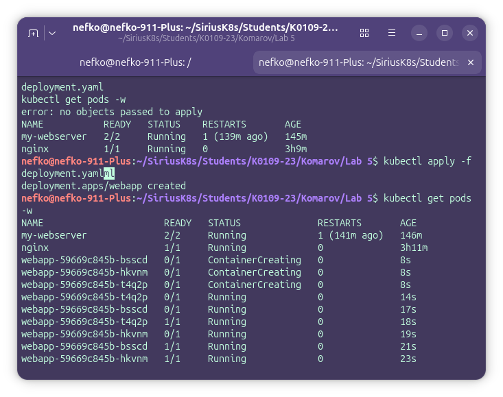

## 2. Service + Rolling Update

На втором этапе лабораторной работы был создан Service `webapp-svc`, обеспечивающий доступ к приложению, развёрнутому в Deployment `webapp`.

Для этого был подготовлен файл `service.yaml`, в котором был описан объект `Service` с типом `NodePort`.

После создания файла, Service был применён командой:

`kubectl apply -f service.yaml`

Проверка созданного сервиса выполнялась командами:

`kubectl get svc`  
`minikube ip`

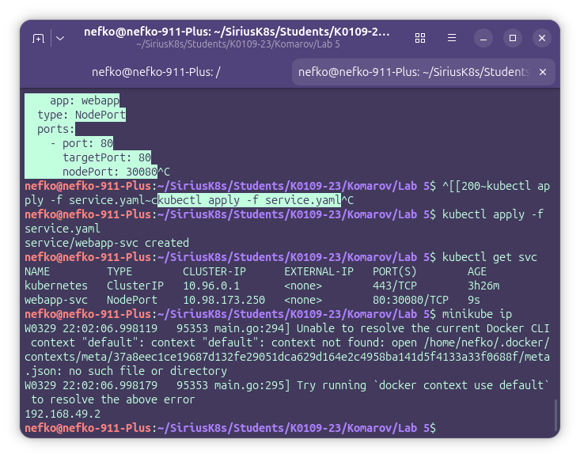

Для распределения запросов между Pod'ами использовался цикл запросов в новом терминале:

`while true; do curl -s $(minikube ip):30080 | grep "Server name"; sleep 0.5; done`

Можно увидеть, что Service направляет трафик на разные Pod'ы приложения, обеспечивая балансировку нагрузки.

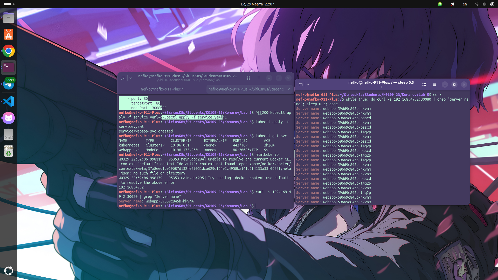

Далее был выполнен rolling update Deployment с помощью команды:

`kubectl set image deployment/webapp webapp=nginxdemos/hello:latest`

После запуска обновления его состояние контролировалось командой в другом терминале:

`kubectl rollout status deployment/webapp`

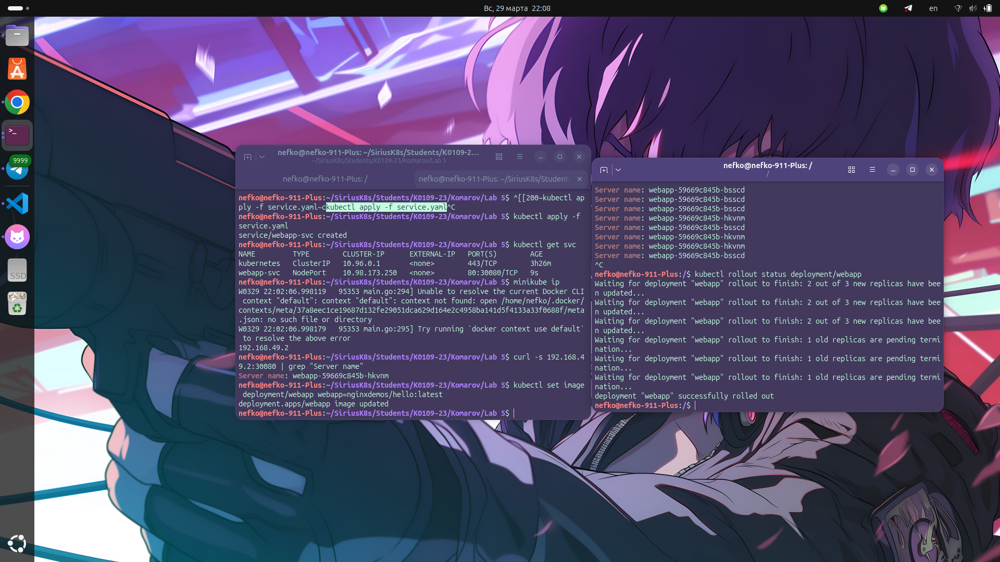

Также была просмотрена история развёртывания:

`kubectl rollout history deployment/webapp`

После этого был выполнен откат Deployment к предыдущей версии:

`kubectl rollout undo deployment/webapp`

Затем повторно была выполнена проверка статуса и истории развёртывания:

`kubectl rollout status deployment/webapp`  
`kubectl rollout history deployment/webapp`

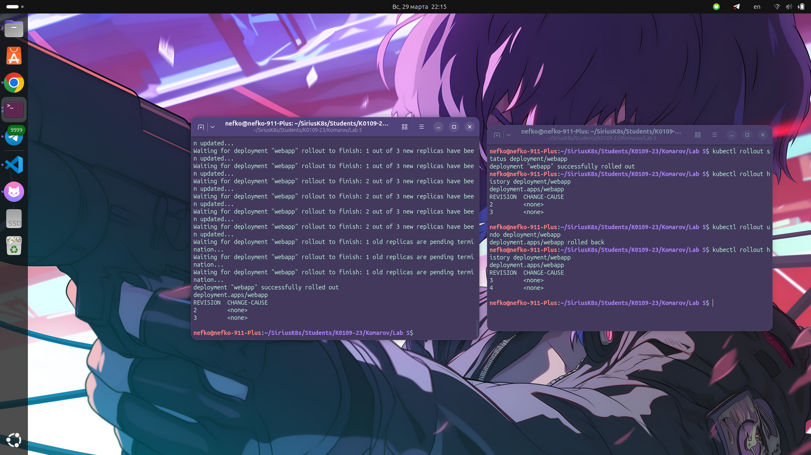

В результате было подтверждено, что Kubernetes выполняет rolling update без остановки сервиса, а также позволяет откатиться к предыдущей версии приложения.

## 3. Ingress

На третьем этапе лабораторной работы была выполнена настройка маршрутизации трафика через Ingress.

Сначала в Minikube был включён Ingress Controller:

`minikube addons enable ingress`

После этого была выполнена проверка Pod'ов ingress-контроллера:

`kubectl get pods -n ingress-nginx`

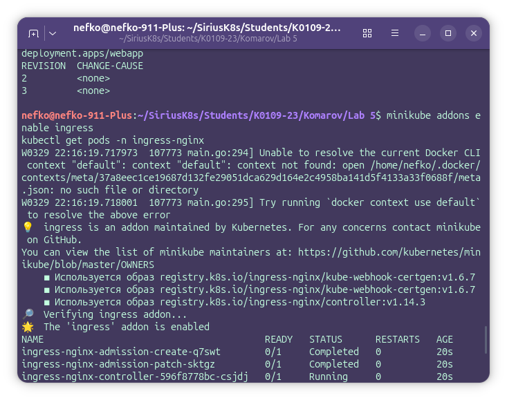

Далее для демонстрации маршрутизации был создан дополнительный backend-сервис `api-backend` с помощью следующих команд:

`kubectl create deployment api-backend --image=hashicorp/http-echo -- /http-echo -text="Hello from API"`  
`kubectl expose deployment api-backend --port=5678 --name=api-svc`

После этого был подготовлен файл `ingress.yaml`, в котором был описан объект `Ingress`, направляющий запросы по пути `/` в сервис `webapp-svc`, а запросы по пути `/api` в сервис `api-svc`.

Созданный Ingress был применён командой:

`kubectl apply -f ingress.yaml`

Проверка Ingress выполнялась командой:

`kubectl get ingress`

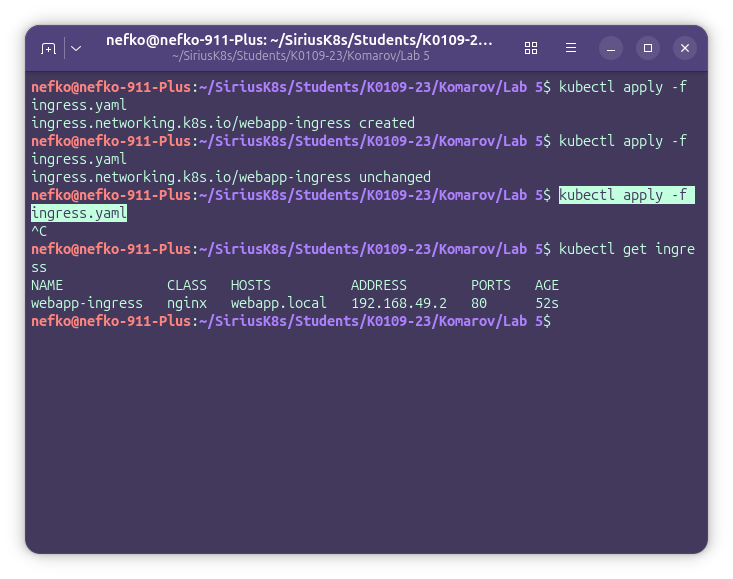

Для тестирования маршрутизации в файл `/etc/hosts` была добавлена запись, связывающая имя `webapp.local` с IP-адресом Minikube:

`echo "192.168.49.2 webapp.local" | sudo tee -a /etc/hosts`

После этого была выполнена проверка маршрутов с помощью команд:

`curl webapp.local`  
`curl webapp.local/api`

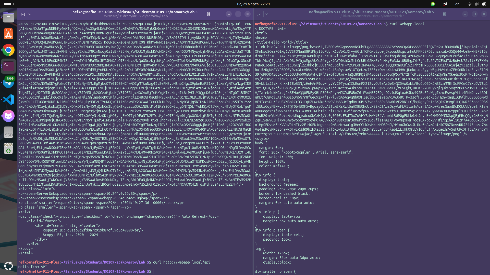

В результате можно увидеть, что запросы на корневой путь направляются в основной сервис приложения, а запросы на путь `/api` перенаправляются во второй backend и возвращают ответ `Hello from API`.

## 4. Сравнение типов Service

На заключительном этапе лабораторной работы были рассмотрены основные типы сервисов Kubernetes: `ClusterIP`, `NodePort` и `LoadBalancer`.

Был создан сервис типа `ClusterIP` с помощью команды:

`kubectl expose deployment webapp --name=webapp-clusterip --type=ClusterIP --port=80`

После этого была выполнена проверка созданного сервиса:

`kubectl get svc webapp-clusterip`

В результате было установлено, что сервис типа `ClusterIP` не имеет внешнего IP-адреса и доступен только внутри Kubernetes-кластера.

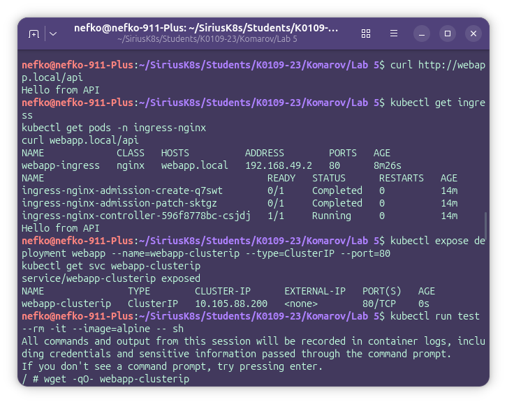

Для проверки доступности сервиса изнутри кластера был запущен временный тестовый Pod:

`kubectl run test --rm -it --image=alpine -- sh`

Внутри этого Pod была выполнена команда:

`wget -qO- webapp-clusterip`

В результате был получен ответ от приложения, что подтвердило доступность сервиса `ClusterIP` внутри кластера.

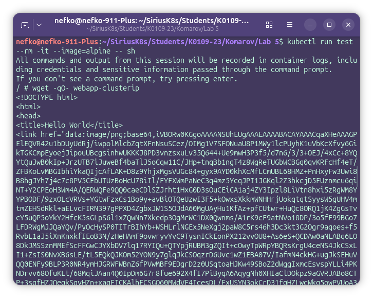

После этого была выполнена дополнительная проверка сервисов:

`kubectl get svc webapp-svc`  

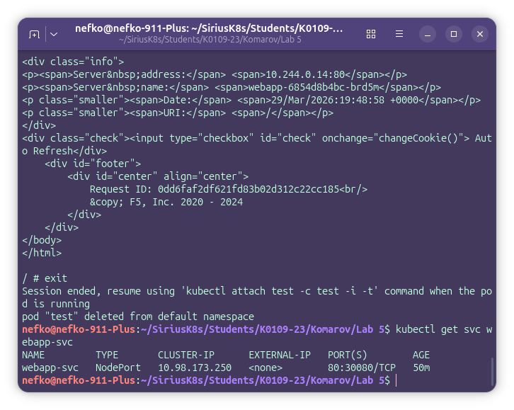

В ходе сравнения было установлено, что:

- `ClusterIP` используется для внутреннего взаимодействия между приложениями внутри кластера;
- `NodePort` открывает доступ к сервису извне через порт на узле кластера;
- `LoadBalancer` применяется в облачных средах для публикации сервиса через внешний балансировщик нагрузки.

Таким образом, на данном этапе были практически изучены различия между типами сервисов Kubernetes и определены их основные области применения.
