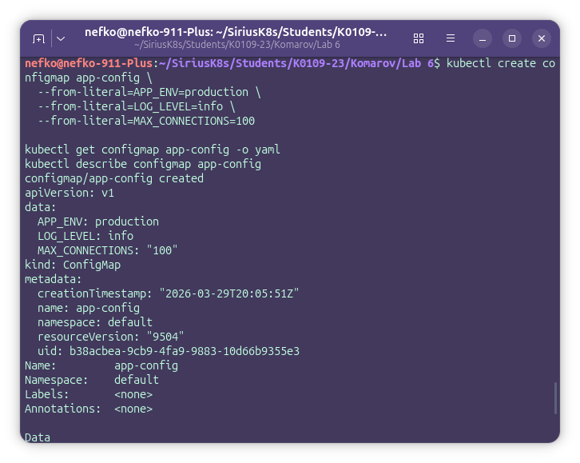
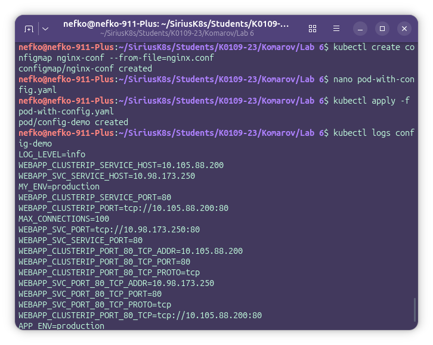
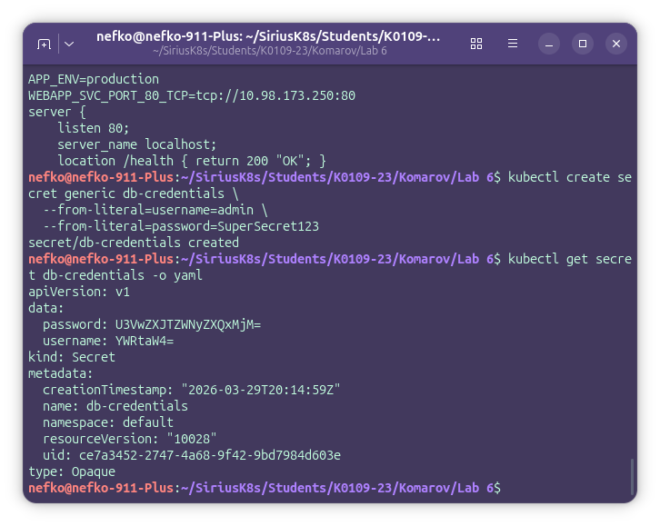
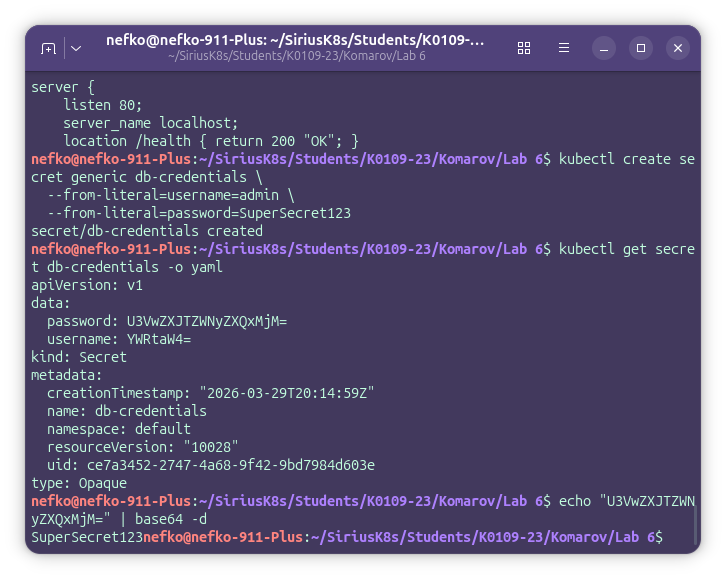
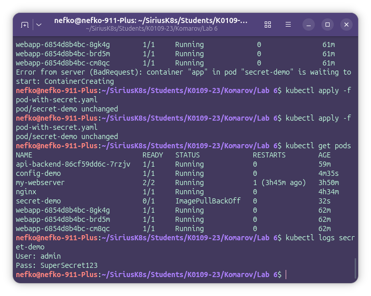
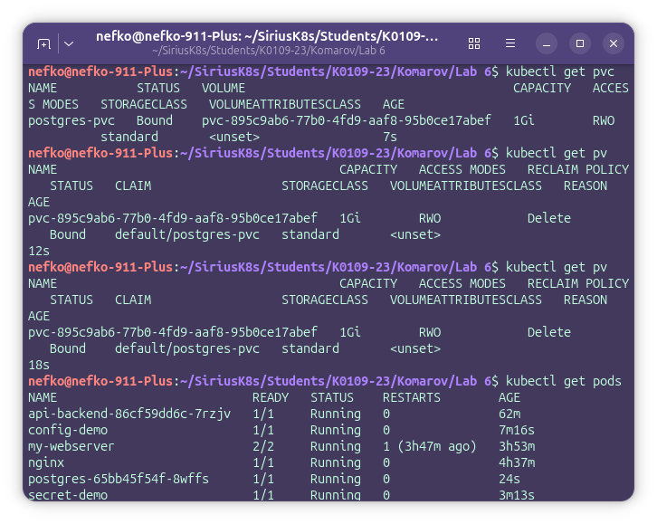
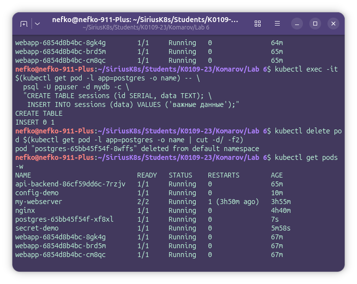
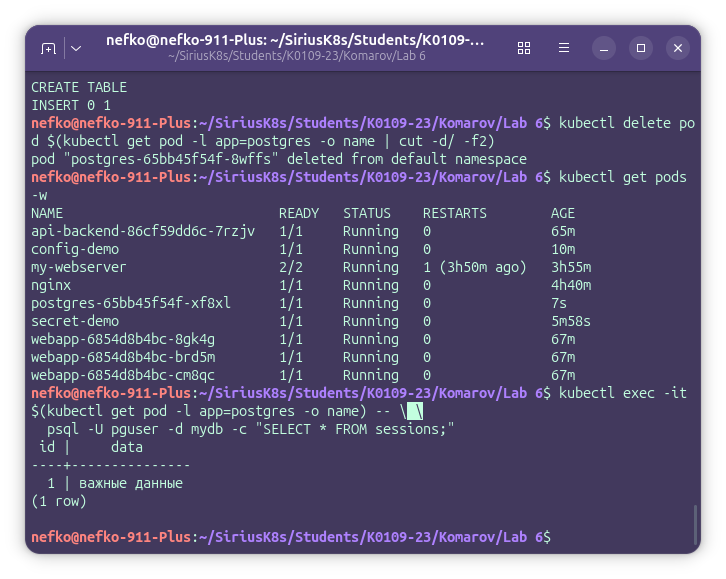

# Lab 6

## ConfigMap

На первом этапе лабораторной работы была выполнена работа с объектом `ConfigMap` для передачи конфигурации приложению разными способами.

Сначала был создан ConfigMap `app-config` c помощью команды:

`kubectl create configmap app-config --from-literal=APP_ENV=production --from-literal=LOG_LEVEL=info --from-literal=MAX_CONNECTIONS=100`

После этого была выполнена проверка созданного ConfigMap командами:

`kubectl get configmap app-config -o yaml`  
`kubectl describe configmap app-config`

Далее был создан файл `nginx.conf`, содержащий конфигурацию, и на его основе был создан второй ConfigMap:

`kubectl create configmap nginx-conf --from-file=nginx.conf`

После этого был подготовлен файл `pod-with-config.yaml`, в котором ConfigMap был подключён к Pod тремя способами:

- через `envFrom` для загрузки всех ключей как переменных окружения;
- через `configMapKeyRef` для передачи отдельного ключа под именем `MY_ENV`;
- через монтирование ConfigMap как файла в каталог `/etc/config`.

Под был создан командой:

`kubectl apply -f pod-with-config.yaml`

Проверка результата выполнялась командами:

`kubectl get pods`  
`kubectl logs config-demo`

В результате было подтверждено, что переменные окружения из ConfigMap успешно передаются в контейнер, отдельный ключ может быть загружен под другим именем, а также что содержимое ConfigMap может быть смонтировано в контейнер как файл.

## Secrets

На втором этапе лабораторной работы была выполнена работа с объектом `Secret` для хранения важных данных приложения.

Сначала был создан Secret `db-credentials` с помощью команды:

`kubectl create secret generic db-credentials --from-literal=username=admin --from-literal=password=SuperSecret123`

После этого была выполнена проверка созданного Secret:

`kubectl get secret db-credentials -o yaml`

В результате было установлено, что данные в Secret отображаются в формате base64, что не является полноценным шифрованием.

Для показа декодирования значения была выполнена команда:

`echo "U3VwZXJTZWNyZXQxMjM=" | base64 -d`

После этого был подготовлен файл `pod-with-secret.yaml`, в котором значения из Secret были подключены в контейнер через `secretKeyRef`.

Под был создан командой:

`kubectl apply -f pod-with-secret.yaml`

Проверка результата выполнялась командами:

`kubectl get pods`  
`kubectl logs secret-demo`

В результате было подтверждено, что значения из Secret успешно передаются в контейнер и могут использоваться приложением через переменные окружения.

## PersistentVolume

На третьем этапе лабораторной работы была выполнена настройка постоянного хранилища для PostgreSQL с использованием `PersistentVolumeClaim`.

Для этого был подготовлен файл `postgres-pvc.yaml`, содержащий:

- объект `PersistentVolumeClaim`;
- объект `Secret`;
- объект `Deployment`;
- объект `Service`.

После создания файла манифест был применён командой:

`kubectl apply -f postgres-pvc.yaml`

Проверка состояния хранилища выполнялась командами:

`kubectl get pvc`  
`kubectl get pv`

В результате было установлено, что `PersistentVolumeClaim` `postgres-pvc` успешно перешёл в состояние `Bound`, а Kubernetes автоматически выделил постоянное хранилище.

После запуска PostgreSQL в базу данных были записаны тестовые данные с помощью команды:

`kubectl exec -it $(kubectl get pod -l app=postgres -o name) -- psql -U pguser -d mydb -c "CREATE TABLE sessions (id SERIAL, data TEXT); INSERT INTO sessions (data) VALUES ('важные данные');"`

Затем Pod PostgreSQL был удалён командой:

`kubectl delete pod $(kubectl get pod -l app=postgres -o name | cut -d/ -f2)`

После удаления Pod Deployment автоматически создал новый Pod, что было подтверждено командой:

`kubectl get pods -w`

После повторного запуска PostgreSQL была выполнена проверка сохранности данных:

`kubectl exec -it $(kubectl get pod -l app=postgres -o name) -- psql -U pguser -d mydb -c "SELECT * FROM sessions;"`

В результате было подтверждено, что после удаления и пересоздания Pod данные в таблице `sessions` сохранились.
