# Lab 7

## RBAC

На первом этапе лабораторной работы была выполнена настройка ролевой модели доступа в Kubernetes с использованием `ServiceAccount`, `Role` и `RoleBinding`.

Сначала был создан отдельный namespace для демонстрации прав доступа:

`kubectl create namespace rbac-demo`

После этого был подготовлен файл `rbac.yaml`, в котором были описаны:

- `ServiceAccount` с именем `app-reader`;
- `Role`, разрешающая только чтение Podов;
- `RoleBinding`, связывающий созданный `ServiceAccount` с этой ролью.

Применение конфигурации выполнялось командой:

`kubectl apply -f rbac.yaml`

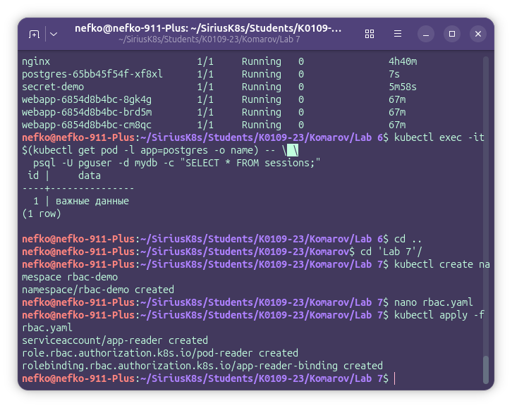

Затем были проверены права созданного `ServiceAccount` с помощью следующих команд:

`kubectl auth can-i list pods --namespace rbac-demo --as=system:serviceaccount:rbac-demo:app-reader`  
`kubectl auth can-i delete pods --namespace rbac-demo --as=system:serviceaccount:rbac-demo:app-reader`  
`kubectl auth can-i list pods --namespace default --as=system:serviceaccount:rbac-demo:app-reader`

В результате было установлено, что `ServiceAccount` может смотреть Podы только в namespace `rbac-demo`, не может удалять Podы и не имеет доступа к Podам в namespace `default`.

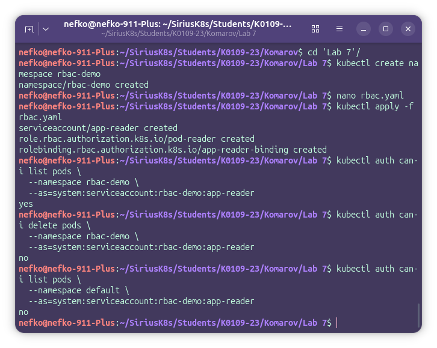

После этого был создан Pod `rbac-test`, запускаемый от имени `ServiceAccount` `app-reader`.

Для проверки работы прав доступа был выполнен вход в Pod:

`kubectl exec -it rbac-test -n rbac-demo -- sh`

Внутри контейнера были выполнены команды:

`kubectl get pods -n rbac-demo`  
`kubectl delete pod rbac-test -n rbac-demo`  
`kubectl get pods -n default`

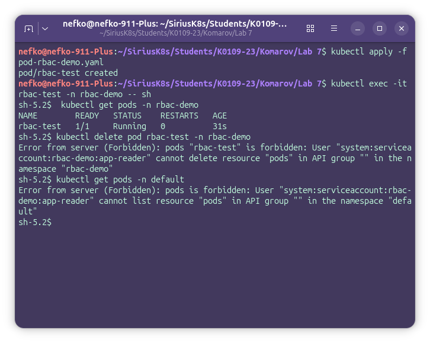

В результате было подтверждено, что чтение Podов в `rbac-demo` разрешено, а попытка удалить Pod или получить доступ к Podам в другом namespace приводит к ошибке `Forbidden`.

## NetworkPolicy

На следующем этапе лабораторной работы была выполнена настройка сетевой изоляции Podов с помощью `NetworkPolicy`.

Сначала был создан отдельный namespace для демонстрации сетевых политик:

`kubectl create namespace netpol-demo`

После этого были запущены три тестовых Podа:
- `frontend`
- `backend`
- `database`

Для каждого Pod также был создан отдельный Service.

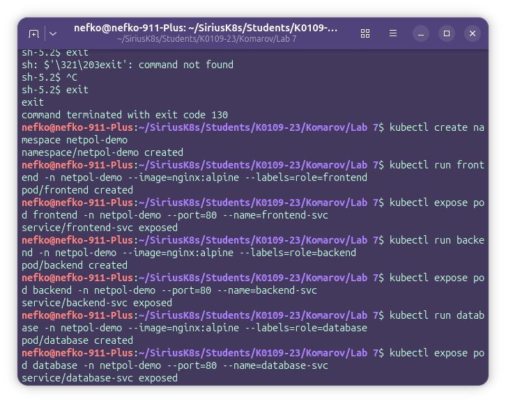

До применения сетевых политик была выполнена проверка доступности сервисов из Pod `frontend`:

`kubectl exec frontend -n netpol-demo -- wget -qO- backend-svc`  
`kubectl exec frontend -n netpol-demo -- wget -qO- database-svc`

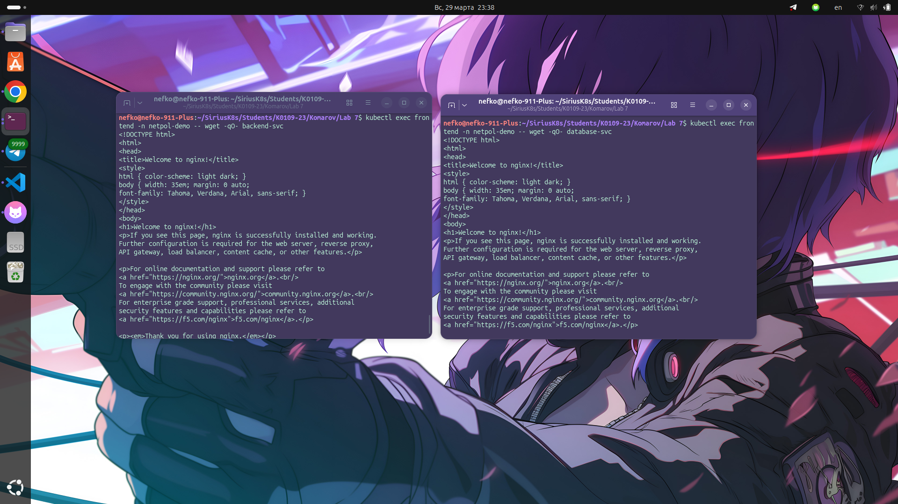

В результате мы можем увидеть, что до настройки `NetworkPolicy` Pod `frontend` мог обращаться как к `backend`, так и к `database`, что не соответствует принципу необходимого доступа.

После этого был подготовлен файл `networkpolicies.yaml`, содержащий набор сетевых политик:

- запрет всего входящего трафика по умолчанию;
- разрешение входящего трафика на `frontend`;
- разрешение доступа к `backend` только со стороны `frontend`;
- разрешение доступа к `database` только со стороны `backend`.

Применение конфигурации выполнялось командой:

`kubectl apply -f networkpolicies.yaml`

Проверка созданных политик выполнялась командой:

`kubectl get networkpolicy -n netpol-demo`

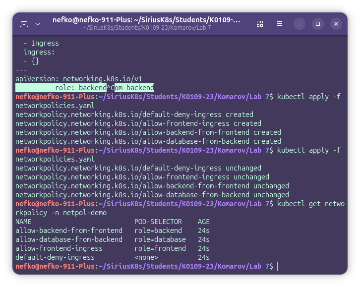

После применения политик была повторно выполнена проверка сетевого общения:

`kubectl exec frontend -n netpol-demo -- wget -qO- backend-svc`  
`kubectl exec frontend -n netpol-demo -- wget -T 3 -qO- database-svc`  
`kubectl exec backend -n netpol-demo -- wget -qO- database-svc`  
`kubectl exec database -n netpol-demo -- wget -T 3 -qO- backend-svc`

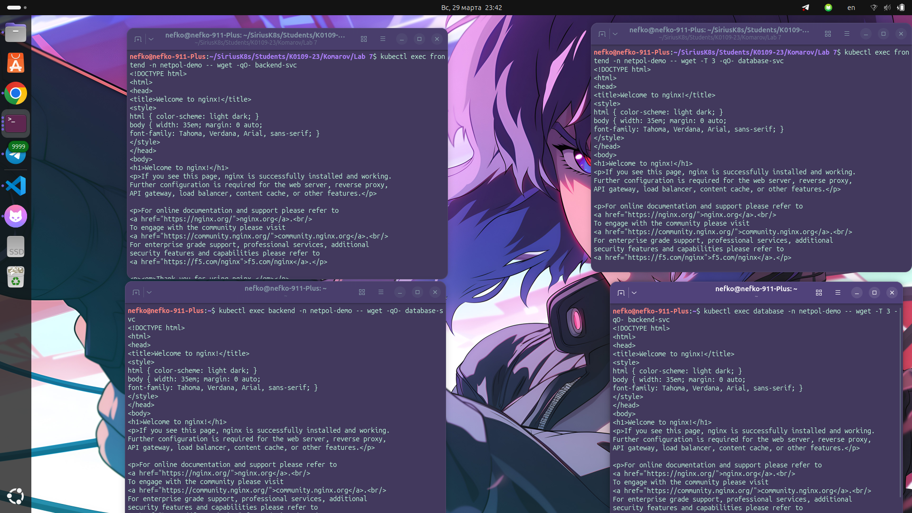

В результате было подтверждено, что:

- Pod `frontend` может обращаться к `backend`;
- Pod `frontend` не может обращаться к `database`;
- Pod `backend` может обращаться к `database`;
- Pod `database` не может обращаться к `backend`.

Таким образом, на данном этапе была успешно настроена сетевая изоляция Podов в Kubernetes.

## TLS Сертификаты с OpenSSL

На следующем этапе лабораторной работы была выполнена настройка TLS для Ingress с использованием  сертификата, подписанного через OpenSSL.

Сначала была создана директория, затем сгенерирован ключ центра сертификации и выпущен самоподписанный сертификат:

`mkdir -p ~/ssl-lab && cd ~/ssl-lab`  
`openssl genrsa -out ca.key 4096`  
`openssl req -x509 -new -nodes -key ca.key -sha256 -days 3650 -out ca.crt -subj "/C=RU/ST=Moscow/O=SiriusLab CA/CN=SiriusLab Root CA"`

После этого была выполнена проверка созданного сертификата центра сертификации:

`openssl x509 -in ca.crt -noout -text | grep -E "Issuer:|Subject:|Not (Before|After)"`

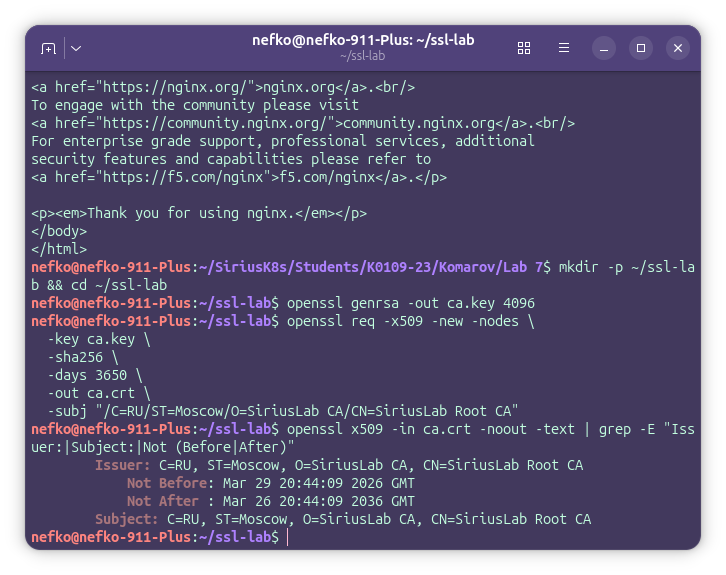

Далее был подготовлен конфигурационный файл `webapp.ext`, содержащий параметры SAN для доменного имени `webapp.local`.

После этого были созданы ключ и CSR для веб-сервера:

`openssl genrsa -out webapp.key 2048`  
`openssl req -new -key webapp.key -out webapp.csr -subj "/C=RU/O=SiriusLab/CN=webapp.local"`

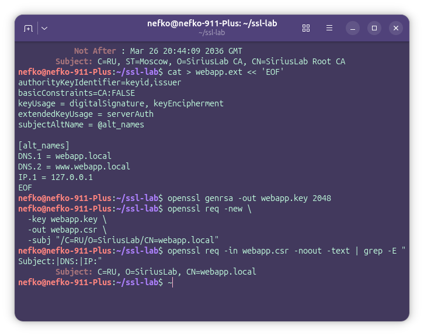

Затем CSR был подписан собственным центром сертификации:

`openssl x509 -req -in webapp.csr -CA ca.crt -CAkey ca.key -CAcreateserial -out webapp.crt -days 365 -sha256 -extfile webapp.ext`

Проверка выпущенного сертификата выполнялась командами:

`openssl x509 -in webapp.crt -noout -text | grep -A5 "Subject Alternative"`  
`openssl verify -CAfile ca.crt webapp.crt`

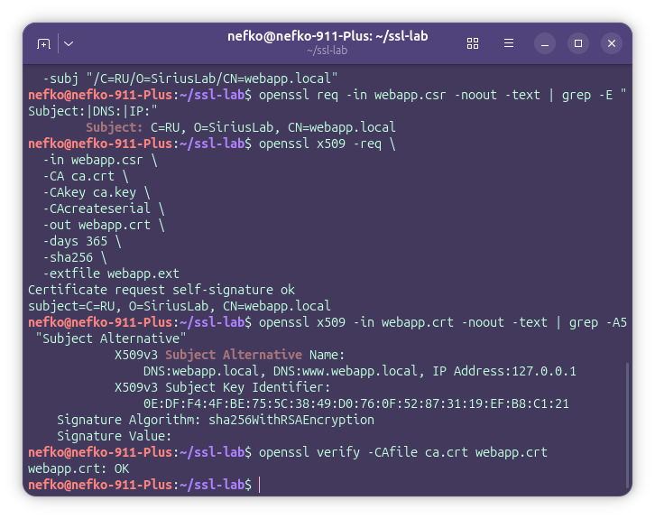

В результате было подтверждено, что сертификат корректно подписан центром сертификации и проходит проверку.

После этого в Kubernetes был создан TLS Secret:

`kubectl create secret tls webapp-tls --cert=webapp.crt --key=webapp.key -n netpol-demo`

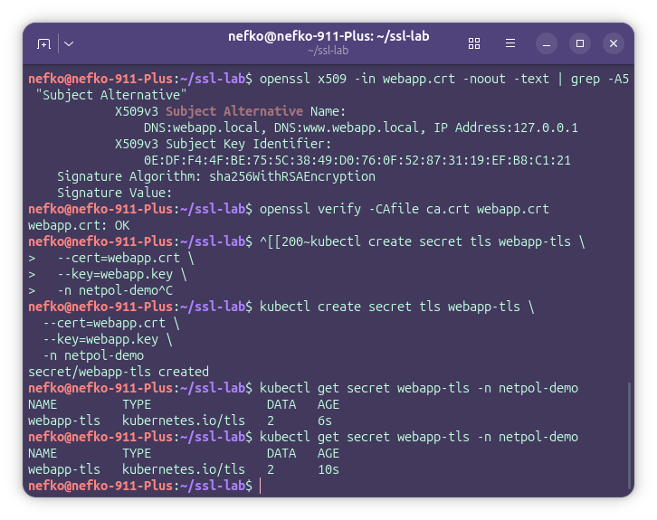

Затем был подготовлен файл `ingress-tls.yaml`, в котором сертификат был подключён к Ingress через секцию `tls`, а для домена `webapp.local` был настроен маршрут в сервис `frontend-svc`.

Применение конфигурации выполнялось командой (сначала не могла выполниться, потому что был поднят ингресс из 5 лабы):

`kubectl apply -f ingress-tls.yaml`

Проверка созданного Ingress выполнялась командой:

`kubectl get ingress -n netpol-demo`

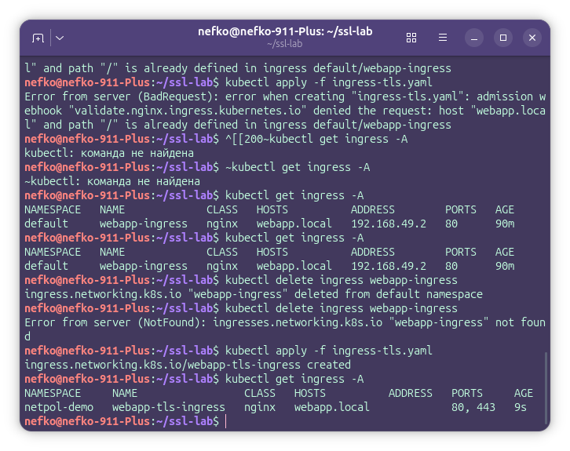

После этого в файл `/etc/hosts` была добавлена запись для доменного имени `webapp.local`, указывающая на IP-адрес Minikube.

Для проверки HTTPS-соединения использовалась команда:

`curl --cacert ca.crt https://webapp.local`

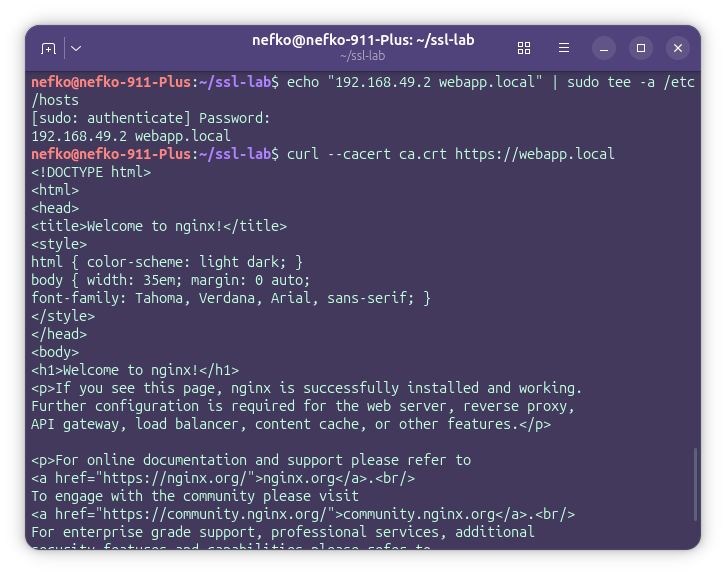

Также была выполнена дополнительная проверка TLS через OpenSSL:

`openssl s_client -connect webapp.local:443 -CAfile ca.crt -showcerts`

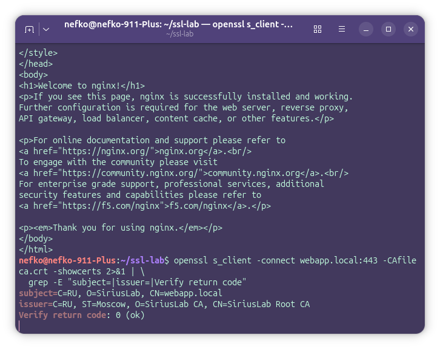

В результате было подтверждено, что Ingress успешно использует выпущенный сертификат, соединение устанавливается по HTTPS, а проверка выполняется с доверием к собственному центру сертификации.

После этого сертификат был извлечён из Kubernetes Secret и декодирован для просмотра его полей и срока действия.

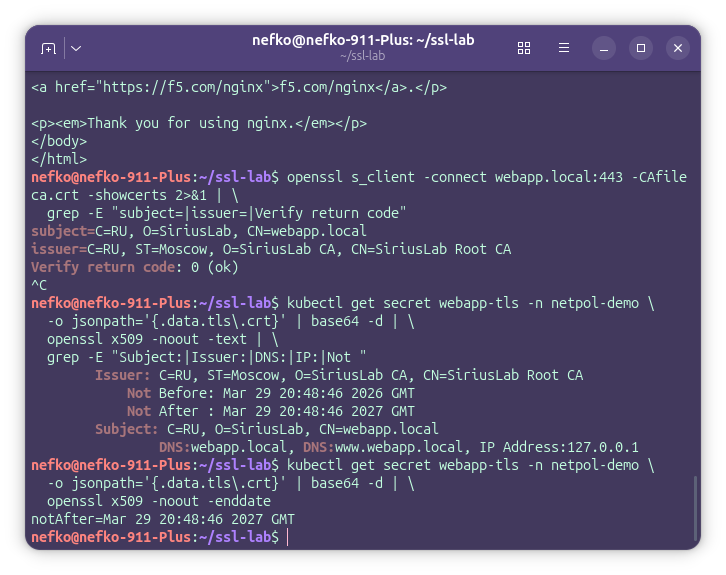

## Бонус

я рял хотел сделать, но чет оно не работало и я забил

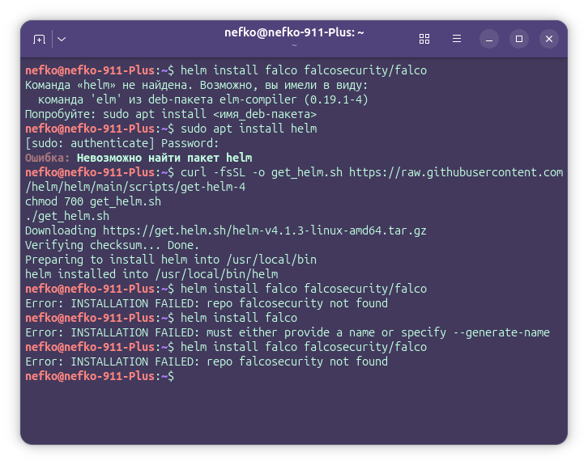
