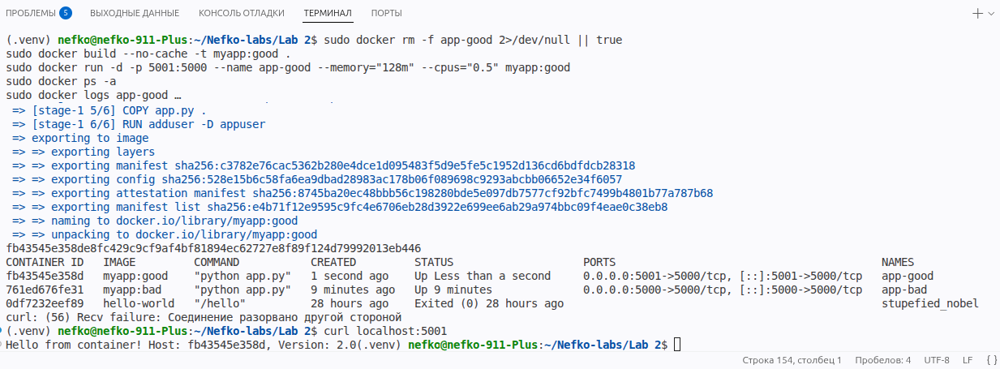
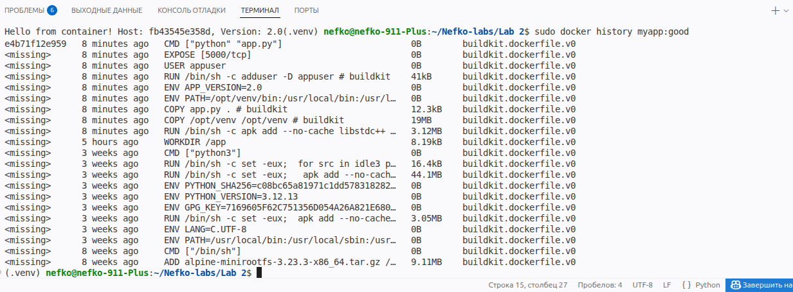
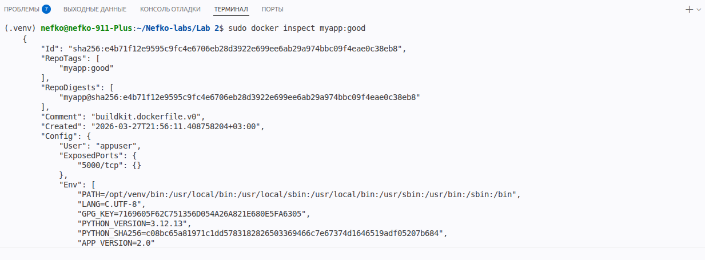
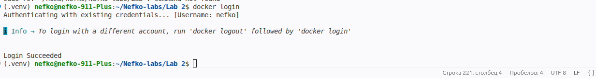
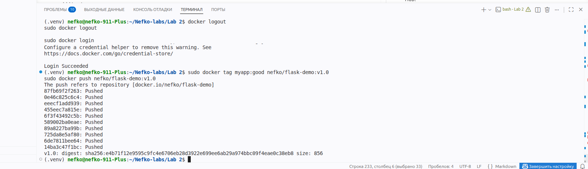
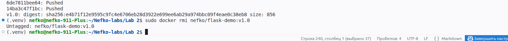
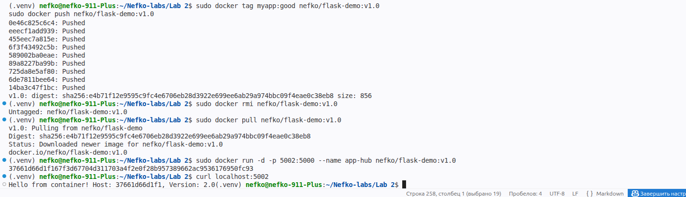

## Блок 1 — Первый Dockerfile

На первом этапе было создано простое Flask-приложение с двумя маршрутами:

* `/` — вывод приветственного сообщения из контейнера;
* `/health` — проверка состояния приложения.

Файл `app.py`:

```python
from flask import Flask
import os
import socket

app = Flask(__name__)

@app.route('/')
def hello():
    return f"Hello from container! Host: {socket.gethostname()}, Version: {os.getenv('APP_VERSION', '1.0')}"

@app.route('/health')
def health():
    return {"status": "ok"}

if __name__ == '__main__':
    app.run(host='0.0.0.0', port=5000)
```

Файл `requirements.txt`:

```txt
flask==3.0.0
```

Был создан Dockerfile с неоптимальной конфигурацией:

```dockerfile
FROM python:3.12
WORKDIR /app
COPY . .
RUN pip install -r requirements.txt
CMD ["python", "app.py"]
```


После сборки образа его размер составил около 1.6 GB, что является избыточным для такого простого приложения.

Контейнер был успешно запущен, и приложение корректно ответило на HTTP-запрос:

```bash
curl localhost:5000
```

Результат:

```
Hello from container! Host: <container_id>, Version: 1.0
```


 
## Блок 2 — Multistage build

На данном этапе была выполнена оптимизация Docker-образа с использованием многоэтапной сборки (multistage build). Целью являлось уменьшение размера итогового образа и повышение эффективности его использования.

В исходном варианте (`myapp:bad`) использовался полный базовый образ `python:3.12`, в который копировался весь проект и устанавливались зависимости. Это привело к избыточному размеру образа.

Для оптимизации был создан новый `Dockerfile`, состоящий из двух этапов:

### Этап 1 — builder

На первом этапе используется образ `python:3.12-slim`, в котором:

* создаётся виртуальное окружение `venv`;
* устанавливаются зависимости из файла `requirements.txt`.

Это позволяет изолировать установку зависимостей и подготовить минимально необходимую среду для выполнения приложения.

### Этап 2 — runtime

На втором этапе используется облегчённый образ `python:3.12-alpine`, в который:

* копируется только готовое виртуальное окружение;
* добавляется файл приложения `app.py`;
* создаётся отдельный пользователь `appuser`;
* задаётся переменная окружения `APP_VERSION=2.0`.

Контейнер запускается от непривилегированного пользователя, что повышает безопасность.

Полный `Dockerfile`(использовал не файл из лабы, потому что не работал фласк, гпт предложил свой вариант):

```dockerfile
# ---------- builder ----------
FROM python:3.12-slim AS builder

WORKDIR /build

RUN python -m venv /opt/venv
ENV PATH="/opt/venv/bin:$PATH"

COPY requirements.txt .
RUN pip install --no-cache-dir -r requirements.txt


# ---------- runtime ----------
FROM python:3.12-alpine

WORKDIR /app

RUN apk add --no-cache libstdc++

COPY --from=builder /opt/venv /opt/venv
COPY app.py .

ENV PATH="/opt/venv/bin:$PATH"
ENV APP_VERSION=2.0

RUN adduser -D appuser
USER appuser

EXPOSE 5000

CMD ["python", "app.py"]
```

После сборки были получены два образа:

* `myapp:bad` — ~1.64 GB
* `myapp:good` — ~81.4 MB

Таким образом, размер образа был уменьшен примерно в 20 раз.

Далее был запущен оптимизированный контейнер с ограничениями ресурсов:

```bash
sudo docker run -d -p 5001:5000 --name app-good --memory="128m" --cpus="0.5" myapp:good
```

После запуска была выполнена проверка доступности приложения:

```bash
curl localhost:5001
```

Результат выполнения запроса:

```text
Hello from container! Host: <container_id>, Version: 2.0
```

Это подтверждает, что контейнер успешно запускается, а приложение корректно работает в оптимизированном окружении.

В результате применения многоэтапной сборки удалось значительно сократить размер образа, улучшить его структуру и повысить безопасность за счёт использования непривилегированного пользователя.



---

## Блок 3 — Исследование образа

На данном этапе было выполнено исследование структуры и поведения Docker-образа `myapp:good` с помощью встроенных инструментов Docker.

### Анализ слоёв образа

Для просмотра истории сборки образа была использована команда:

```bash
sudo docker history myapp:good
```

Данная команда позволяет увидеть:

* последовательность слоёв образа;
* команды, которые формировали каждый слой;
* размер каждого слоя.

Анализ показал, что образ состоит из небольшого количества слоёв, а основные изменения связаны с:

* установкой зависимостей на этапе сборки;
* копированием виртуального окружения;
* добавлением приложения.

Использование многоэтапной сборки позволило исключить из итогового образа лишние файлы, такие как кэш и временные зависимости, что значительно уменьшило его размер.


---

### Просмотр информации об образе

Для получения подробной информации об образе была использована команда:

```bash
sudo docker inspect myapp:good
```

С её помощью можно получить:

* метаданные образа;
* переменные окружения;
* информацию о слоях;
* параметры конфигурации контейнера.

Анализ показал, что в образе корректно заданы:

* переменная окружения `APP_VERSION=2.0`;
* рабочая директория `/app`;
* пользователь `appuser`.



---

## Блок 4 — Docker Hub

На заключительном этапе работы был опубликован оптимизированный Docker-образ в Docker Hub.

Сначала была выполнена авторизация в Docker Hub:

```bash
sudo docker login
```


После успешного входа образ `myapp:good` был помечен новым тегом для публикации:

```bash
sudo docker tag myapp:good nefko/flask-demo:v1.0
```

Далее образ был отправлен в удалённый репозиторий Docker Hub:

```bash
sudo docker push nefko/flask-demo:v1.0
```


После публикации была выполнена проверка корректности загрузки. Для этого локальный тег был удалён:

```bash
sudo docker rmi nefko/flask-demo:v1.0
```

Затем образ был повторно загружен из Docker Hub:

```bash
sudo docker pull nefko/flask-demo:v1.0
```

После этого контейнер был запущен уже из скачанного образа:

```bash
sudo docker run -d -p 5002:5000 --name app-hub nefko/flask-demo:v1.0
```

Проверка через HTTP-запрос подтвердила, что образ успешно опубликован и может быть использован повторно:

```bash
curl localhost:5002
```


Результат выполнения подтверждает, что образ доступен в Docker Hub (https://hub.docker.com/repository/docker/nefko/flask-demo/general) и корректно запускается после повторного скачивания.

Таким образом, на данном этапе была успешно выполнена публикация образа в Docker Hub и проверена его работоспособность после загрузки из удалённого репозитория.

## Ответы на контрольные вопросы

### 1. Почему образ такой большой?

Образ большой, потому что используется тяжёлый базовый образ, весь проект копируется целиком, а зависимости ставятся прямо в финальный контейнер без оптимизации и multistage build

