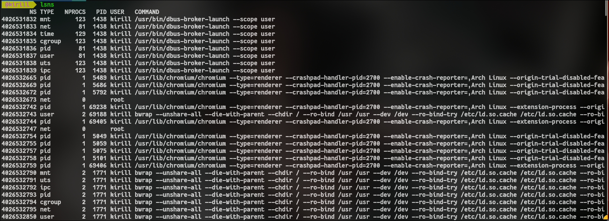
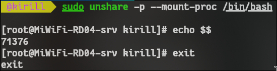
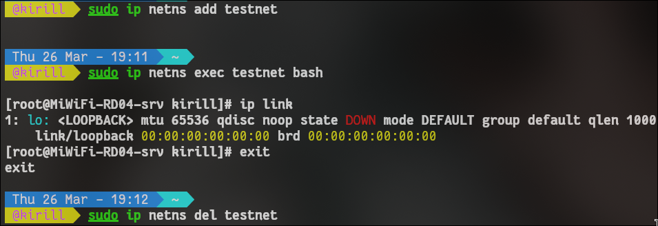
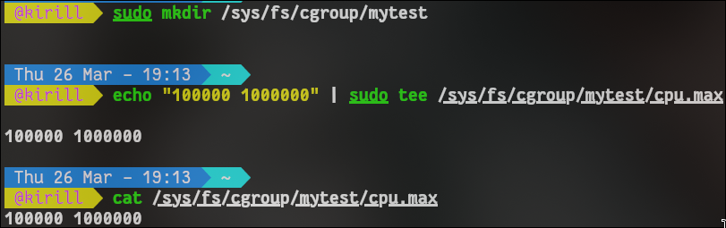
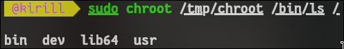

# __лабораторная работа 1: linux-основы контейнеризации__

## что изучается
- namespaces: механизм изоляции процессов, сети, mount-точек, ipc и других подсистем ядра.
- cgroups: механизм ограничения и учета ресурсов (cpu, память, io).
- chroot: смена корневой файловой системы для процесса.

## зачем это нужно
> контейнеры не магия и не отдельная виртуальная машина. в основе лежат обычные механизмы linux:
- namespaces дают изоляцию;
- cgroups дают контроль ресурсов;
- chroot помогает ограничить видимую файловую систему.

docker и kubernetes поверх этого дают удобный интерфейс, автоматизацию и оркестрацию.

## короткая теория по каждому блоку

### namespaces
> namespace делит системные ресурсы между группами процессов. например:
- pid namespace: внутри процесса своя иерархия pid;
- net namespace: своя сеть и интерфейсы;
- mount namespace: своя таблица монтирования;
- uts namespace: отдельные hostname/domainname.

когда запускаем `unshare --pid --fork --mount-proc /bin/bash`, внутри оболочки процесс получает отдельный pid namespace и становится pid 1 в этой новой изоляции.

### cgroups
> cgroups управляют ресурсами через файловую систему `/sys/fs/cgroup`. 
на cgroup v2 лимит cpu задается через `cpu.max` в формате:
`<quota> <period>`

пример `20000 100000` означает примерно 20% одного ядра.

### chroot
> `chroot` меняет корень процесса на указанную директорию. это не полноценная защита само по себе, но полезный строительный блок для изоляции окружения и воспроизводимости.

## что важно понимать после лабораторной
- namespace изолирует, cgroup ограничивает.
- chroot ограничивает обзор файловой системы, но без дополнительных мер не заменяет контейнерную безопасность.
- контейнер = комбинация этих механизмов + runtime/инструменты.

## скрины
- [] вывод `lsns`
- [] `echo $$` внутри нового pid namespace
- [] `ip link` внутри net namespace
- [] `cat /sys/fs/cgroup/mytest/cpu.max`
- [] `ls /` внутри chroot
