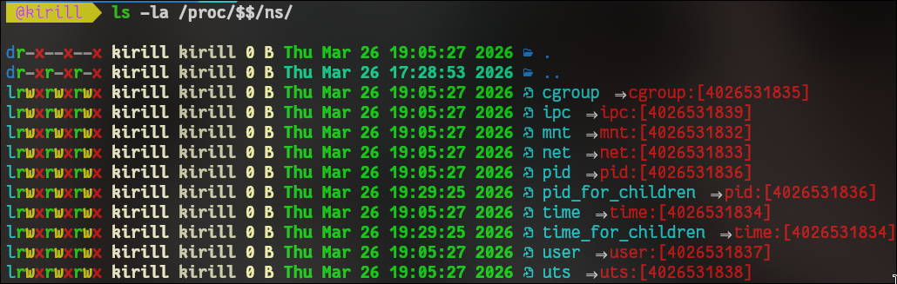
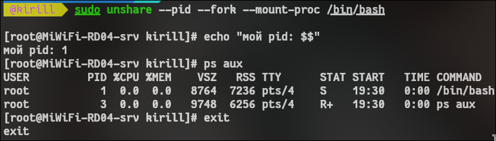
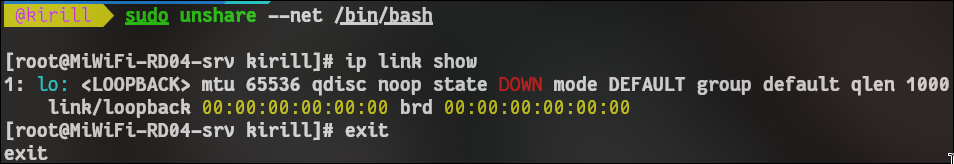
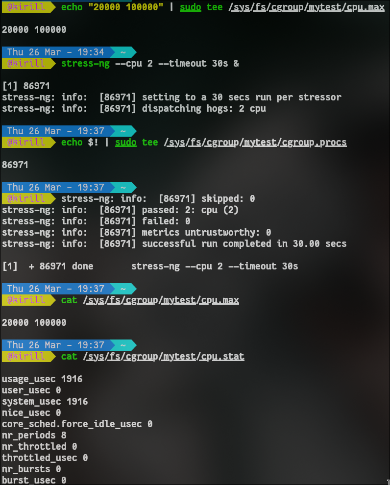
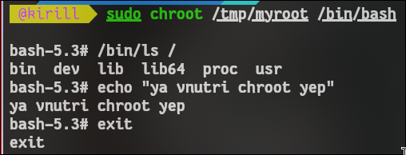

# __лабораторная работа 1: выполнение__

## условия работы
> выполнить практику по linux-механизмам контейнеризации без docker:
1. посмотреть namespace-ы;
2. запустить процесс в новом pid namespace;
3. запустить процесс в новом net namespace;
4. ограничить процесс по cpu через cgroup;
5. сделать chroot в минимальный rootfs;
6. объяснить разницу namespace и cgroup.

## подготовка
```bash
sudo -v
which unshare
which stress-ng || echo "stress-ng не найден"
```
если `stress-ng` отсутствует, установить:
```bash
sudo apt install -y stress-ng # для debian и прочих
sudo pacman -S stress-n # я на арче, поэтому через пакман
```

## ход выполнения

### 1) проверка namespace-ов
```bash
ls -la /proc/$$/ns/
lsns
```
> результат: видны типы namespace в системе (pid, net, mnt, uts, ipc и др).

### 2) отдельный pid namespace
```bash
sudo unshare --pid --fork --mount-proc /bin/bash
echo "мой pid: $$"
ps aux
exit
```
> результат: внутри окружения pid маленький (обычно 1), это подтверждает изоляцию pid-дерева.

### 3) отдельный net namespace
```bash
sudo unshare --net /bin/bash
ip link show
exit
```
> результат: обычно доступен только loopback-интерфейс `lo`, сетевой стек изолирован.

### 4) ограничение cpu через cgroup v2
```bash
sudo mkdir -p /sys/fs/cgroup/mytest
echo "20000 100000" | sudo tee /sys/fs/cgroup/mytest/cpu.max
stress-ng --cpu 2 --timeout 30s &
echo $! | sudo tee /sys/fs/cgroup/mytest/cgroup.procs
cat /sys/fs/cgroup/mytest/cpu.max
cat /sys/fs/cgroup/mytest/cpu.stat
```
> проверка:
```bash
top
```
> ожидание: процесс не должен занимать больше заданного лимита.

очистка:
```bash
sudo kill $(cat /sys/fs/cgroup/mytest/cgroup.procs)
```

### 5) chroot в минимальный rootfs
```bash
mkdir -p /tmp/myroot/{bin,lib,lib64,proc,dev}
cp /bin/bash /tmp/myroot/bin/
cp /bin/ls /tmp/myroot/bin/
for dep in $(ldd /bin/bash | awk '/=>/ {print $3}'); do
  cp --parents "$dep" /tmp/myroot/
done
cp /lib64/ld-linux-x86-64.so.2 /tmp/myroot/lib64/

sudo chroot /tmp/myroot /bin/bash
/bin/ls /
echo "я внутри chroot"
exit
```
> результат: внутри доступны только файлы из `/tmp/myroot`.

## вывод по проверкам
- изоляция процессов и сети подтверждена;
- cpu-лимит задается и применяется через cgroup;
- chroot формирует минимальное изолированное файловое окружение;
- разница: namespace изолирует ресурсы, cgroup ограничивает их потребление.

## контрольные вопросы

**Контрольный вопрос:** Почему после `exit` процессы хоста остались нетронутыми?
**Ответ:** namespaces работают деревом: каждый процесс принадлежит своему namespace-дереву. 

**Контрольный вопрос:** Что произойдёт если лимит памяти превысить? (OOM-killer)
**Ответ:** при превышении лимита памяти cgroup срабатывает OOM-killer (Out-Of-Memory killer): 1. ядро linux мониторит использование памяти в cgroup 2. при 100% -> сигнал SIGKILL всем процессам в cgropup 3. приоритет убийства по объему памяти 4. процессы завершаются навсегда

## скрины
- [] вывод `ls -la /proc/$$/ns/`
- [] `echo $$` и `ps aux` внутри pid namespace
- [] `ip link show` в net namespace
- [] `cpu.max` и `cpu.stat`
- [] `ls /` внутри chroot
