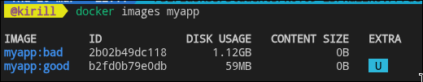
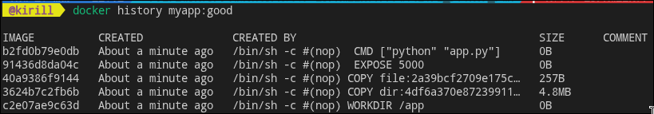
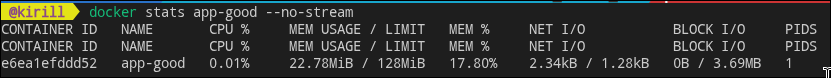
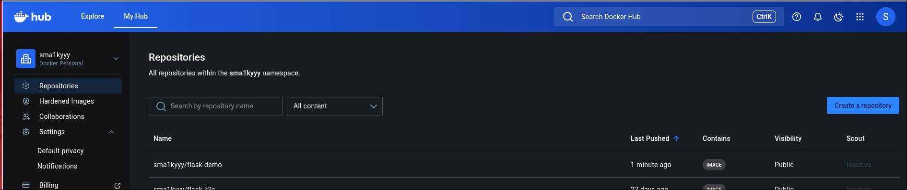
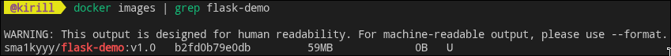

# __лабораторная работа 2: docker образы и запуск__

## цель
> понять, как из dockerfile собирается образ, почему размер образа может быть большим, и как оптимизировать его через multistage build.

## базовые понятия
- образ (image): неизменяемый шаблон с файловой системой и метаданными.
- контейнер (container): запущенный экземпляр образа.
- слой (layer): результат отдельной инструкции dockerfile, который кешируется.
- multistage build: разделение сборки и рантайма для уменьшения размера итогового образа.
- `.dockerignore`: исключение лишних файлов из контекста сборки.

## зачем нужны лимиты запуска
> флаги `--memory` и `--cpus` позволяют не дать контейнеру съесть все ресурсы хоста и повышают предсказуемость работы.

## что обычно портит образ
- `from python:3.12` без slim/alpine;
- `copy . .` до установки зависимостей;
- отсутствие `--no-cache-dir`;
- запуск приложения от root;
- отсутствие `.dockerignore`.

## что должно получиться
- два образа (условно bad и good) с заметной разницей в размере;
- рабочий контейнер на порту 5000/5001;
- просмотр истории слоев и метаданных;
- опционально публикация в docker hub.

## место для скриншотов
- [] `docker images myapp`
- [] `docker history myapp:good`
- [] `docker history myapp:bad`
- [] `docker stats app-good`
- [] страница образа в docker hub
- [] проверка статуса 
