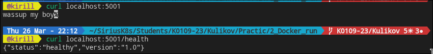
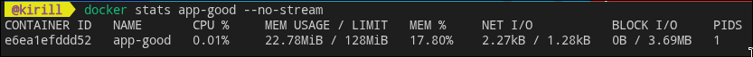
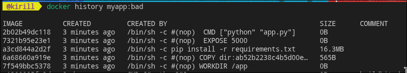

# __лабораторная работа 2: выполнение__

## условия работы
1. написать и собрать dockerfile;
2. сравнить неоптимизированный и оптимизированный образы;
3. запустить контейнер с лимитами;
4. посмотреть слои и inspect;
5. использовать `.dockerignore`;
6. при возможности отправить образ в docker hub.

## структура мини-проекта
```text
2_Docker_run/
  app.py
  requirements.txt
  dockerfile.bad
  dockerfile
  .dockerignore
```

## шаги выполнения

### 1) подготовка приложения
создано простое flask-приложение с маршрутами `/` и `/health`.

### 2) сборка bad-образа
```bash
docker build -f dockerfile.bad -t myapp:bad .
docker images myapp
```
ожидание: размер заметно больше.

### 3) сборка good-образа (multistage)
```bash
docker build -t myapp:good .
docker images myapp
```
ожидание: размер заметно меньше благодаря slim/alpine и выносу зависимостей в stage builder.

### 4) запуск контейнера с ограничениями
```bash
docker run -d -p 5001:5000 --name app-good \
  --memory="128m" --cpus="0.5" --restart=unless-stopped \
  myapp:good

curl localhost:5001
docker stats app-good --no-stream
```
ожидание: приложение отвечает, лимиты отображаются.

### 5) исследование слоев
```bash
docker history myapp:bad
docker history myapp:good
docker inspect myapp:good
```
результат: у good-образа меньше лишних слоев и общий объем ниже.

### 6) публикация (опционально)
```bash
docker login
docker tag myapp:good <dockerhub_username>/flask-demo:v1.0
docker push <dockerhub_username>/flask-demo:v1.0
```

## самопроверка
- приложение доступно по порту;
- контейнер запущен с ограничениями;
- разница размеров bad/good зафиксирована;
- `.dockerignore` уменьшает контекст сборки.

## контрольные вопросы

**Контрольный вопрос:** Почему образ такой большой?
**Ответ:** Базовый образ много весит + pip кэш (он сохраняет индексы, временные файлы и т д) + лишние слои (каждый run,copy - это новый слой и они занимают место) + контекст сборки + apt тянет зависимости для сборки.

## скрины
- [] сравнение `docker images myapp`
- [] успешный ответ `curl localhost:5001`
- [] `docker stats app-good --no-stream`
- [] `docker stats app-good`
- [] `docker history myapp:bad`
