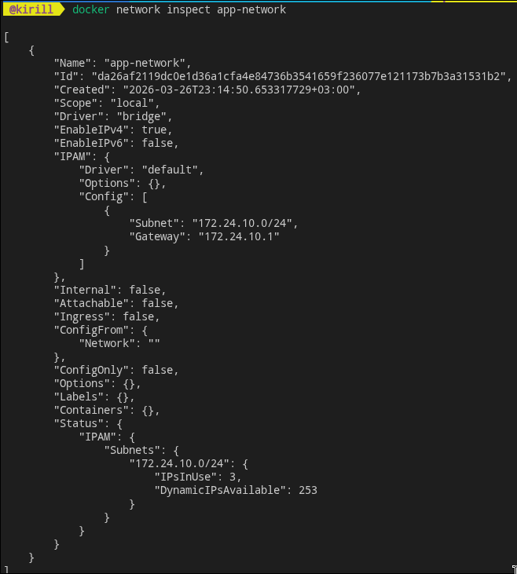
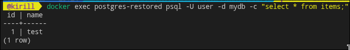
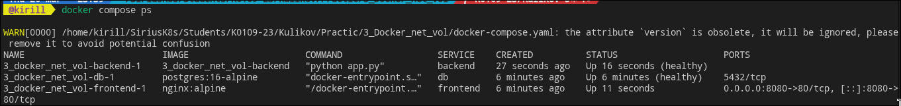
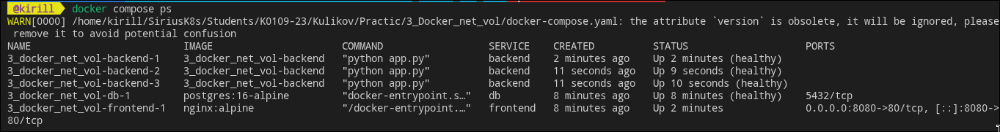

# __лабораторная работа 3: docker сети, volumes и compose__

## цель
> разобраться, как контейнеры общаются между собой, как сохранять данные между перезапусками и как поднимать многосервисный стек одной командой.

## теория кратко

### сети docker
- bridge: стандартная изолированная сеть на одном хосте.
- host: контейнер использует сетевой стек хоста.
- overlay: сеть поверх нескольких хостов.

> в user-defined bridge сети контейнеры резолвят друг друга по имени через встроенный dns docker.

### volumes
> volume хранит данные отдельно от жизненного цикла контейнера.
если контейнер удалить, данные в volume сохраняются.

### docker compose
compose описывает многоконтейнерное приложение в yaml:
- сервисы;
- сети;
- volumes;
- зависимости и healthcheck.

## что должно получиться
- собственная bridge-сеть и связь контейнеров по имени;
- postgres с persistent volume;
- стек frontend + backend + db через compose;
- проверка health и масштабирование backend.

## место для скриншотов
- [] `docker network ls` и `docker network inspect app-network`
- [] проверка `ping db` внутри сети
- [] `select * from items;` после перезапуска контейнера
- [] `docker compose ps` (healthy)
- [] `docker compose ps` после `--scale backend=3`
