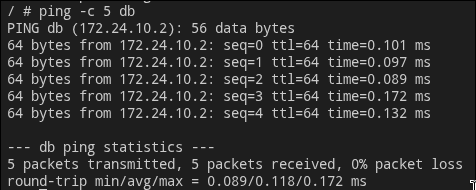
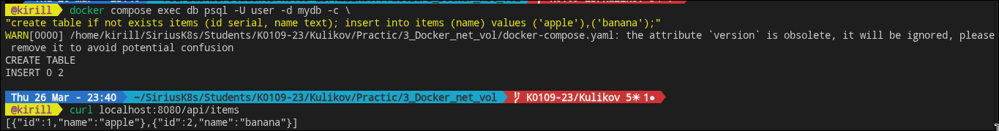

# __лабораторная работа 3: выполнение__

## условия работы
1. создать и проверить пользовательскую bridge-сеть;
2. поднять postgres с volume и проверить сохранность данных;
3. собрать и запустить стек из 3 сервисов через docker compose;
4. добавить healthcheck;
5. масштабировать backend.

## шаги выполнения

### 1) работа с сетями
```bash
docker network ls
docker network create --driver bridge app-network
docker network inspect app-network
```
далее запуск postgres в сети и проверка из alpine:
```bash
docker run -d --name db --network app-network -e POSTGRES_PASSWORD=secret postgres:16-alpine
docker run -it --rm --network app-network alpine sh
# внутри
ping db
nc -zv db 5432
```
> результат: внутри сети имя `db` резолвится.

### 2) проверка persistent volume
```bash
docker volume create pgdata
docker run -d --name postgres-persistent \
  -e POSTGRES_DB=mydb -e POSTGRES_USER=user -e POSTGRES_PASSWORD=pass \
  -v pgdata:/var/lib/postgresql/data postgres:16-alpine

docker exec -it postgres-persistent psql -U user -d mydb -c \
"create table items (id serial, name text); insert into items values (1, 'test');"

docker rm -f postgres-persistent

docker run -d --name postgres-restored \
  -e POSTGRES_DB=mydb -e POSTGRES_USER=user -e POSTGRES_PASSWORD=pass \
  -v pgdata:/var/lib/postgresql/data postgres:16-alpine

docker exec postgres-restored psql -U user -d mydb -c "select * from items;"
```
> результат: запись остается после удаления и повторного запуска контейнера.

### 3) docker compose стек
описаны сервисы:
- db (postgres + healthcheck);
- backend (flask + depends_on db healthy);
- frontend (nginx reverse proxy к backend).

запуск:
```bash
docker compose up -d --build
docker compose ps
docker compose logs -f
```
добавление тестовых данных и проверка цепочки:
```bash
docker compose exec db psql -U user -d mydb -c \
"create table if not exists items (id serial, name text); insert into items (name) values ('apple'),('banana');"

curl localhost:8080/api/items
```

### 4) масштабирование backend
```bash
docker compose up -d --scale backend=3
docker compose ps
```
> ожидание: видно 3 инстанса backend.

## самопроверка
- сервисы в compose имеют состояние `healthy`;
- frontend отдает данные из db через backend;
- volume сохраняет данные между перезапусками;
- масштабирование backend работает.

## место для скриншотов
- [] `docker network inspect app-network`
- [] успешный `ping db`
- [] `select * from items;`
- [] `docker compose ps` до/после scale
- []
- [] ответ `curl localhost:8080/api/items`
