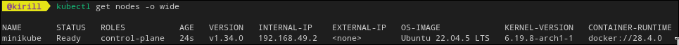
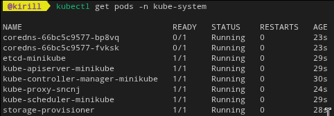
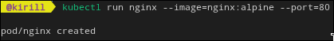
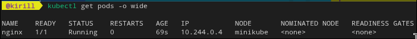
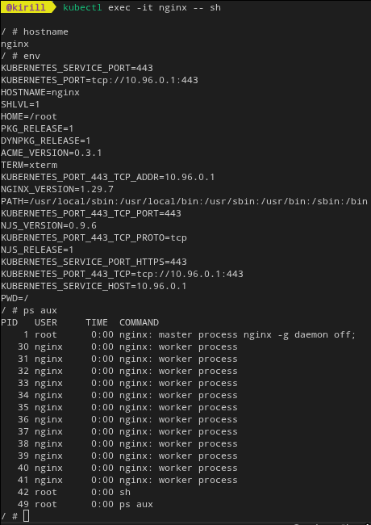
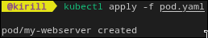
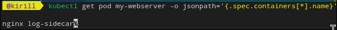
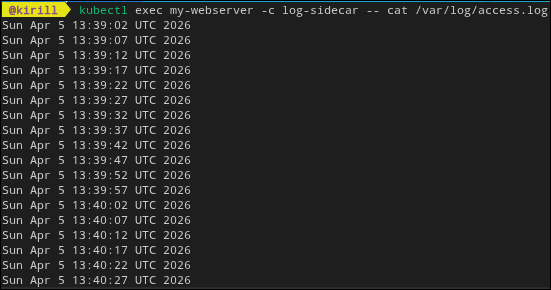
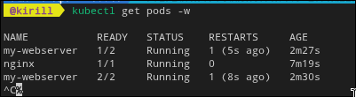
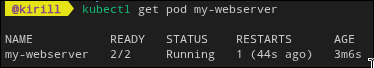

# лаба 4 kub init

цель лабы: поднять локальный kubernetes, создать поды разными способами и посмотреть как работает самовосстановление

1. сначала запустил кластер и проверил ноды

команды

```bash
kubectl get nodes -o wide
kubectl get pods -n kube-system
```



2. запустил первый под через kubectl run

```bash
kubectl run nginx --image=nginx:alpine --port=80
kubectl get pods -o wide
kubectl exec -it nginx -- sh
```

внутри пода посмотрел hostname, env и процессы. прикол в том что видно изоляцию очень наглядно, сразу становится понятно как это устроено внутри





3. сделал под через yaml манифест

я использовал файл `pod.yaml` из этой же папки. там два контейнера и пробы готовности

```bash
kubectl apply -f pod.yaml
kubectl get pod my-webserver -o jsonpath='{.spec.containers[*].name}'
kubectl logs my-webserver -c log-sidecar
```

сначала написал не то имя и получил ошибку, потом исправил и логи пошли





4. проверил self healing

```bash
kubectl exec my-webserver -c nginx -- kill 1
kubectl get pods -w
kubectl get pod my-webserver
```

после kill контейнер не умер навсегда, kubelet его перезапустил и счетчик restarts вырос. тема реально рабочая




5. вывод

в этой лабе закрепил базу по kubernetes: диагностика кластера, запуск подов, работа с yaml и проверка самовосстановления. теперь намного проще читать состояние кластера и не паниковать когда контейнер падает