# лаба 5 kub deploy

в этой лабе собрал нормальный путь выката приложения: deployment, service, ingress и откат версии

1. создал deployment на 3 реплики

использовал `deployment.yaml`

```bash
kubectl apply -f deployment.yaml
kubectl get pods -w
kubectl rollout status deployment/webapp
kubectl get rs
```

реплики поднялись нормально, готовность прошла, все три пода стали running

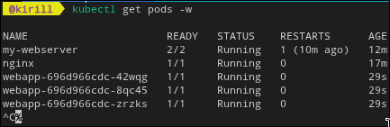


2. добавил service и проверил доступ

использовал `service.yaml`

```bash
kubectl apply -f service.yaml
kubectl get svc
NODE_IP=$(minikube ip)
while true; do curl -s $NODE_IP:30080 | head -n 3; sleep 1; done
```

в цикле видно что ответы идут от разных подов, балансировка работает

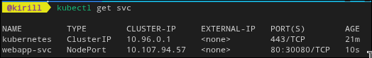
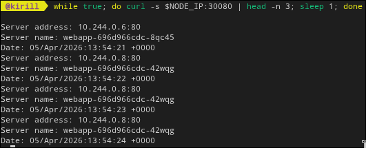

3. сделал rolling update и откат

```bash
kubectl set image deployment/webapp webapp=nginxdemos/hello:latest
kubectl rollout status deployment/webapp
kubectl rollout history deployment/webapp
kubectl rollout undo deployment/webapp
kubectl rollout status deployment/webapp
```

на апдейте без даунтайма все ок, потом откатил назад для проверки и тоже без проблем

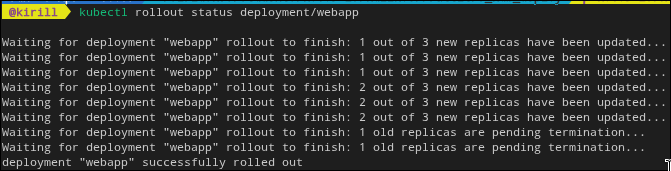
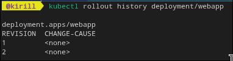
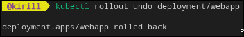
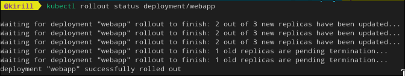

4. настроил ingress

использовал `ingress.yaml`

```bash
minikube addons enable ingress
kubectl apply -f ingress.yaml
kubectl get ingress
echo "$(minikube ip) webapp.local" | sudo tee -a /etc/hosts
curl webapp.local
curl webapp.local/api
```

тут была затычка с hosts, сначала забыл запись и думал что ingress сломан. потом добавил домен и сразу полетело

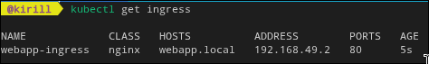
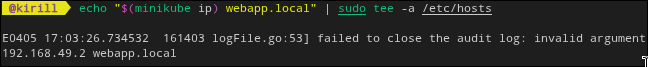
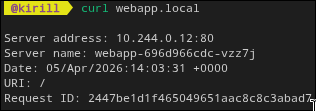
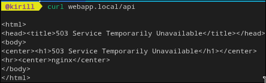

5. вывод

теперь понял как деплой живет в реале: обновление, откат и внешняя маршрутизация
