# лаба 6 kub config

тут весь фокус был на правильном хранении конфигов, секретов и данных

1. сделал configmap и подключил в под

```bash
kubectl create configmap app-config \
  --from-literal=APP_ENV=production \
  --from-literal=LOG_LEVEL=info \
  --from-literal=MAX_CONNECTIONS=100
kubectl create configmap nginx-conf --from-file=nginx.conf
kubectl apply -f pod-with-config.yaml
kubectl logs config-demo
```

в логах увидел и env переменные и файл из volume, значит оба способа работают

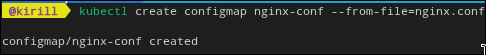
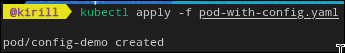
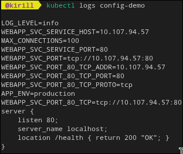

2. создал secret и подключил в под

```bash
kubectl create secret generic db-credentials \
  --from-literal=username=admin \
  --from-literal=password=SuperSecret123
kubectl get secret db-credentials -o yaml
echo "U3VwZXJTZWNyZXQxMjM=" | base64 -d
kubectl apply -f pod-with-secret.yaml
kubectl logs secret-demo
```

тут закрепил важный момент: base64 это не шифрование, а просто кодировка

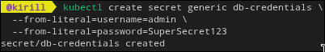
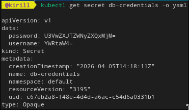
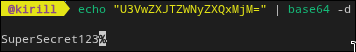
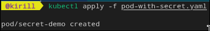
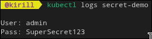

3. поднял postgres с pvc и проверил сохранение данных

```bash
kubectl apply -f postgres-pvc.yaml
kubectl get pvc
kubectl get pv
kubectl exec -it $(kubectl get pod -l app=postgres -o name) -- psql -U pguser -d mydb -c "create table sessions (id serial, data text); insert into sessions (data) values ('важные данные');"
kubectl delete pod $(kubectl get pod -l app=postgres -o name | cut -d/ -f2)
kubectl exec -it $(kubectl get pod -l app=postgres -o name) -- psql -U pguser -d mydb -c "select * from sessions;"
```

после удаления пода данные остались, значит pvc реально решает задачу постоянного хранилища

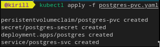
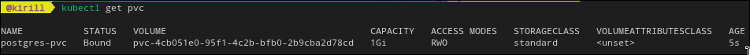

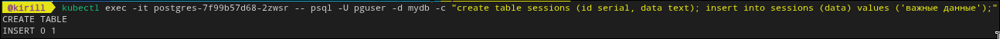
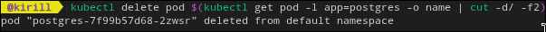
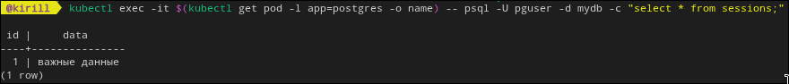

4. вывод

в этой лабе понял разницу между configmap, secret и pvc на практике. теперь конфиги и данные не мешаются с образом приложения