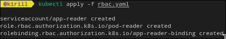
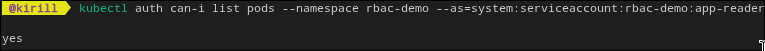
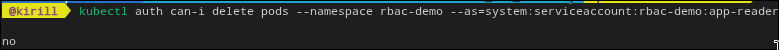
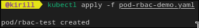
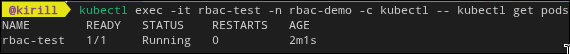
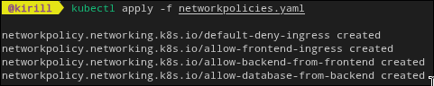
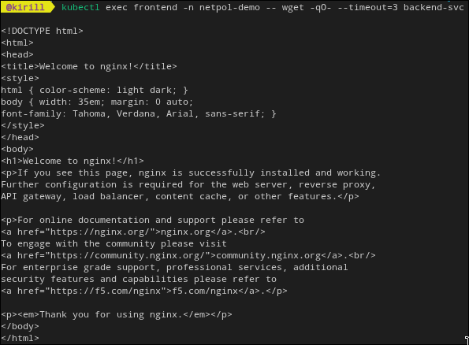
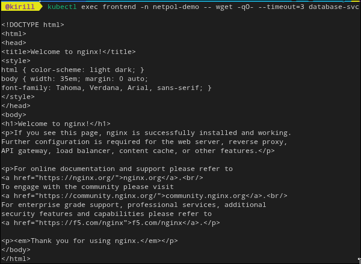
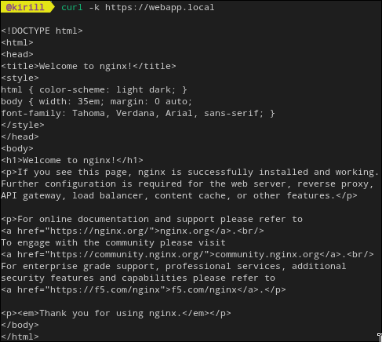
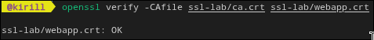

# лаба 7 kub security

финальная лаба по практикуму вышла самой мясной: rbac, сетевые политики и tls

1. rbac и serviceaccount

использовал `rbac.yaml` и `pod-rbac-demo.yaml`

```bash
kubectl create namespace rbac-demo
kubectl apply -f rbac.yaml
kubectl auth can-i list pods --namespace rbac-demo --as=system:serviceaccount:rbac-demo:app-reader
kubectl auth can-i delete pods --namespace rbac-demo --as=system:serviceaccount:rbac-demo:app-reader
kubectl apply -f pod-rbac-demo.yaml
kubectl exec -it rbac-test -n rbac-demo -- sh
```

проверка показала что list можно, delete нельзя, то есть минимум прав соблюден







2. networkpolicy

использовал `networkpolicies.yaml`

```bash
kubectl create namespace netpol-demo
kubectl run frontend -n netpol-demo --image=nginx:alpine --labels=role=frontend
kubectl run backend -n netpol-demo --image=nginx:alpine --labels=role=backend
kubectl run database -n netpol-demo --image=nginx:alpine --labels=role=database
kubectl expose pod frontend -n netpol-demo --port=80 --name=frontend-svc
kubectl expose pod backend -n netpol-demo --port=80 --name=backend-svc
kubectl expose pod database -n netpol-demo --port=80 --name=database-svc
kubectl apply -f networkpolicies.yaml
kubectl exec frontend -n netpol-demo -- wget -qO- --timeout=3 backend-svc
kubectl exec frontend -n netpol-demo -- wget -qO- --timeout=3 database-svc
```

после политик frontend к database уже не ходит напрямую, а backend ходит. изоляция работает как надо





3. tls сертификаты и ingress tls

файлы сертификатов лежат в `ssl-lab`

```bash
kubectl create secret tls webapp-tls --cert=ssl-lab/webapp.crt --key=ssl-lab/webapp.key
kubectl apply -f ingress-tls.yaml
kubectl get ingress
curl -k https://webapp.local
openssl verify -CAfile ssl-lab/ca.crt ssl-lab/webapp.crt
```

сначала у меня ругался браузер на недоверенный ca, потом добавил свой ca и проверка прошла




4. вывод

самый главный вывод простой: безопасность это не одна кнопка, а набор практик. rbac режет лишние права, networkpolicy режет лишний трафик, tls закрывает данные в пути