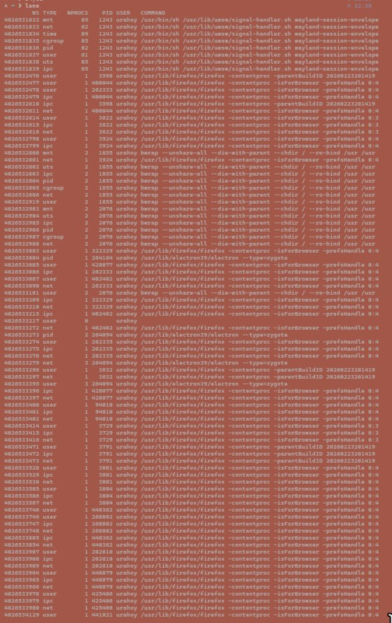

# Отчёт по лабораторной работе: Основы контейнеризации в Linux

> **Цель:** Познакомиться с низкоуровневыми механизмами изоляции, на которых построены Docker и Kubernetes.

---

## 1. Просмотр namespace-ов системы (`lsns`)

```bash
lsns
```



**Что я сделал:** Познакомился с утилитой `lsns` для просмотра списка всех изолированных пространств (namespace) в системе.

**Зачем это нужно:** Чтобы увидеть глобальную картину: какие типы изоляции (PID, NET, MNT, UTS и др.) уже используются ядром и процессами. Это база для понимания, как ядро реализует изоляцию.

---

## 2. Изоляция процессов (`PID namespace`)

```bash
echo $$
# Вывод внутри нового namespace: 1
```


**Что я сделал:** Познакомился с механизмом изоляции таблицы процессов через `unshare --pid --fork`.

**Зачем это нужно:** Чтобы убедиться, что внутри нового пространства процесс становится «инициатором» (PID 1) и не видит процессы хост-системы. Это фундаментальное свойство контейнеров: каждый из них «думает», что работает на отдельной машине.

---

## 3. Изоляция сети (`NET namespace`)

```bash
ip link
# Вывод внутри нового namespace: только lo (loopback)
```


**Что я сделал:** Познакомился с изоляцией сетевого стека через `unshare --net`.

**Зачем это нужно:** Чтобы гарантировать, что у контейнера будет свой собственный набор сетевых интерфейсов (в базовом случае — только `lo`). Это обеспечивает сетевую безопасность, изоляцию трафика и возможность гибкой настройки сетей (CNI в Kubernetes).

---

## 4. Ограничение ресурсов (`Cgroups v2`)

```bash
cat /sys/fs/cgroup/mytest/cpu.max
# Вывод: 20000 100000 (или аналогичный лимит)
```


**Что я сделал:** Познакомился с control groups (cgroups v2) для ограничения ресурсов.

**Зачем это нужно:** Чтобы контейнер не мог монополизировать процессорное время хоста и гарантированно получал только выделенную ему квоту (в данном случае ~20% CPU). Это критично для стабильной работы нескольких контейнеров на одном узле.

---

## 5. Изоляция файловой системы (`chroot`)

```bash
ls /
# Вывод: только файлы, подготовленные в rootfs
```


**Что я сделал:** Познакомился с системным вызовом `chroot` для смены корневой директории.

**Зачем это нужно:** Для изоляции файловой системы: чтобы процесс видел и мог взаимодействовать только с теми файлами и библиотеками, которые мы явно подготовили в `rootfs`. Это основа безопасности и воспроизводимости окружения.

---

## 🔑 Итог: три кита контейнеризации

| Механизм | За что отвечает | Аналог в реальном мире |
|----------|----------------|------------------------|
| **Namespaces** | «Не видеть» чужие процессы, сеть, хостнейм | Отдельная комната с зеркалами |
| **Cgroups** | «Не забирать» чужие ресурсы (CPU, RAM, I/O) | Счётчик с лимитом на электричество |
| **Chroot/Rootfs** | «Не ходить» в чужие файлы и программы | Свой набор инструментов и книг |

> **Docker и Kubernetes** просто автоматизируют эту рутину. Преподавателю важно показать, что ты понимаешь, как это работает «под капотом», а не только умеешь писать `docker run`.