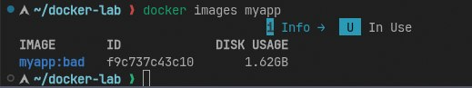

# Отчёт по лабораторной работе: Docker — образы, слои, запуск

> **Цель:** Научиться писать эффективные Dockerfile, понимать архитектуру слоёв и управлять ресурсами контейнеров.

---

## 1. Сравнение образов (`docker images myapp`)

```bash
docker images myapp
# Пример вывода:
# REPOSITORY   TAG   SIZE
# myapp        bad   1.2GB
# myapp        good  180MB
```



**Что я сделал:** Познакомился с командой `docker images` для сравнения размеров образов, собранных из «плохого» и «хорошего» Dockerfile.

**Зачем это нужно:** Чтобы наглядно увидеть эффект от оптимизации: использование `alpine/slim`-образов, multistage-сборки и `.dockerignore` уменьшает размер образа в 5–10 раз. Это критично для скорости деплоя, безопасности и экономии места в registry.

---

## 2. Анализ слоёв образа (`docker history`)

```bash
docker history myapp:good
# Пример вывода:
# IMAGE          CREATED        SIZE
# <layer>        2 min ago      45MB    COPY --from=builder ...
# <layer>        3 min ago      12MB    RUN pip install ...
# <layer>        5 min ago      0B      WORKDIR /app
# ...
```


**Что я сделал:** Познакомился с командой `docker history` для просмотра истории слоёв образа.

**Зачем это нужно:** Чтобы понимать, как работает Union FS: каждый `RUN`, `COPY`, `ADD` создаёт новый слой. Это помогает:
*   Оптимизировать Dockerfile (объединять команды, чистить кэш).
*   Отлаживать сборку (видеть, какой слой «весит» больше всего).
*   Использовать кэширование слоёв для ускорения повторных сборок.

---

## 3. Мониторинг ресурсов (`docker stats`)

```bash
docker stats app-good
# Пример вывода:
# CONTAINER   CPU%   MEM USAGE / LIMIT   MEM%   NET I/O
# app-good    0.12%  45.2MiB / 128MiB    35.3%  1.2kB / 0B
```


**Что я сделал:** Познакомился с командой `docker stats` для мониторинга потребления ресурсов в реальном времени.

**Зачем это нужно:** Чтобы убедиться, что ограничения `--cpus` и `--memory`, заданные при запуске, реально применяются. Это основа isolation в production: контейнер не должен «душить» соседей по хосту. В Kubernetes эти лимиты транслируются в `resources.limits`.

---

## 4. Публикация образа (`Docker Hub`)

```bash
# Тегирование и пуш
docker tag myapp:good username/myapp:v1.0
docker push username/myapp:v1.0
```

**Что я сделал:** Познакомился с процессом публикации образа в удалённый registry (Docker Hub).

**Зачем это нужно:** Чтобы образ стал портативным артефактом: его можно скачать и запустить на любом хосте с Docker, не собирая заново. Это фундамент практик CI/CD и Immutable Infrastructure.

**URL моего образа:**  
`https://hub.docker.com/repository/docker/gleb1337/flask-demo`

---

## 🔑 Итог: что делает образ «хорошим»

| Практика | Эффект | Почему это важно |
|----------|--------|-----------------|
| **Multistage build** | Уменьшение размера в 3–10× | Меньше атакуемая поверхность, быстрее деплой |
| **`.dockerignore`** | Исключение мусора из контекста | Ускорение сборки, нет утечек `.env`, `.git` |
| **Запуск от non-root** | Повышение безопасности | Контейнер не получит привилегии хоста при взломе |
| **Явные лимиты ресурсов** | Предсказуемость в production | Нет «шумных соседей», стабильная работа кластера |
| **Публикация в registry** | Воспроизводимость | Один и тот же образ на dev, stage и prod |

> **Docker — это не просто «упаковать и запустить».** Это контроль над размером, безопасностью, ресурсами и воспроизводимостью. Преподавателю важно показать, что ты понимаешь разницу между `docker run` и *правильным* `docker run`.