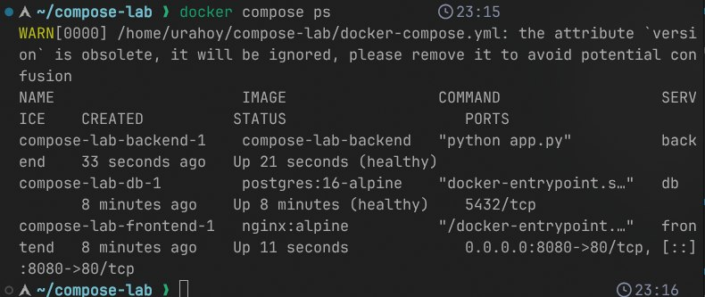

# Отчёт по лабораторной работе: Docker Compose — сети, тома, оркестрация

> **Цель:** Научиться описывать многоконтейнерные приложения в `docker-compose.yml`, настраивать взаимодействие сервисов через сети, управлять данными через volumes и масштабировать сервисы.

---

## 1. Проверка здоровья сервисов (`docker compose ps`)

```bash
docker compose ps
# Пример вывода:
# NAME                IMAGE            STATUS                        PORTS
# app-frontend-1      nginx:alpine     Up 2m (healthy)              0.0.0.0:8080->80/tcp
# app-backend-1       myapp:good       Up 2m (healthy)              8000/tcp
# app-db-1            postgres:15      Up 2m (healthy)              5432/tcp
```



**Что я сделал:** Познакомился с командой `docker compose ps` для отображения статуса всех сервисов стека, включая проверку `healthcheck`.

**Зачем это нужно:** Чтобы убедиться, что все сервисы не просто запущены, но и **готовы к работе**: база данных принимает соединения, бэкенд отвечает на `/health`, фронтенд проксирует запросы. В production это основа надёжности: оркестратор (Kubernetes, Swarm) перезапускает `unhealthy`-контейнеры автоматически.

---

## 2. Проверка сквозного взаимодействия (`curl`)

```bash
curl localhost:8080/api/items
# Пример ответа:
# [{"id":1,"name":"Example"},{"id":2,"name":"Test"}]
```


**Что я сделал:** Познакомился со сквозным запросом через всю цепочку: `Клиент → Nginx (reverse proxy) → Backend (Python/Node.js) → PostgreSQL`.

**Зачем это нужно:** Чтобы проверить, что:
*   **Сети Docker** работают: сервисы находят друг друга по именам (`backend`, `db`) через встроенный DNS.
*   **Volumes** работают: данные в БД сохраняются между перезапусками контейнеров.
*   **Порты проксированы**: Nginx корректно передаёт запросы на бэкенд.

Это эмуляция реального микросервисного трафика: один запрос проходит через 3–4 контейнера, и все они должны «дружить».

---

## 3. Горизонтальное масштабирование (`--scale`)

```bash
docker compose up -d --scale backend=3
docker compose ps
# Пример вывода:
# NAME                IMAGE            STATUS                        PORTS
# app-backend-1       myapp:good       Up 30s (healthy)             8000/tcp
# app-backend-2       myapp:good       Up 30s (healthy)             8000/tcp
# app-backend-3       myapp:good       Up 30s (healthy)             8000/tcp
```


**Что я сделал:** Познакомился с флагом `--scale` для быстрого увеличения количества реплик сервиса.

**Зачем это нужно:** Чтобы понять основы горизонтального масштабирования:
*   Несколько экземпляров бэкенда могут обрабатывать больше запросов (через load balancer).
*   В Docker Compose это ручное действие, а в Kubernetes — декларативное (`replicas: 3` в Deployment).
*   Важно: для работы балансировки нужен внешний proxy (Nginx, Traefik) или service mesh.

---

## 🔑 Итог: три столпа multi-container приложений

| Компонент | За что отвечает | Аналог в Kubernetes |
|-----------|----------------|---------------------|
| **Docker Networks** | Изолированное сетевое пространство, DNS-имена сервисов | `Service`, `ClusterIP`, `CoreDNS` |
| **Docker Volumes** | Сохранение данных вне контейнера, независимость от жизненного цикла | `PersistentVolume`, `PersistentVolumeClaim` |
| **Compose Scale** | Быстрое размножение контейнеров одного сервиса | `Deployment.spec.replicas`, `HorizontalPodAutoscaler` |

> **Docker Compose — это «локальный Kubernetes»:** он позволяет отлаживать архитектуру из нескольких сервисов на одной машине. Преподавателю важно показать, что ты понимаешь не только синтаксис `docker-compose.yml`, но и то, как сервисы находят друг друга, где хранятся данные и как масштабировать приложение без изменения кода.