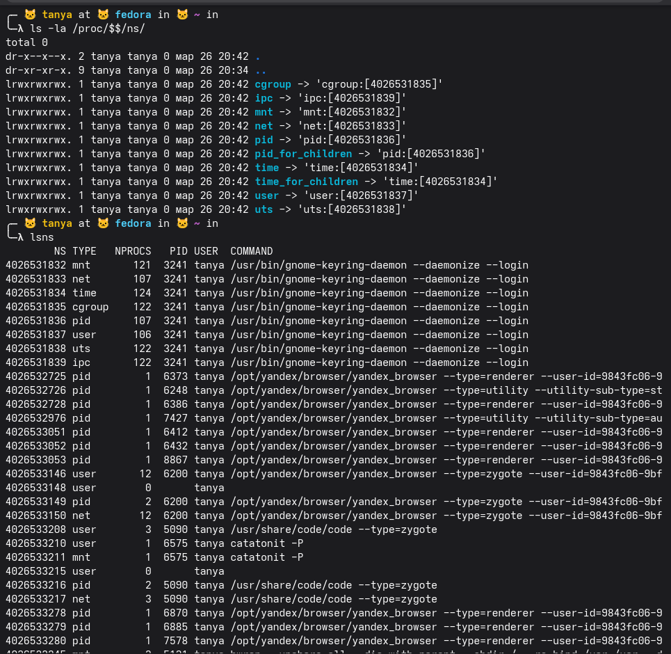
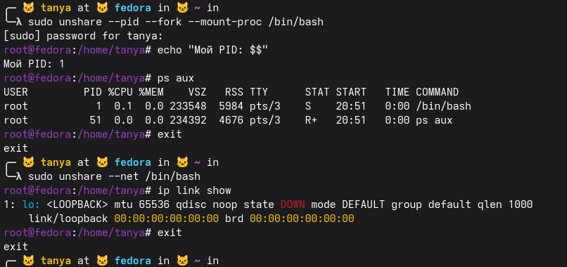
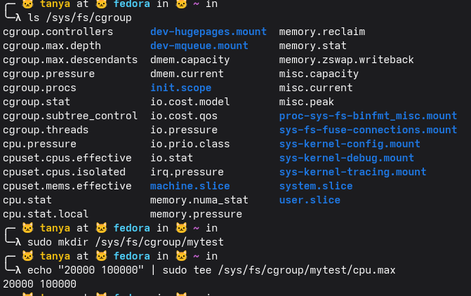
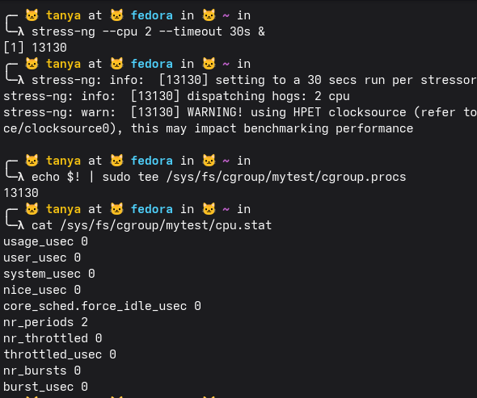
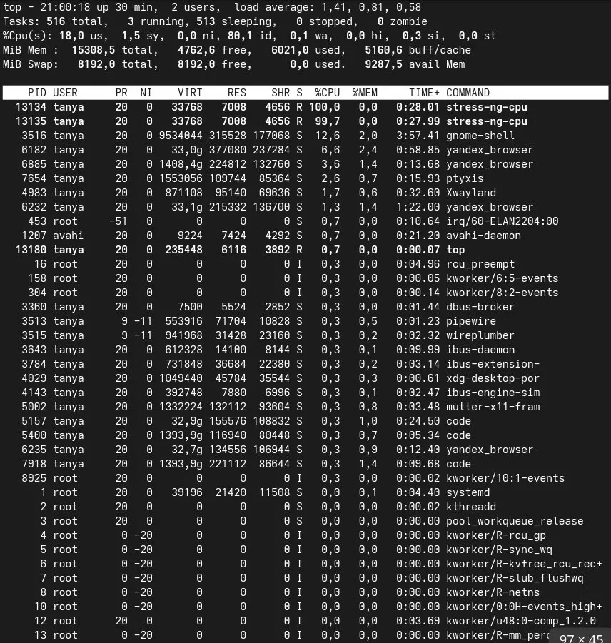
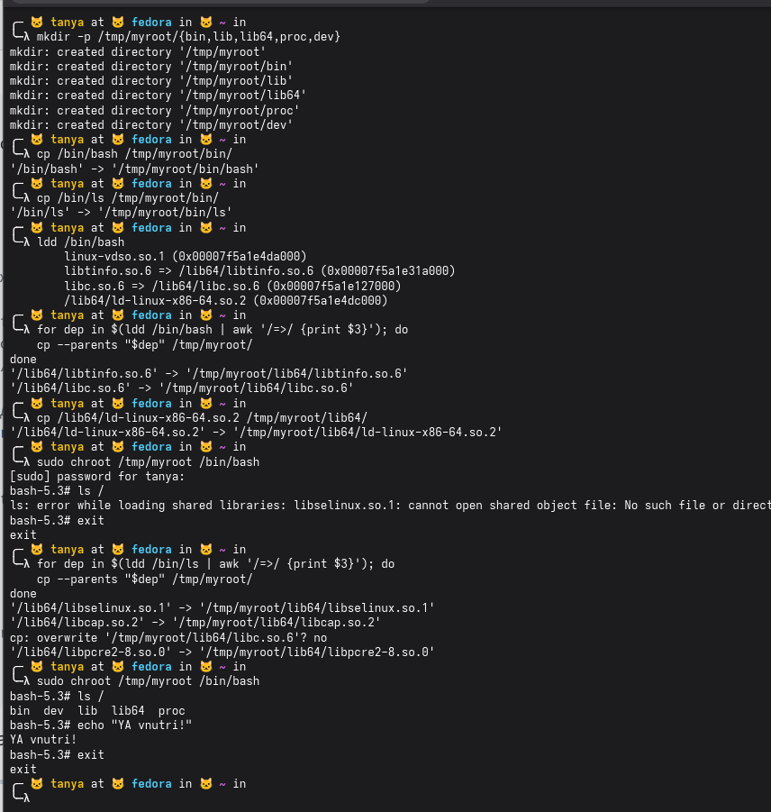

### Блок 1

ls -la /proc/$$/ns/ — смотрим неймспейсы текущего шелла, видим 8 симлинков: cgroup, ipc, mnt, net, pid, time, user, uts, у каждого свой id

lsns — список всех неймспейсов системы, в основном там gnome-keyring, yandex browser и vscode, всё под пользователем tanya, у браузера куча отдельных pid-неймспейсов на каждый процесс

два эксперимента с unshare

первый: sudo unshare --pid --fork --mount-proc /bin/bash — запускаем bash в новом pid-неймспейсе. echo $$ показывает что наш pid теперь 1, а ps aux видит только два процесса — bash и сам ps, больше ничего из системы не видно

второй: sudo unshare --net /bin/bash — запускаем bash в новом сетевом неймспейсе. ip link show показывает только loopback и он даже down, то есть сеть полностью изолирована, ничего нет

почему после exit процессы хоста остались нетронутыми?

потому что unshare создаёт новый namespace только для дочернего процесса, хостовые процессы в нём вообще не видны и никак не связаны. когда мы делали exit — просто завершился bash внутри нового namespace, а хост жил в своём pid namespace и ничего не заметил

### Блок 2

ls /sys/fs/cgroup — смотрим что есть в корневой cgroup, видим кучу файлов для управления ресурсами: cpu, memory, io, всякие slice и mount юниты от systemd

потом создаём свою cgroup: sudo mkdir /sys/fs/cgroup/mytest

и записываем в cpu.max значение "20000 100000" — это означает что процессы в этой cgroup смогут использовать не больше 20% cpu (20000 микросекунд из каждых 100000)

запускаем stress-ng — грузит 2 cpu на 30 секунд в фоне, получаем pid 13130

потом добавляем этот процесс в нашу cgroup mytest: echo $! (последний фоновый pid) записываем в cgroup.procs

затем смотрим cpu.stat — но там всё нули почти, только nr_periods 2, значит статистика только начала собираться, троттлинга ещё не видно

top во время работы stress-ng — видно что два процесса stress-ng-cpu (pid 13134 и 13135) жрут по 100% и 99.7% cpu соответственно, то есть cgroup лимит в 20% пока не применился к ним, либо они ещё не были достаточно долго в cgroup либо неизвестно почему...

что будет если превысить лимит памяти в cgroup?

сработает OOM-killer — это механизм ядра который при нехватке памяти выбирает процесс-нарушитель и убивает его (SIGKILL). причём не спрашивает, просто убивает. если лимит памяти выставлен в cgroup, то OOM-killer сработает именно внутри неё и прибьёт процесс который превысил лимит, не трогая остальную систему

### Блок 3

создали минимальный rootfs с нужными папками в /tmp/myroot. скопировали bash и ls в bin. запустили ldd на bash — он показал 3 зависимости: libtinfo.so.6, libc.so.6 и ld-linux-x86-64.so.2, все лежат в /lib64. скопировали libtinfo и libc циклом через awk, ld-linux скопировали отдельно потому что он не попадает под паттерн => в выводе ldd.

зашли в chroot, ls упал на libselinux — это специфика федоры, ls тут собран с поддержкой selinux в отличие от ubuntu где такого нет. вышли, прогнали тот же цикл ldd уже для ls — подтянулись libselinux.so.1, libcap.so.2 и libpcre2-8.so.0, libc.so.6 уже была поэтому cp спросил перезаписывать ли и пропустил.

зашли в chroot второй раз — теперь ls / работает и показывает только наши 5 директорий, больше ничего из хостовой системы не видно. echo тоже работает. это и есть суть chroot — процесс думает что / это /tmp/myroot и за пределы выйти не может
